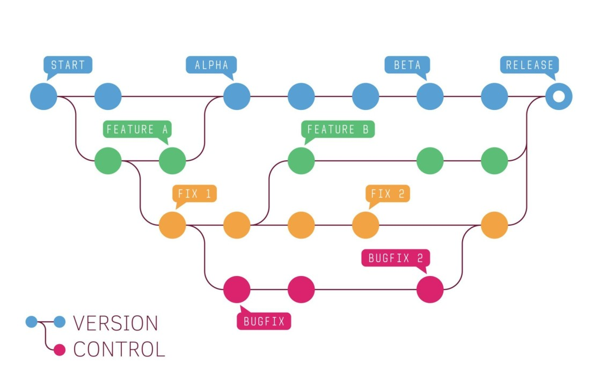
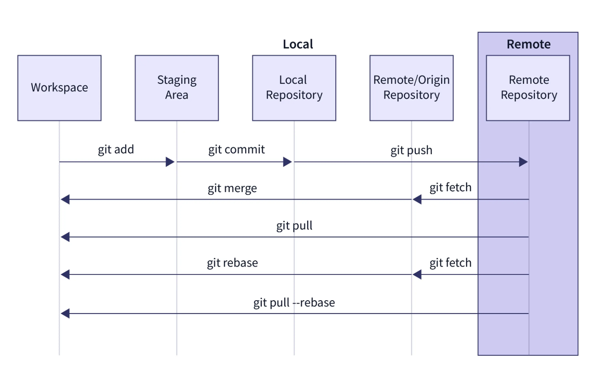
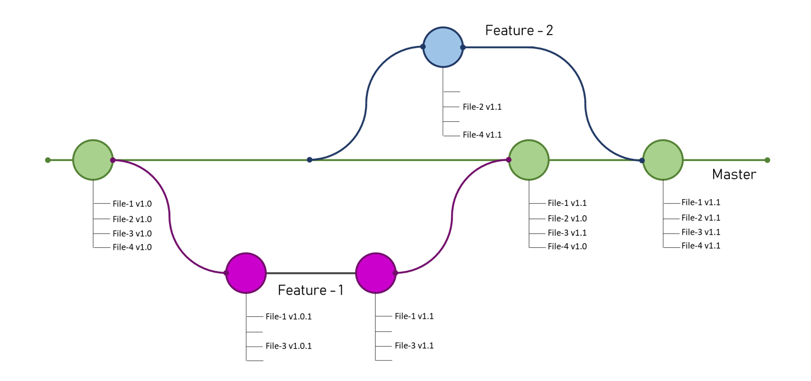

# Лекция: Git и GitLab

## Введение в системы контроля версий

В IT-индустрии стартапы и корпорации используют системы контроля версий, чтобы работать над проектами в команде и защищать код от потери данных. Git стал отраслевым стандартом — без него не обходится ни один серьёзный проект.



Git и GitLab помогают отслеживать изменения, возвращаться к рабочим версиям, объединять результаты команды и безопасно экспериментировать с кодом. Навык работы с системой контроля версий — основа для любого разработчика, даже на начальной позиции.

При работе в командном проекте могут появиться следующие проблемы:

- нужно откатить неудачное изменение, но уже не помнишь, что было раньше
- хочется экспериментировать, но страшно «сломать» рабочий код
- появляется риск перезаписать чужую работу

Чтобы решать эти проблемы, разработчики используют системы контроля версий (СКВ).

**Система контроля версий** (англ. Version Control System, VCS) — это инструмент, который позволяет сохранять каждую версию файлов (например, кода) и отслеживать все изменения, которые происходят с проектом.

**Git** — самая популярная система контроля версий. Git делает для кода то же самое, что Google Docs делает для документов: позволяет работать в команде и не терять изменения.

### Основные преимущества Git

**История изменений всегда под рукой**
Можно проверять, кто вносил изменения в код, а также что и когда менялось. Даже если часть кода удалилась или в ней есть ошибка, всегда можно вернуть предыдущую версию.

**Эксперименты — безопасны**
Можно создавать отдельные ветки для новых идей и тестировать их, не затрагивая основной проект.

**Командная работа без конфликтов между версиями**
Можно работать параллельно с другими участниками. Если изменения пересеклись, Git укажет, где возник конфликт, и предложит, как его устранить.

**Автономность и независимость**
Можно продолжать работать даже без доступа к интернету — Git сохранит все изменения на компьютере.

### Пример использования Git

Студент работает над учебным проектом:

1. В понедельник пишет первый вариант программы
2. Во вторник решает всё переписать, но новый код не работает
3. С помощью Git он может вернуться к версии понедельника

---

## Установка и настройка Git

Прежде чем начать работать с Git, его необходимо установить на свой компьютер. Процесс установки отличается в зависимости от операционной системы.

### Установка на разных ОС

<details>
<summary><strong>Windows</strong></summary>

**Способ 1: Официальный установщик**
1. Перейти на https://git-scm.com/download/win
2. Скачать установщик для Windows
3. Запустить установщик и следовать инструкциям
4. При установке рекомендуется оставить настройки по умолчанию

**Способ 2: Chocolatey**
```cmd
choco install git
```

**Способ 3: Winget (Windows Package Manager)**
```cmd
winget install --id Git.Git -e --source winget
```
</details>

<details>
<summary><strong>macOS</strong></summary>

**Способ 1: Homebrew (рекомендуемый)**
```bash
# Установить Homebrew, если ещё не установлен
/bin/bash -c "$(curl -fsSL https://raw.githubusercontent.com/Homebrew/install/HEAD/install.sh)"

# Установить Git
brew install git
```

**Способ 2: Официальный установщик**
1. Перейти на https://git-scm.com/download/mac
2. Скачать установщик для macOS
3. Запустить установщик и следовать инструкциям

**Способ 3: Xcode Command Line Tools**
```bash
xcode-select --install
```
</details>

<details>
<summary><strong>Linux</strong></summary>

**Ubuntu/Debian:**
```bash
sudo apt update
sudo apt install git
```

**CentOS:**
```bash
# CentOS/RHEL
sudo yum install git

# Fedora
sudo dnf install git
```
</details>

### Первоначальная настройка

После установки Git необходимо настроить имя пользователя и email:

```bash
# Настроить имя пользователя
git config --global user.name "Ваше Имя"

# Настроить email
git config --global user.email "your.email@example.com"

# Проверить настройки
git config --list
```

### GUI инструменты для работы с Git

Хотя Git изначально создавался как консольный инструмент, существует множество графических интерфейсов, которые делают работу с ним более удобной, особенно для начинающих:

**Встроенные в IDE:**
- **JetBrains IDEs** (IntelliJ IDEA, GoLand, PyCharm) — имеют мощный встроенный Git-клиент с визуализацией веток, diff-просмотром и интеграцией с merge request
- **Visual Studio Code** — отличная интеграция с Git, расширения для работы с GitHub/GitLab, встроенный diff-редактор
- **Visual Studio** — полная поддержка Git с графическим интерфейсом

**Отдельные приложения:**
- **GitHub Desktop** — простой и понятный интерфейс, идеален для начинающих
- **GitKraken** — красивый интерфейс с визуализацией веток и истории
- **SourceTree** — бесплатный клиент от Atlassian
- **Tower** — профессиональный Git-клиент для Mac и Windows

**Веб-интерфейсы:**
- **GitLab Web IDE** — позволяет редактировать код и работать с Git прямо в браузере
- **GitHub Codespaces** — полноценная среда разработки в браузере

> **Рекомендация для начинающих:** Начните с изучения консольных команд Git — это поможет понять принципы работы. После этого можно переходить к GUI инструментам для повыш

## Репозиторий и инициализация проекта

При разработке проекта важно сохранять историю изменений. Для этого Git создаёт внутри проекта специальную структуру, где хранятся все версии файлов, информация о сохранениях и настройках. Без этой структуры система контроля версий работать не будет.

**Директория** — это папка на диске, в которой лежат файлы.

**Репозиторий Git** — это директория, где хранятся все изменения проекта, коммиты, ветки и файлы. Репозиторий может быть локальным (на компьютере) и удалённым (на сервере, например в GitLab).

Принципы работы с репозиторием:

- репозиторий всегда создаётся внутри существующей директории проекта
- в одной директории может быть только один репозиторий Git
- пока репозиторий не инициализирован, Git не взаимодействует с файлами

### Инициализация репозитория

**Инициализация репозитория** — это создание структуры Git внутри проекта, позволяющей Git отслеживать изменения в файлах.

Чтобы инициализировать репозиторий и начать работу с Git, используют команду `git init`.

`git init` — это команда, которая создаёт новый, пустой репозиторий Git в текущей папке.

Внутри этой папки появляется скрытая папка `.git`, где будут храниться дальнейшие изменения и настройки Git.

Команду используют, когда:

- начинается работа над новым проектом и хочется отслеживать изменения с помощью Git
- хочется перевести «под контроль версий» существующую директорию с кодом

**Пример:**

```bash
# Перейти в папку своего проекта
cd my_first_go_project

# Выполнить в терминале команду инициализации
git init
```

Что произойдёт:

- появится скрытая папка `.git`
- в терминале появится сообщение: "Инициализирован пустой репозиторий Git в /путь/к/my_first_go_project/.git/"

---

## Состояния файлов и работа с изменениями

После создания репозитория проекта важно понять:

- как Git видит файлы
- как он отслеживает изменения
- что нужно делать, чтобы любое важное изменение не потерялось

### Состояния файлов в Git



В любой момент времени каждый файл в репозитории может находиться в одном из следующих состояний:

- **Untracked** — новый файл, который Git ещё не отслеживает
- **Modified** — файл изменён, но изменения ещё не подготовлены для сохранения
- **Staged** — файл подготовлен для включения в следующий коммит
- **Committed** — изменения сохранены в репозитории

На этапе Staged файлы добавляются в область подготовки.

**Область подготовки или индекс** (англ. staging area) — это промежуточная область в Git, где фиксируются изменения.

На основе изменений в индексе создаётся коммит.

**Коммит** (англ. commit) — это зафиксированное изменение в репозитории Git.

Состояния нужны, потому что Git не отслеживает всё автоматически. Разработчик сам определяет, какие изменения сохранить, что помогает избежать случайных ошибок и лишних файлов в истории проекта.

### Команды для управления состояниями файлов

**Проверка статуса файлов:**
```bash
git status
```
Показывает, какие файлы новые, изменённые или подготовленные к коммиту.

**Добавление нового файла под контроль Git:**
```bash
git add main.go
```
Переводит файл из состояния Untracked или Modified в состояние Staged.

Можно добавить все новые или изменённые файлы разом:
```bash
git add .
```

**Важно:** Чтобы случайно не добавить лишние файлы и не запутаться, стоит избегать использования этой команды в начале работы с Git.

**Фиксация изменений — создание коммита:**

Коммит фиксирует состояние проекта в определённый момент времени. Это как «снимок» всех файлов, которые были отмечены как готовые к сохранению, и краткое описание изменений.

```bash
git commit -m 'Добавлена функция поиска пользователей'
```

Переводит все подготовленные файлы (Staged) в состояние Committed.

`-m '...'` — краткое описание того, что было сделано в этом коммите.

**Просмотр истории коммитов:**
```bash
git log
```
Показывает все сделанные коммиты: кто, когда и что изменил.

### Как писать хорошие сообщения к коммитам

Сообщение к коммиту — это мини-отчёт о том, что и зачем сделано. Через месяц или даже год по этим сообщениям разработчики смотрят, что происходило с проектом.

**Советы:**

- Сообщение должно кратко и по сути сообщать, что и зачем изменено
- Использовать глагол, который отвечает на вопрос «что сделано?» (от третьего лица):
  - «добавлена обработка ошибок»
  - «удалены неиспользуемые файлы»
  - «исправлен баг с авторизацией»
- Не использовать слишком общие фразы наподобие «всё исправлено» или «что-то изменено»
- Если изменения большие, кратко описать их в первой строке (до 50 символов) и добавить подробности на следующей

**Примеры плохих сообщений:**
- «всё починил»
- «правки»
- «снова работает»
- «test»
- «asd»

**Примеры хороших сообщений:**
- «Добавлена базовая реализация функции сложения»
- «Исправлена ошибка с авторизацией на странице входа»
- «Обновлена документация для установки»
- «Удалены устаревшие методы работы с БД»
- «Вынесена обработка ошибок в отдельный модуль»

### Пример работы со статусами файлов

```bash
# Создать новый файл в IDE

# Проверить статус
git status
# main.py (untracked)

# Добавить файл в индекс (staging area)
git add main.go

# Проверить статус ещё раз
git status
# main.go (staged)

# Сделать коммит — сохранить «снимок» изменений в историю изменений
git commit -m 'Добавлена функция gitFunction в main.go'

# Проверить статус снова
git status
# Нет изменений для коммита
```

Когда создаётся файл, он находится в состоянии Untracked, Git не видит его сразу. После команды `git add main.go` Git отмечает файл для добавления в коммит. После команды `git commit` Git навсегда фиксирует изменение. Команда `git status` позволяет в любой момент понять, что происходит с файлами.

### Типичная ошибка

Не нужно сразу писать команду `git commit -m ...`, не выполнив `git add`.

Git ответит: «Нет изменений для коммита».

Причина: Git не добавил файл в staging area. Он не знал, что его надо сохранять.

Решение: всегда перед коммитом использовать `git add <имя_файла>` (или `.`, если уверены).

---

## Просмотр истории изменений

В истории коммитов можно:

- посмотреть всю историю изменений в проекте
- узнать, кто и когда вносил правки
- найти нужную версию или вернуть проект к прошлому состоянию

**История изменений в Git** — это последовательность коммитов, которая показывает, как проект развивался со временем: что и когда менялось, кто был автором изменений, какие файлы затрагивались.

Команда `git log` — основной способ посмотреть историю всех коммитов в репозитории.

**Хеш коммита** (англ. commit hash) — это уникальный короткий идентификатор (набор букв и цифр), который автоматически присваивается каждому коммиту в Git.

Команда `git log` показывает список всех коммитов, начиная с самого нового. Для каждого коммита выводятся:

- хеш
- автор
- дата
- сообщение коммита

### Удобные параметры команды

- `git log --oneline` показывает краткую версию истории изменений: только короткий хеш и сообщение
- `git log --stat` показывает, какие файлы изменились и сколько строк было добавлено или удалено

### Пример работы с историей изменений

Студент продолжает работу над своим проектом, добавляет новый функционал, исправляет ошибки. Теперь он хочет убедиться, что в любой момент сможет понять, что происходило с кодом на каждом этапе.

Для этого нужно сделать несколько изменений и коммитов.

1. Написать новую функцию в файле main.go:
```go
package main

import "fmt"

func hello() {
    fmt.Println("Hello, Git!")
}
```

2. Зафиксировать изменения:
```bash
git add main.go
git commit -m 'Добавлена функция hello'
```

3. Добавить ещё одну функцию в тот же файл:
```go
func bye() {
    fmt.Println("Bye, Git!")
}
```

4. Зафиксировать изменения:
```bash
git add main.go
git commit -m 'Добавлена функция bye'
```

5. Теперь посмотреть историю коммитов:
```bash
git log
```

**Пример вывода:**
```
commit a9b8c7d6e5f4a3b2c1d0e9f8a7b6c5d4e3f2a1b0
Author: Иван Тестов <ivan@example.com>
Date:   Thu May 30 10:12:05 2025 +0300

    Добавлена функция bye

commit 4c3b2a1d0e9f8a7b6c5d4e3f2a1b0a9b8c7d6e5f
Author: Иван Тестов <ivan@example.com>
Date:   Thu May 30 09:56:28 2025 +0300

    Добавлена функция hello
```

Каждый коммит в истории — это отдельный снимок состояния проекта.

У каждого коммита есть:

- уникальный хеш — `a9b8c7d...`
- автор и время — `Иван Тестов <ivan@example.com>`
- сообщение — `Добавлена функция bye`

Если использовать команду `git log --oneline`, увидишь короткую версию:

```
a9b8c7d Добавлена функция bye
4c3b2a1 Добавлена функция hello
```

Если использовать команду `git log --stat`, увидишь более подробную версию истории:

```
commit a9b8c7d6e5f4a3b2c1d0e9f8a7b6c5d4e3f2a1b0
Author: Иван Тестов <ivan@example.com>
Date:   Thu May 30 10:12:05 2025 +0300

    Добавлена функция bye

main.go | 3 ++
1 file changed, 3 insertions(+)

commit 4c3b2a1d0e9f8a7b6c5d4e3f2a1b0a9b8c7d6e5f
Author: Иван Тестов <ivan@example.com>
Date:   Thu May 30 09:56:28 2025 +0300

    Добавлена функция hello

main.go | 2 ++
1 file changed, 2 insertions(+)
```

`--stat` показывает:

- список изменённых файлов
- количество добавленных (+) и удалённых (-) строк
- общее количество изменений в каждом коммите

### Типичные ошибки

**Пустая история**

Когда репозиторий только что инициализировали, в нём нет ни одного коммита, и команда `git log` ничего не покажет.

**Слишком длинная история**

В больших проектах вывод может быть очень длинным. Используй `git log --oneline` или прокрутку в терминале.

---

## Ветки и слияние изменений

В командной разработке часто возникает необходимость:

- добавить новый функционал
- протестировать экспериментальную идею
- поработать над фиксом бага, не мешая основной стабильной версии

Чтобы не помешать коллегам и не сломать основную стабильную версию, разработку ведут в отдельной ветке кода.



**Ветка** (англ. branch) — это независимая линия разработки внутри одного репозитория Git.

Ветка как отдельная «трасса», по которой проходит своя последовательность изменений и коммитов, не мешая другим «трассам».

По умолчанию в каждом репозитории есть главная ветка. Чаще всего она называется main или master. Остальные ветки создаются для отдельных задач или экспериментов.

### Принципы работы веток

- **Изолированность:** ветка не влияет на остальные до тех пор, пока её изменения не объединят с основной
- **Безопасность:** в любой момент можно вернуться в главную ветку (main) и убедиться, что там только стабильный, проверенный код
- **Масштабируемость:** над проектом может работать неограниченное количество людей параллельно, не мешая друг другу
- **История:** вся работа в ветке фиксируется в коммитах, и после слияния история сохраняется полностью

### Команды для работы с ветками

**Создание новой ветки и переход в неё:**

```bash
git switch -c branch_name
```
или
```bash
git checkout -b branch_name
```

Создаёт новую ветку с именем `branch_name` и переключается в неё.

**Переключение между ветками:**

```bash
git switch branch_name
```

Позволяет работать в нужной ветке, менять файлы и делать коммиты.

**Просмотр всех веток:**

```bash
git branch
```

Показывает список всех существующих веток и выделяет, в какой сейчас находится разработчик.

### Пример работы с ветками

В основном файле проекта находятся заготовки функций. Три разработчика работают над своими функциями, каждая из которых реализуется в отдельной ветке.

1. Добавление исходного файла (первый коммит):

```go
// main.go
package main

func addSlices(slice1, slice2 []int) []int {
    // TODO: реализовать
    return nil
}

func subtractSlices(slice1, slice2 []int) []int {
    // TODO: реализовать
    return nil
}

func multiplySlices(slice1, slice2 []int) []int {
    // TODO: реализовать
    return nil
}
```

```bash
git add main.go
git commit -m 'Commit 0: Инициализация файла main.go'
```

2. Создание ветки для каждого разработчика:

```bash
git switch main         # Убеждаемся, что находимся в основной ветке
git switch -c developer_1
# ... реализация функции addSlices ...
git switch main
git switch -c developer_2
# ... реализация функции subtractSlices ...
git switch main
git switch -c developer_3
# ... реализация функции multiplySlices ...
git switch main
```

3. Фиксация работы одного из разработчиков (ветка developer_1):

```go
// main.go (только в ветке developer_1)
package main

func addSlices(slice1, slice2 []int) []int {
    result := make([]int, len(slice1))
    for i := 0; i < len(slice1); i++ {
        result[i] = slice1[i] + slice2[i]
    }
    return result
}

func subtractSlices(slice1, slice2 []int) []int {
    // TODO: реализовать
    return nil
}

func multiplySlices(slice1, slice2 []int) []int {
    // TODO: реализовать
    return nil
}
```

```bash
git add main.go
git commit -m 'Developer 1: реализация функции addSlices'
```

4. Переключение между ветками:

```bash
git switch developer_2
# Файл main.go здесь пока не изменён, только заготовка функции subtractSlices
```

### Слияние веток

После работы в отдельной ветке, реализации фичи или исправления бага важно вернуть изменения в основную ветку (main), чтобы они стали частью общего проекта.

`git merge` — это команда, которая объединяет изменения из одной ветки в текущую (основную) ветку.

Позволяет «переложить» все сделанные в рабочей ветке изменения в основную, чтобы объединить результаты работы разных разработчиков или экспериментальных фич.

### Принципы слияния веток

- Всегда находись в той ветке, куда нужно добавить изменения
- Если хочешь добавить изменения из ветки feature, сначала перейди в main, затем выполни `git merge`
- Исходная ветка остаётся без изменений
- После слияния обе ветки сохранятся — можно продолжить работу в любой из них

### Как пользоваться командой git merge

1. Перейти в ветку, куда нужно добавить изменения:
```bash
git switch main
```

2. Объединить нужную ветку с текущей:
```bash
git merge feature_branch
```

Здесь `feature_branch` — имя ветки, из которой переносятся изменения.

**Пример:**

После работы в ветке `developer_1` добавляем изменения в main:

```bash
git switch main
git merge developer_1
```

Есть ветка main с коммитом "Commit 0: Инициализация". В ветке `developer_1` реализована функция `add_lists` и сделан отдельный коммит.

Объединяем ветки:

```bash
git switch main
git merge developer_1
```

В результате:

- ветка main теперь содержит все изменения из `developer_1`
- если Git не обнаружит проблем при объединении веток, произойдёт слияние и появится автоматическое сообщение о слиянии

```
Merge made by the 'ort' strategy.
```

---

## Конфликты при слиянии веток

Иногда в командном проекте разработчики работают в разных ветках и изменяют одну и ту же часть кода, например одну и ту же строку функции. При попытке объединить такие изменения Git не может автоматически определить, какой вариант оставить. Это и называется конфликтом.

**Конфликт при слиянии** (англ. merge conflict) — это ситуация, когда Git не может автоматически объединить изменения из двух веток, потому что они затрагивают одни и те же строки или файлы разными способами.

Принципы работы с конфликтами:

- при слиянии Git всегда сообщает о конфликте
- в файле появляются специальные маркеры. Они показывают, что в одной части файла есть две версии — основная и из сливаемой ветки
- чтобы разрешить конфликт, выбрать, какой код оставить, и вручную исправить файл
- после разрешения сделать коммит

Так выглядит конфликт:

```go
func addSlices(slice1, slice2 []int) []int {
<<<<<<< HEAD
    result := make([]int, len(slice1))
    for i := 0; i < len(slice1); i++ {
        result[i] = slice1[i] + slice2[i]
    }
    return result
=======
    // TODO: реализовать
    return nil
>>>>>>> developer_2
}
```

- Всё, что между `<<<<<<< HEAD` и `=======` — основная ветка. HEAD — это указатель на текущий коммит — положение «головы» истории в ветке, в которой находишься
- Всё, что между `=======` и `>>>>>>> developer_2` — версия из сливаемой ветки

### Пошаговое разрешение конфликта

1. Открыть файл и выбрать, что оставить, или скомбинировать оба варианта

2. Удалить все маркеры (`<<<<<<<`, `=======`, `>>>>>>>`, HEAD)

3. Сохранить исправленный файл

Например, оставить рабочую версию:

```go
func addSlices(slice1, slice2 []int) []int {
    result := make([]int, len(slice1))
    for i := 0; i < len(slice1); i++ {
        result[i] = slice1[i] + slice2[i]
    }
    return result
}
```

4. После исправления файла зафиксировать изменения:

```bash
git add main.go        # Добавить исправленный файл в индекс
git commit -m "Merge branch 'developer_2'"   # Завершить слияние
```

### Удаление неиспользуемых веток

После слияния ветка с задачей обычно больше не нужна. Удаление ветки помогает держать репозиторий в порядке.

**Команда для удаления:**

```bash
git branch -d branch_name
```

**Порядок действий:**

1. Переключиться на основную ветку:
```bash
git switch main
```

2. Удалить лишние ветки:
```bash
git branch -d developer_1
git branch -d developer_2
git branch -d developer_3
```

---

## Работа с удалёнными репозиториями

Реальный проект — это всегда обмен изменениями с коллегами, видимость истории изменений для всей команды и резервная копия кода. Для этого используются удалённые репозитории: специальные «копии» проекта на сервере.

**Удалённый репозиторий** (англ. remote repository) — это версия проекта, размещённая на специальном сервере (например, в GitLab), доступная всем участникам команды. Любой участник может отправить туда свои изменения (push) или получить свежие изменения от других (pull/fetch).

### Принципы работы

- Каждый разработчик работает со своей локальной копией, а затем синхронизируется с удалённым репозиторием
- Основные команды работы с удалёнкой: `git clone`, `git remote`, `git push`, `git pull`, `git fetch`
- Удалённый репозиторий — это центр обмена: тут собирается весь командный прогресс

### Работа с GitLab

**Шаг 1. Создание удалённого репозитория**

Обычно используется GitLab — корпоративная платформа, которую можно развернуть на своём сервере или использовать как облачное решение.

1. Зайти в GitLab
2. Нажать Create blank project
3. Заполнить:
   - Project name — коротко, по смыслу
   - Visibility Level — выбрать Private (только для своей команды) или Public (доступен всем)
   - включить галочку Initialize repository with a README — так проект сразу станет полноценным git-репозиторием
4. Нажать Create Project — готово!

**Шаг 2. Клонирование репозитория к себе на компьютер**

Клонировать — значит создать у себя на компьютере точную копию удалённого репозитория со всей историей.

```bash
git clone <адрес_репозитория>
```

Например:

```bash
git clone git@git.culab.ru:username/my_project.git
```

или

```bash
git clone https://git.culab.ru/username/my_project.git
```

После клонирования есть полностью настроенная директория, где уже подключён удалённый репозиторий с именем origin.

**Шаг 3. Как делиться изменениями — отправка и получение изменений**

Отправить изменения на сервер:

```bash
git push
```

(отправляет коммиты в основную ветку origin/main)

Получить изменения других:

```bash
git pull
```

(скачивает изменения из репозитория на сервере и объединяет с локальными)

**Шаг 4. Проверить подключение к удалённому репозиторию**

```bash
git remote -v
```

Выведет адреса, с которыми работает локальный репозиторий.

### Практический пример

Разработчику дали ссылку на новый командный проект в GitLab.

1. Он клонирует репозиторий к себе:

```bash
git clone https://git.culab.ru/my_team/best_project.git
```

2. Работает локально, делает коммиты

3. Когда хочет поделиться результатом, отправляет изменения:

```bash
git push
```

4. Если коллега внёс изменения, подтягивает их себе:

```bash
git pull
```

### Важные замечания и типичные ошибки

**Ошибка:** изменения конфликтуют с тем, что уже появилось на сервере.

Сначала выполнить `git pull`, разрешить возможные конфликты, потом делать `git push`.

**Ошибка:** не настроены SSH-ключи или токен — GitLab не пускает.

Использовать официальную инструкцию, настроить доступ заранее.

---

## Оформление проекта и принципы командной работы

### README.md

Когда открываешь любой новый проект, сначала хочется понять — что это за проект, кто его сделал, как его использовать и как подключиться к разработке. README.md — это визитная карточка и инструкция к проекту. Хорошо оформленный README.md экономит время разработчику, команде и любому новому участнику.

**README.md** — это текстовый файл в формате Markdown. Он должен быть простым, структурированным и отвечать на следующие вопросы:

- Что делает проект?
- Какая цель у проекта?
- Какая у проекта область применения?
- Как установить проект?
- Как использовать проект? Привести примеры
- Как внести вклад?
- Кто автор и по какой лицензии распространяется проект?

### Стандартная структура README.md

**Название проекта:**
чётко и коротко, чтобы понятно было уже с первой строки.

**Описание проекта:**
1–2 предложения — зачем этот проект, кому он полезен.

**Инструкция по установке:**
пошагово, что нужно установить и как запустить проект.

**Примеры использования:**
примеры команд, фрагменты кода, скриншоты — всё, что поможет быстро начать работу.

**Вклад в проект (Contributing):**
как предложить изменения, где писать вопросы, где обсуждать баги.

**Лицензия и автор:**
на каких условиях можно использовать проект.

**Советы:**
- использовать краткие списки, заголовки, выделения
- не забывать про понятные примеры и инструкции
- README.md — это «точка входа». Ориентироваться на того, кто никогда не видел проект

### Пример хорошего README.md

```markdown
# Calculator

Calculator — это простая библиотека Go для математических операций с числами.

## Установка

Склонируй репозиторий и собери проект:

```bash
git clone https://github.com/username/calculator.git
cd calculator
go build```

## Использование

```go
package main

import (
    "fmt"
    "./calculator"
)

func main() {
    result := calculator.Add(5, 3)
    fmt.Println("5 + 3 =", result) // 8
    
    result = calculator.Multiply(4, 7)
    fmt.Println("4 * 7 =", result) // 28
}```

## Вклад в проект

Pull requests приветствуются. Для крупных изменений — сначала открой issue.

## Автор и лицензия

Автор: Иван Тестов
Лицензия: MIT
```

README.md — это первое, что видят пользователи или коллеги. Хорошо структурированный файл экономит время и повышает доверие к проекту. Не стоит игнорировать оформление и наполнение, это показывает профессионализм.

### Файл .gitignore

В любом проекте появляются временные файлы, логи, настройки среды, кеш, пароли и файлы IDE, которые не должны попадать в репозиторий. `.gitignore` защищает проект и команду от случайных утечек данных и захламления истории.

**.gitignore** — это текстовый файл, где построчно указываются файлы, папки или шаблоны, которые Git должен игнорировать.

Какие типы файлов обычно вносят в `.gitignore`:

- скомпилированные бинарные файлы (имя проекта без расширения на Linux/macOS, `*.exe` на Windows)
- личные настройки среды (`.env`, `config.local.json`)
- системные и кеш-файлы (`.DS_Store`, `Thumbs.db`)
- файлы IDE и редакторов (`.idea/`, `.vscode/`)
- логи, отчёты и временные файлы (`*.log`, `logs/`, `tmp/`)

**Рекомендации:**
- добавлять `.gitignore` с первого коммита
- не размещать в репозитории личные и чувствительные данные
- для большинства языков и платформ существуют готовые шаблоны

### Пример файла .gitignore

```
# Скомпилированные бинарные файлы
my_go_project
*.exe

# Временные файлы и логи
*.log
tmp/
logs/

# Файлы среды и конфигурации
.env
config.local.json

# Файлы IDE
.idea/
.vscode/

# Системные файлы
.DS_Store
Thumbs.db

# Go модули (если используется vendor)
vendor/
```

### Что делать, если игнорируемый файл случайно попал в репозиторий?

Удалить его из индекса, но не из своей папки:

```bash
git rm --cached путь/к/файлу
git commit -m "Удалён лишний файл из репозитория"
```

Добавить шаблон этого файла или папки в `.gitignore` перед следующим коммитом.

`.gitignore` — фильтр для всего ненужного и приватного. Поддерживать `.gitignore` в актуальном состоянии — стандарт профессионального подхода.

### Merge Request (MR) — совместная работа и ревью в GitLab

Когда работаешь в команде, важно не только внести изменения, но и согласовать их с коллегами, получить обратную связь и сделать проект лучше. Merge Request — это инструмент для обсуждения, проверки и интеграции кода без хаоса и конфликтов.

**Merge Request (MR)** — это запрос на слияние ветки с изменениями в основную ветку проекта – чаще всего main или develop. MR — это не просто «объединение кода», а процесс согласования, проверки и документирования изменений.

### Роли в командной работе

- **Мэйнтейнеры (Maintainers)** имеют полный контроль над проектом: принимают финальные решения о слиянии изменений, следят за качеством
- **Контрибьюторы (Contributors)** создают новые ветки, вносят изменения, открывают Merge Requests
- **Ревьюеры (Reviewers)** просматривают MR, задают вопросы, пишут замечания и подтверждают качество изменений

Один человек может совмещать несколько ролей.

### Процесс работы с Merge Request

1. Разработчик создает отдельную ветку и вносит изменения – feature, fix, docs

2. Открывает Merge Request:
   - указывает исходную ветку и целевую ветку
   - пишет понятный заголовок и описание изменений, чтобы ревьюер понял суть
   - назначает ревьюеров

3. Ревьюер проверяет MR:
   - смотрит изменения и коммиты во вкладке Changes
   - оставляет комментарии, пишет вопросы, рекомендует улучшения

4. Разработчик отвечает на замечания:
   - вносит правки, пишет ответы
   - если всё устраивает, ревьюер закрывает треды и даёт «зелёный свет»

5. Слияние (Merge):
   - можно автоматически удалить ветку-источник, чтобы не было мусора
   - можно объединить коммиты в один (squash) и отредактировать итоговое сообщение коммита
   - после merge изменения попадают в основную ветку на сервере

### Практический пример

1. Разработчик создаёт ветку `feature/update-readme`, вносит изменения и отправляет их на сервер через `git push`

2. В GitLab открывает MR:
   - Source branch: `feature/update-readme`
   - Target branch: `main`
   - Заголовок: `feature: обновлён README.md`
   - Описание: «Добавил подробную инструкцию по использованию проекта»
   - Назначает коллегу ревьюером

3. Коллега оставил пару замечаний. Разработчик вносит правки, коммитит и снова пушит в ту же ветку

4. Ревьюер подтверждает, что всё хорошо, и выполняет слияние

5. Ветка автоматически удаляется, а коммиты могут быть объединены

### Важные замечания

После merge локальный репозиторий не обновится автоматически! Переключиться на основную ветку и выполнить:

```bash
git pull
```

Так подтянутся свежие изменения с сервера.

MR — стандарт работы в любой современной команде разработчиков. Это удобно, прозрачно и позволяет учиться друг у друга. Качественное ревью и обсуждение помогают улучшать проект.

### Организация структуры проекта

Структура проекта — это ориентир для любой команды, автоматизации и долгосрочного развития кода. Хорошо организованный проект проще поддерживать, тестировать, масштабировать и передавать другим.

#### Хорошая структура Go-проекта

```
my_go_project/
├── cmd/                  # Основные приложения
│   └── main.go
├── internal/             # Внутренняя логика приложения
│   └── calculator/
│       └── calculator.go
├── pkg/                  # Публичные библиотеки
├── README.md             # Документация
├── go.mod                # Go модули и зависимости
├── go.sum                # Контрольные суммы модулей
└── .gitignore            # Исключения Git
```

Что важно:
- чёткое разделение кода, тестов, документации
- README.md, go.mod и go.sum всегда на виду
- `.gitignore` — защищает от мусора

### Пример плохой структуры

```
my_go_project/
├── abc.go
├── test.go
├── README.txt
├── test1.log
├── my_go_project
└── config.local.json
```

Проблемы:
- нет единого места для кода
- в проект попал лог, скомпилированный бинарный файл, локальный конфиг и неправильный README не в формате markdown
- сложно понять, где искать точку входа

### Рекомендации по структуре

- Следовать стандартам Go-сообщества и официальным рекомендациям по структуре проектов
- Для сложных проектов использовать папки cmd/, internal/, pkg/ для чёткого разделения
- Не держать лишних или временных файлов в корне проекта
- Поддерживать порядок — это профессиональная репутация и вклад в удобство команды

Хорошая структура — залог долгосрочного успеха проекта. Даже если работаешь один, всегда делай так, чтобы новый участник понял проект за 5 минут!

---

## Заключение

Git — это не только способ сохранить или откатить изменения. Это ответственность, командная работа и уверенность в том, что проект всегда под контролем и понятен разработчику и другим участникам команды.

## Заключение

Git — это не только способ сохранить или откатить изменения. Это ответственность, командная работа и уверенность в том, что проект всегда под контролем и понятен разработчику и другим участникам команды.

### Дальнейшее изучение

**Для закрепления знаний рекомендуется:**

1. **Практика с командной строкой** — освойте основные команды Git через терминал
2. **Интерактивное обучение** — попробуйте пройти курс [Learn Git Branching](https://learngitbranching.js.org/?locale=ru_RU) для лучшего понимания веток и слияния
3. **GUI инструменты** — после освоения основ, используйте графические интерфейсы для повышения производительности
4. **Командная работа** — практикуйтесь с merge request'ами в реальных проектах


### Основные выводы

**Git** — это система контроля версий, которая позволяет сохранять, отслеживать и управлять изменениями в коде.

В Git важно:
- фиксировать изменения коммитами
- работать с ветками для безопасного развития проекта
- сливать изменения через merge и merge request
- синхронизировать локальный и удалённый репозиторий

**Ветка** — это независимая линия разработки для новых функций, исправлений или экспериментов.

**Коммит** — это фиксированное изменение в истории проекта с комментарием и уникальным идентификатором (хешем).

**Merge** — это процесс объединения изменений из одной ветки в другую.

**Конфликт** — это ситуация, когда одно и то же место в коде изменено по-разному в разных ветках; решается вручную.

**Слияние и разрешение конфликтов** — навык объединять изменения без потерь и ошибок.

**Репозиторий** — «контейнер» для хранения истории кода и всех правок.

**Удалённый репозиторий** — это серверная копия проекта (например, на GitLab), куда команда отправляет изменения и откуда получает их.

**README.md** — это главный информационный файл проекта: что это, как установить, как использовать.

**.gitignore** — это список файлов и папок, которые Git должен игнорировать (не добавлять в репозиторий).

**Merge Request** — это запрос на слияние изменений из одной ветки в другую с обязательным ревью и согласованием в команде.
