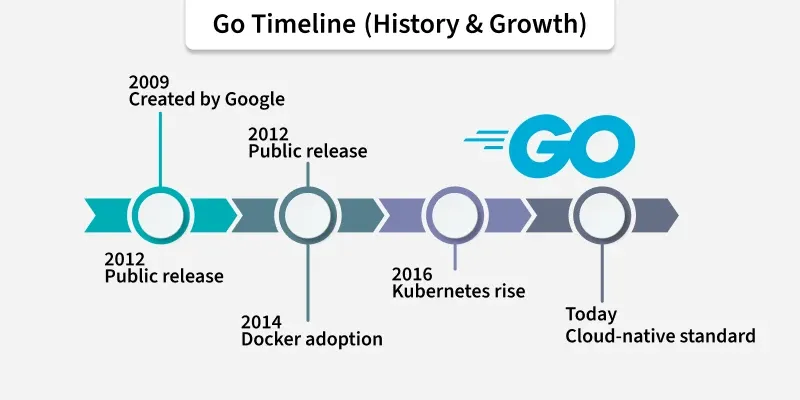
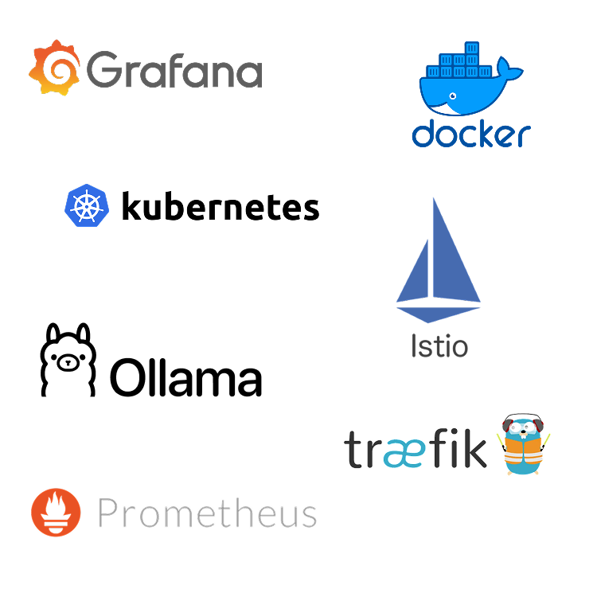
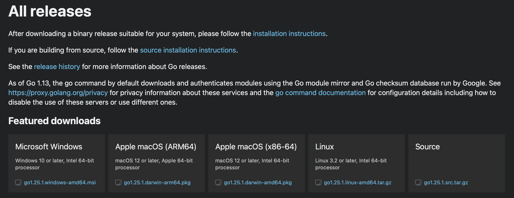
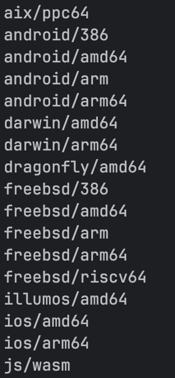
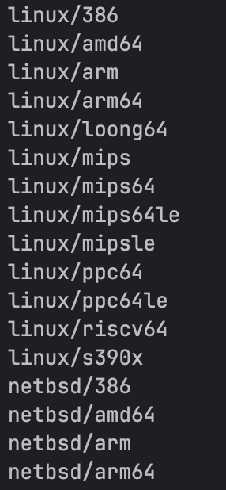
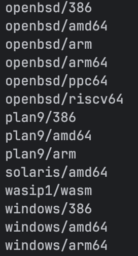
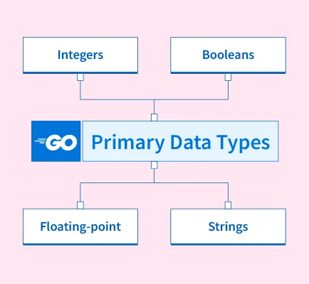
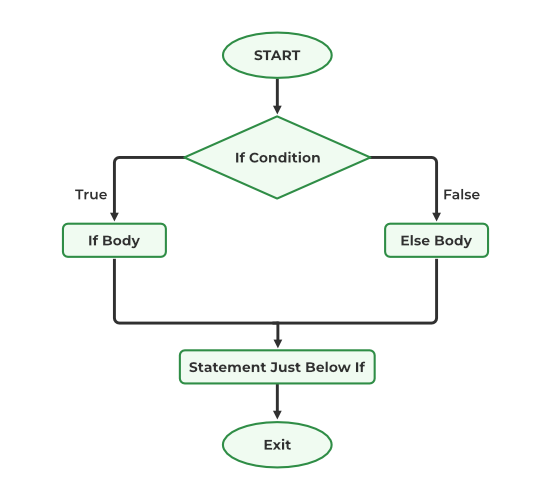
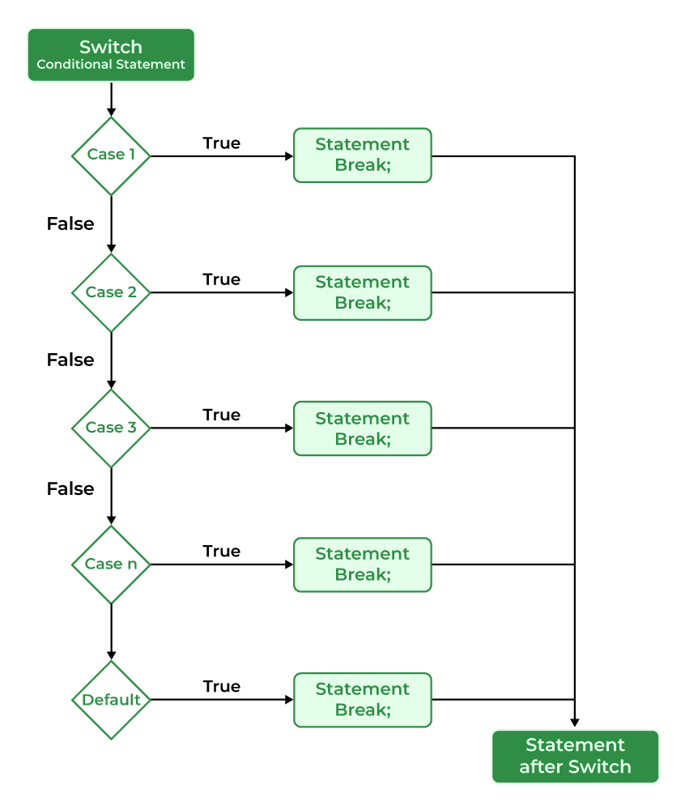

# Лекция: Введение в язык программирования Go


## История и философия Go


Go - компилируемый, статически типизированный язык программирования с поддержкой конкурентности. Он был разработан компанией Google в 2007 году для улучшения производительности высоконагруженных серверных приложений. Начиная примерно с 2015 года язык начал набирать популярность, и сейчас многие крупные компании выбирают Go для развития своих проектов.





Когда язык только зарождался, компания Google выдвинула несколько ключевых концепций, которым должен был следовать Go. Во-первых, язык должен быть максимально простым для изучения. Во-вторых, в его дизайне сознательно отказались от классического ООП с наследованием и иерархиями классов в пользу более простых механизмов - структур и интерфейсов. Также важными требованиями были:
- быстрая компиляция;
- кроссплатформенность - возможность компиляции под разные ОС и архитектуры из одного исходного кода;
- богатый встроенный инструментарий (в том числе для работы с сетью и тестированием);
- автоматическое управление памятью за счёт сборщика мусора;
- конкурентность как часть языка (об этом ниже).


Основные преимущества Go включают в себя несколько важных аспектов. Первое и самое важное преимущество - это простота языка. За счёт минималистичного синтаксиса Go считается самым простым для изучения типизированным языком: в нём всего 25 ключевых слов. Команда разработчиков сознательно придерживается принципа стабильности и не добавляет новые конструкции без крайней необходимости. Простота синтаксиса делает код легко читаемым и снижает порог входа для новичков, сохраняя при этом мощные возможности для разработки сложных систем.


| Language   | Keywords |
| ---------- | :------: |
| Go         |    25    |
| Python 2   |    31    |
| C          |    32    |
| Python 3   |    33    |
| JavaScript |    46    |
| PHP        |    49    |
| Java       |    63    |
| C++        |    82    |


Второе важное преимущество - это лёгкая читаемость библиотек. Go, включая стандартную библиотеку, компилятор и сборщик мусора, написан на самом Go. Это означает, что любой разработчик, знающий этот язык, может с лёгкостью прочитать его стандартную библиотеку и понять, как всё устроено. Изначально компилятор языка был написан на С, но в дальнейшем и его переписали на Go.


Третье преимущество связано с поддержкой многопоточности. С приходом на рынок многоядерных процессоров разработчики получили новые возможности для оптимизации приложений. Go умеет работать с многопоточностью с помощью **горути́н** (от *coroutines* - «сопрограммы», однако горутины это не корутины в классическом смысле). Горутины позволяют запускать любую функцию асинхронно, а встроенный планировщик автоматически распределяет их выполнение по доступным ядрам, эффективно используя ресурсы системы.


И наконец, четвертое важное преимущество - самодостаточность. После компиляции программа представляет собой один бинарный файл, включающий все необходимые зависимости. Это позволяет переносить сборку на любой компьютер с той же операционной системой и архитектурой, не беспокоясь о зависимостях.


Как и у любого языка, у Go есть свои недостатки. Встроенный сборщик мусора справляется хорошо, но ручное управление памятью могло бы дать меньший расход и более предсказуемое поведение. Кроме того, в Go малое количество «синтаксического сахара», что заставляет разработчика писать базовые функции с нуля. К примеру, до недавнего времени не существовало функции поиска по слайсу или массиву, а тернарного оператора в языке нет вовсе.


Среди популярных инструментов, реализованных на языке Go, можно выделить Docker. В этой же экосистеме контейнеризации на Go написан и оркестратор контейнеров Kubernetes. Крупные инструменты для работы с метриками - такие как Prometheus и Grafana - тоже написаны на Go. Более того, весь бэкенд мессенджера TiMe, используемого в ЦУ, является форком проекта Mattermost, который также написан на Go.




## Установка и настройка окружения


Для установки и настройки Go на различных операционных системах используются разные подходы.


<details><summary>macOS</summary>


Установка Go для операционной системы macOS происходит буквально в пару команд.

Для этого необходимо сначала скачать пакетный менеджер [Homebrew](https://brew.sh):
```bash
/bin/bash -c "$(curl -fsSL https://raw.githubusercontent.com/Homebrew/install/HEAD/install.sh)"
```

А далее просто выполнить одну команду:

```bash
brew install go
```


И всё! После этого можно начинать писать первую программу. </details>


<details> <summary>Windows</summary>

На Windows, Go можно установить несколькими способами:
- [через встроенный пакетный менеджер WinGet](#winget-method)
- [через официальный установщик](#installer-method)
- [через пакетный менеджер Chocolatey](#choco-method)

#### Встроенный пакетный менеджер WinGet <a id="winget-method"></a>

Данный метод установки Go для Windows должен являться самым быстрым, однако он может не сработать в ряде случаев - пакетный менеджер WinGet стал поставляться лишь в ряде последних релизов Windows. Если окажется, что у вас его нет, используйте один из других способов.

Откройте `Windows Terminal` (в русской версии - «`Терминал Windows`»). Важно открыть именно его, а не классический `cmd` или `PowerShell`.

Проверьте наличие WinGet командой:

```powershell
winget --version
```

Если команда не найдена - этот способ не подойдет.

Если же команда вернула версию WinGet, установить Go можно командой:
```powershell
winget install --id=GoLang.Go -e
```

#### Установщик <a id="installer-method"></a>

Для установки Go на Windows через официальный установщик:

1. Перейти на официальный сайт <https://go.dev/dl/>
   
2. Скачать установщик для Windows
3. Запустить установщик и следовать инструкциям


#### Пакетный менеджер Chocolatey <a id="choco-method"></a>

Данный метод предназначен для установки Go через пакетный менеджер [Chocolatey](https://chocolatey.org), который [устанавливается отдельно](https://chocolatey.org/install#install-step2).

```powershell
choco install golang
```
</details>


<details> <summary>Linux</summary>

В зависимости от вашего дистрибутива, установка Go будет разной.

#### Debian/Ubuntu

```bash
# Установить из репозитория пакетов дистрибутива
sudo apt-get update
sudo apt-get install golang-go

# Скачать через архив с официального сайта
GO_VERSION=1.25.1
GO_ARCH=$(uname -m)
wget https://golang.org/dl/go${GO_VERSION}.linux-${GO_ARCH}.tar.gz
sudo tar -C /usr/local -xzf go${GO_VERSION}.linux-${GO_ARCH}.tar.gz
echo 'export PATH=$PATH:/usr/local/go/bin' >> ~/.bashrc
source ~/.bashrc
```


#### CentOS и CentOS-based

```bash
# Для систем с yum
sudo yum install golang

# Для систем с dnf
sudo dnf install golang
```

</details>


Чтобы убедиться, что Go установлен корректно, выполните команду:

```bash
go version
```


## Первая программа Hello World


Теперь можно приступить к написанию первой программы. Создадим классическое приложение "Hello World!", с которого традиционно начинают изучение любого языка программирования.


Создаем новый файл с названием `hello_world.go`. Любой файл на языке Go начинается с ключевого слова `package` и названия пакета, к которому относится этот файл.


Пакет – это базовая единица деления кода внутри архитектуры приложения Go. Область видимости неэкспортируемых переменных ограничивается именно пакетом, в котором она объявлена. Важное правило: входная точка для запуска приложения всегда должна быть объявлена в пакете `main`.


Далее объявляется секция импорта других пакетов. Импортировать пакеты можно через конструкцию ключевого слова `import` и указание названия пакета в двойных кавычках. Например, `import "fmt"`. Важный момент: если в файле был импортирован какой-либо пакет, то он обязательно должен быть использован, иначе при сборке компилятор завершится с ошибкой о неиспользуемом пакете.


Если необходимо импортировать несколько пакетов, то можно использовать конструкцию множественного импорта:


```go
import (
	"fmt"
	"os"
)
```


И наконец, создается входная точка приложения - функция `main`:


```go
func main() {

}
```


Чтобы вывести в консоль какую-то строку, можно использовать функцию `Println` из пакета `fmt`. Получается следующий код:


```go
package main

import "fmt"

func main() {
	fmt.Println("Hello, world!")
}
```


Структура очень простая и понятная даже новичку.


## Сборка и кроссплатформенная разработка


Теперь, когда есть первая программа, нужно разобраться, как её собрать и запустить. Для сборки программы на языке Go используется команда `go build`. Общий формат вызова выглядит так:


```bash
go build [-o output] [build flags] [packages]
```


Результатом выполнения этой команды является исполняемый двоичный файл. Имя файла будет выбрано в соответствии с именем собираемого пакета - последний компонент имени пакета, который не является номером версии.


Команда `go build example/hello` создаст исполняемый файл `hello` (`hello.exe` для Windows). Команда `go build example/hello/v2` тоже создаст файл `hello`, а не файл `v2`.


Если вместо пакета команде `go build` передается файл с расширением `.go`, то исполняемый файл будет назван по имени первого исходного файла.


Очень часто используемым флагом для команды `go build` является флаг `-o`. Этот флаг позволяет переопределить путь и имя, по которому будет записан скомпилированный файл. Из других важных флагов отметим `-race` для проверки на *race condition*.


Одна из ключевых особенностей Go - по умолчанию сборка «чисто Go»-проекта даёт самодостаточный бинарник: зависимости из Go-пакетов линкуются статически, и программу можно запускать без дополнительной установки библиотек. При этом Go поддерживает динамическую линковку: она появляется при использовании `cgo`, а также в специальных режимах (о `cgo` будет написано ниже).

> [!NOTE]
> Именно поэтому часто внутри CI для получения полностью статичного бинарника проект собирают с отключенным cgo: `CGO_ENABLED=0 go build`


Большинство современных языков поддерживают кроссплатформенную разработку, но работать с этими средствами часто непросто. В Go кроссплатформенность - часть базовой модели: компилятор и стандартная библиотека изначально спроектированы так, чтобы собирать приложения для разных ОС и архитектур прямо с вашего ноутбука.


Чтобы посмотреть, какие платформы и архитектуры доступны, необходимо выполнить команду:


```bash
go tool dist list
```


  

В версии Go `1.22`, помимо вполне ожидаемых `darwin`, `windows` и `linux`, доступны даже такие платформы как `android` и `ios`! Это стало возможным благодаря открытому развитию языка: благодаря модели Open Source, значимую часть портов внесло сообщество. В частности, например так ранний порт на Windows был реализован участниками сообщества.


Часть до символа `/` - это операционная система (целевое окружение), часть после `/` - архитектура. Например, для сборки исполняемого файла для Windows на MacBook можно выполнить команду:


```bash
GOOS=windows GOARCH=amd64 go build
```


При кроссплатформенной разработке приходится сталкиваться со сложностями. Одна из них - это `cgo`, механизм вызова кода на C. При кроссплатформенной сборке `cgo` по умолчанию отключается, если у вас нет подходящего C-кросс-компилятора и заголовков для целевой платформы. В таком случае сборка кода, который использует пакеты, зависящие от `cgo`, падает с ошибкой.


## Переменные и основные типы данных

### Базовые типы данных в Go
С точки зрения компьютера, любые данные являются числовыми в двоичной системе исчисления и разбиваются на блоки по 8 бит - байты. Компьютеру все равно, что эти байты означают - являются ли они текстовой строкой или каким-либо числом. А вот человеку это не все равно! Поэтому во всех языках программирования реализуется концепция типов данных.


В Go основными типами значений являются следующие категории:



Первая категория - целые числа фиксированного размера, со знаком (`int`) или без (`uint`). Например, `int8` - один байт со знаком в старшем бите, а `uint32` - 4 байта без знака. Сюда же входят два алиаса: `byte` для `uint8` и `rune` для `int32` (представляющий символ Unicode).

Вторая категория - строковый тип `string`. Это неизменяемая последовательность байт, обычно хранящая набор символов в кодировке UTF-8 (но может содержать любые байты). Внутреннее представление на 64-битных системах занимает 16 байт - указатель на данные и длина.

> [!NOTE]
> Далее по курсу вы познакомитесь со встроенными функциями, одной из которых является `len`.
> Обратите внимание, что для строк `len` возвращает длину в байтах, а не количество рун (символов Unicode).

Третья категория - логический тип `bool`. Это всегда один байт, означающий значение "истина" (`true`) или "ложь" (`false`). Этот тип выделен специально, чтобы не было путаницы с числовыми типами. Для него характерно наличие специальных булевых операций.


И четвертая категория - вещественные числа с мантиссой и экспонентой (`float32` и `float64`), также сюда часто приписывают комплексные числа с мнимой единицей (`complex64` и `complex128`).


Для целых чисел есть `int8`, `int16`, `int32`, `int64` - знаковые целые числа различной разрядности. Есть также `uint8`, `uint16`, `uint32`, `uint64` - беззнаковые целые числа. Особо отмечены типы `int` и `uint`, которые зависят от архитектуры - на 32-битных системах это 32 бита, на 64-битных - 64 бита.


Важно помнить, что целые числа подвержены проблеме переполнения разрядности во время исполнения программы, но паники при этом не возникает - значение просто переполняется и обрезается.


Для вещественных чисел есть `float32` и `float64` - числа с плавающей запятой соответствующей разрядности. Они отличаются точностью в знаках после запятой - у 32-битной версии точность существенно ниже. Есть также `complex64` и `complex128` для комплексных чисел с мнимой единицей:


```go
var z complex128 = 4 + 3i
```

### Способы определения переменных

Есть несколько способов определения переменных. Классическое полное определение переменной выглядит так:


```go
var i int = 1
var w float64 = 12.5
```

Здесь видны все части определения переменной - ключевое слово var, имя, тип и значение.

В такой записи указание типа требуется только для явного указания типа переменной, если оно не выводится автоматически из значения (например, переменная должна хранить явный `int64`). Поэтому зачастую указание типа отбрасывают из ненадобности:

```go
var i = 1         // int
var w = 12.5      // float64
var name = "John" // string
```


Если значение отсутствует, то переменная объявляется с "нулевым" для данного типа значением: `0` для чисел, `false` для булево типа, пустая строка для строк:


```go
var i int          // 0
var w float64      // 0.0
var isPresent bool // false
var name string    // ""
```


Можно определять несколько переменных сразу:


```go
var i, j, k int = 1, 2, 3
var (
	name       string = "John Doe"
	occupation string = "gardener"
)
```


И наконец, короткое определение переменной с помощью оператора `:=`:

```go
name := "John Doe"
age := 34
```

Важное ограничение: короткую операцию присваивания можно использовать только в блоках кода, нельзя использовать для определения переменных уровня пакета.

В Go заведомо существует целых 2 варианта объявления переменной, они имеют свои особенности и варианты применения.

### Преобразование типов

В Go нет неявных преобразований между разными типами - поэтому нужно указывать целевой тип явно:


```go
var i = 1
var v float64 = float64(i)
```

> [!NOTE]
> Это именно преобразование типов, а не «приведение» в стиле C. Не путайте с утверждением типа у интерфейсов: для x.(T) используется другой механизм (об этом вы узнаете на курсе позже).

### Области видимости переменных

Область видимости - участок кода, в котором имя (переменной, константы, функции, типа и т. п.) доступно.

Имена, объявленные на верхнем уровне файла (вне функций), видны во всем пакете - их обычно называют переменными пакетного уровня. В Go экспорт идентификатора наружу определяется регистром первого символа: имя с заглавной буквы доступно из других пакетов, с прописной - только внутри текущего пакета. Это правило действует для названий `var`, `const`, `type` и `func`.

Область видимости функции ограничена её границами - фигурными скобками. За пределами этих границ переменные недоступны.


После объявления переменной её тип фиксируется и не может измениться - меняется только значение в пределах этого типа. Это и есть принцип строгой статической типизации в Go.

### Константы

Отдельно стоит упомянуть константы. Они объявляются с помощью ключевого слова `const`:


```go
const Pi = 3.14159

const (
	StatusOK       = 200
	StatusNotFound = 404
)
```


Особенно интересны перечислимые константы (enum-like) - они создаются с использованием специального счетчика `iota`:


```go
type Direction int

const (
	North Direction = iota // 0
	East                   // 1
	South                  // 2
	West                   // 3
)
```


## Операции с переменными


Все операции можно разделить на несколько категорий: арифметические, сравнения, побитовые и логические.

Арифметические операции для чисел включают стандартный набор операторов, хорошо знакомый из других языков: оператор `+` для сложения, `-` для вычитания, `*` для умножения, `/` для деления и `%` для получения остатка от деления (определен только для целых чисел). Операторы `+` и `-` могут использоваться как унарные: `+n` означает `0 + n`, а `-n` означает `0 - n`. Важно помнить, что в Go операнды должны быть одного типа.


```go
x := 10
y := 3

fmt.Println(x + y) // 13

fmt.Println(x % y) // 1
```

Что касается строк - у оператора `+` определена операция *конкатенации*:


```go
greeting := "Hello, " + "world!" // "Hello, world!"
```

Операторы сравнения: `==` для проверки равенства, `!=` для неравенства, `>` и `<` для сравнения "больше" и "меньше", `>=` и `<=` для "больше или равно" и "меньше или равно".

Эти операции также определены для строк. Сравнение строк выполняется лексикографически по байтам.


Побитовые операции работают с битовым представлением целых чисел. Основные из них: `&` для побитового И, `|` для побитового ИЛИ, `^` для побитового исключающего ИЛИ. Также есть операторы сдвига: `<<` для сдвига влево и `>>` для сдвига вправо.


Логические операции работают только со значениями типа `bool`. Доступны: `&&` для логического И, `||` для логического ИЛИ и `!` для логического НЕ:


```go
a := true
b := false

fmt.Println(a && b) // false

fmt.Println(a || b) // true

fmt.Println(!a) // false
```


Go предоставляет удобные операторы сокращенного присваивания: если операция выполняется над одной и той же переменной, которая принимает результат, можно использовать сокращенную запись. Например, `+=` означает "прибавить и присвоить" (для строк - сконкатенировать), `-=` означает "вычесть и присвоить", и так далее:


```go
var v int
v += 1 // 1, эквивалентно v = v + 1

var s = "Go"
s += "pher" // Gopher
```


## Операторы ветвления if/switch


Операторы ветвления, или условные операторы, позволяют выполнять код при выполнении определенных условий. Вариативность возникает там, где требуется разветвление логики. Один из самых частых случаев использования условных операторов в Go - обработка ошибок.



Простейший синтаксис оператора `if` выглядит следующим образом:


```go
if условие {
	// блок кода
}
```


Важные моменты:
- условие должно быть выражением типа `bool` (т.к. в Go нет неявных преобразований);
- условие не требуется оборачивать круглыми скобками (в отличие от многих C-подобных языков);
- переменные, объявленные внутри тела блока, видны только внутри этого блока;
- переменные, объявленные внутри условия операторов (об этом ниже), видны во всей управляющей конструкции, но не за её пределами.


Простой пример:


```go
x := 10

if x > 5 {
	fmt.Println("x больше 5")
}
```


Очень полезная особенность Go - возможность объявления и инициализации переменной прямо в условии оператора ветвления:


```go
if x := getValue(); x > 0 {
	fmt.Println("Положительное значение:", x)
}
// x здесь уже недоступна
```


Так выглядит конструкция `if-else`:


```go
if x > 0 {
	fmt.Println("Положительное")
} else if x < 0 {
	fmt.Println("Отрицательное")
} else {
	fmt.Println("Ноль")
}
```


Следует помнить, что в Go нет тернарного оператора, как во многих других языках. Вместо него используют обычный `if`.


Когда в коде требуется выполнить множество последовательных проверок условий, конструкции с `else if` могут выглядеть очень громоздко. На этот случай в Go есть отдельный оператор `switch`.



Общая форма выглядит так:


```go
switch выражение {
case значение1:
	// блок кода 1

case значение2, значение3:
	// блок кода 2

default:
	// блок по умолчанию
}
```


Практический пример:


```go
switch time.Now().Weekday() {
case time.Saturday:
	fmt.Println("Today is Saturday")
case time.Sunday:
	fmt.Println("Today is Sunday")
default:
	fmt.Println("Today is a working day")
}
```


Как и у `if`, у `switch` есть возможность объявления и инициализации переменной прямо в условии:


```go
switch tnow := time.Now().Weekday(); tnow {
case time.Saturday, time.Sunday:
	fmt.Println("Today is", tnow)
	return
}
```


Если выражение после `switch` отсутствует, это эквивалентно `switch true`. Это позволяет использовать в `case` не значения, а условия:


```go
hour := time.Now().Hour()
switch {
case hour < 12:
	fmt.Println("Good morning!")
case hour < 17:
	fmt.Println("Good afternoon!")
default:
	fmt.Println("Good evening!")
}
```


Выполнением `switch` в Go можно управлять двумя операторами: `break` и `fallthrough`.
В Go каждая ветка `case` завершает выполнение неявно - писать `break` не нужно (в отличие от многих C-подобных языков). `break` пригодится, если требуется выйти из `switch` раньше.
Оператор `fallthrough` выполняет следующую ветку `case` без повторной проверки её условия; он должен стоять последним оператором в ветке.


Зачем нужен `switch`, если есть `if-else`? Потому что при множестве разветвлений он короче и понятнее, поддерживает несколько значений в одном `case` и вариант без указания условия, что делает его универсальной и более читаемой конструкцией. Кроме того, компилятор Go иногда выполняет микрооптимизации (например, превращает `switch` по константам в таблицу переходов или бинарный поиск), что в ряде случаев может быть быстрее, чем длинная цепочка `if-else`. Однако выбирать `switch` стоит прежде всего из соображений читаемости.

## Циклы


Иногда нужно выполнить один и тот же фрагмент кода несколько раз. Копировать подряд один и тот же код - не лучшая идея. Для этой задачи используют операторы циклов, и Go здесь не исключение.

В отличие от многих C-подобных языков программирования, в Go применение оператора `for` - единственный способ организации циклов. Это обеспечивается засчет четырех разновидностей оператора `for`:
- полной формы оператора `for` в стиле C;
- оператора `for`, использующего только условие;
- бесконечной формы оператора `for`;
- оператора `for-range`.


Синтаксис полной формы оператора `for` выглядит следующим образом:


```go
for инициализация; условие; пост-выражение {
	// тело цикла
}
```


Простой пример:

```go
sum := 0

for i := 1; i < 5; i++ {
	sum += i
}
fmt.Println(sum) // 10
```


Сначала выполняется выражение инициализации `i := 1`. Затем перед каждой итерацией проверяется условие `i < 5`. Если условие истинно, выполняется тело цикла. После тела выполняется пост-выражение `i++`, и следует следующая проверка условия.


Как и в других управляющих конструкциях, область видимости переменных, объявленных в заголовке оператора `for`, начинается в инициализаторе, охватывает условие, пост-выражение и тело цикла и не распространяется за пределы всего оператора `for`.


Одной из разновидностей цикла `for` является вариант, в котором опущена инициализация и пост-выражение, и используется только условие. Это аналог цикла `while` в других языках программирования:

```go
n := 1

for n < 5 {
	n *= 2
}
fmt.Println(n) // 8
```


Бесконечный цикл получится, если опустить все три части заголовка `for`:

```go
sum := 0

for {
	sum++
	if sum >= 100 {
		break
	}
}
fmt.Println(sum) // 100
```


Для выхода из бесконечного цикла используется оператор `break`.


Иногда нужно выйти сразу из нескольких вложенных циклов. В этом случае можно использовать метки:


```go
sum := 0

outer:
for {
	sum++
	for j := 0; j < sum; j++ {
		if j*sum == 111 {
			break outer
		}
	}
}
```


Бывают ситуации, когда работа в рамках текущей итерации уже завершена, и нужно досрочно перейти на следующую итерацию. Для этого существует оператор `continue`:


```go
sum := 0

for i := 1; i < 5; i++ {
	if i%2 != 0 {
		continue // пропустить нечётные
	}
	sum += i
}
fmt.Println(sum) // 6 (2+4)
```


Наконец, четвертой разновидностью оператора `for` является оператор `range`, выполняющий обход элементов одного из встроенных типов. Эту конструкцию часто называют «`for-range`» (хотя более идиоматично называть её `for … range`). Этот цикл используют для обхода массивов, слайсов, строк, мап и каналов, а в качестве специального случая - и для выполнения тела `n` раз по целому числу.


К примеру, для итерации по слайсу строк можно сделать следующее:


```go
strings := []string{"hello", "world"}
for i, s := range strings {
	fmt.Println(i, s)
}
// Результат:
// 0 hello
// 1 world
```

А для итерации `n` раз можно написать так:

```go
for i := range 3 {
	fmt.Println(i)
}
// Результат:
// 0
// 1
// 2
```


Одна из особенностей этой конструкции возникает при итерации по строке - итерация будет проходить не по байтам, а по символам Unicode, называемыми в Go рунами (`rune`):


```go
for i, ch := range "日本語" {
	fmt.Printf("%#U starts at byte position %d\n", ch, i)
}
// Результат:
// U+65E5 '日' starts at byte position 0
// U+672C '本' starts at byte position 3
// U+8A9E '語' starts at byte position 6
```

На каждой итерации `i` - байтовый индекс начала очередной руны в строке, а `ch` - сама руна типа `rune`.


Если требуется итерироваться только по индексам, второе значение можно опустить:

```go
strings := []string{"I", "love", "Go"}
for i := range strings {
	// работаем только с индексом
}
```


А чтобы итерироваться только по значению, опускаем первое значение (индекс) с помощью символа подчёркивания (`_`):

```go
strings := []string{"I", "love", "Go"}
for _, s := range strings {
	// работаем только со значением
}
```


## Функции


Всё, что делает программа, состоит из действий, объединённых в функции. Поведение типов в Go также описывается функциями.

Функции в Go - функции первого класса: их можно присваивать переменным, передавать как аргументы и возвращать из других функций. Это важная и часто используемая особенность.

Функция принимает ноль или более входных параметров и возвращает ноль или более результатов.

Функции определяются с помощью ключевого слова `func`. Тело функции - это блок (последовательность) операторов и объявлений, выполняемых при её вызове. Для возврата значений из функции используется ключевое слово `return`.


Пример простой функции:


```go
func add(a int, b int) int {
	return a + b
}

func main() {
	x := 4
	y := 5
	z := add(x, y)
	fmt.Printf("Output: %d\n", z)
}
```


Если несколько соседних параметров имеют один и тот же тип, его указывают один раз после списка имён:

```go
func add(a, b int) int {
	return a + b
}
```


Одна из замечательных особенностей Go - возможность множественного возврата значений:


```go
func divmod(a, b int) (int, int) {
	return a / b, a % b
}

func main() {
	q, r := divmod(10, 3)
	fmt.Printf("10/3 = %d остаток %d\n", q, r)
}
```


Можно давать имена возвращаемым значениям, а в дополнение использовать `return` без значений:


```go
func split(sum int) (x, y int) {
	x = sum * 4 / 9
	y = sum - x
	return // возвращает x и y
}
```

Использование `return` без указания значений затрудняет читаемость функций и используется только в коротких функциях.


Функции могут не принимать параметров или ничего не возвращать:


```go
func sayHello() {
	fmt.Println("Hello!")
}
```


Анонимные функции - ещё одна полезная особенность Go. Функции можно определять не только в области видимости пакета, но и внутри тела других функций:


```go
func main() {
	mul := func(x, y int) int {
		return x * y
	}
	fmt.Println(mul(2, 2))
}
```


Анонимные функции можно не только присваивать в переменные, но и выполнять непосредственно:


```go
func main() {
	sum := func(a, b, c int) int {
		return a + b + c
	}(3, 5, 7)

	fmt.Println("3+5+7 =", sum)
}
```


В Go можно объявлять функции с вариадическим параметром: последний параметр пишется как `...T` и принимает переменное число аргументов:


```go
func sum(begin int, nums ...int) int {
	res := begin
	for _, n := range nums {
		res += n
	}
	return res
}

fmt.Println(sum(1)) // 1
fmt.Println(sum(1, 1, 1)) // 3
```

Здесь переменная `nums` представляет собой слайс, содержащий все значения, переданные после значения `begin`.


Сигнатуру функции можно вынести в определённый тип:


```go
type Output func(string) string
```

Если функция принимает другие функции как параметры или возвращает функцию, её называют функцией высшего порядка:

```go
func apply(x, y int, add, sub func(int, int) int) (int, int) {
	r1 := add(x, y)
	r2 := sub(x, y)
	return r1, r2
}
```

Для читаемости сигнатуру функций часто выносят в определённый тип:

```go
type Operation func(int, int) int

func apply(x, y int, add, sub Operation) (int, int) {
	r1 := add(x, y)
	r2 := sub(x, y)
	return r1, r2
}
```


Go поддерживает рекурсию - способ определения функции, при котором функция вызывает сама себя внутри собственного определения:


```go
func fact(n int) int {
	if n == 0 || n == 1 {
		return 1
	}
	return n * fact(n-1)
}
```


Очень важное свойство параметров в Go - все они передаются по значению (копируются). Поэтому изменение параметра внутри функции не влияет на исходную переменную вызывающего кода:


```go
func inc(x int) {
	x++
	fmt.Printf("Внутри inc: %d\n", x) // Внутри inc: 6
}

func main() {
	a := 5
	inc(a)
	fmt.Printf("Изнутри inc: %d\n", a) // Изнутри inc: 5
}
```


Использование функций даёт преимущества: разбивает сложную логику на простые части, повышает ясность, избавляет от дублирования кода, облегчает повторное использование и инкапсулирует поведение.
