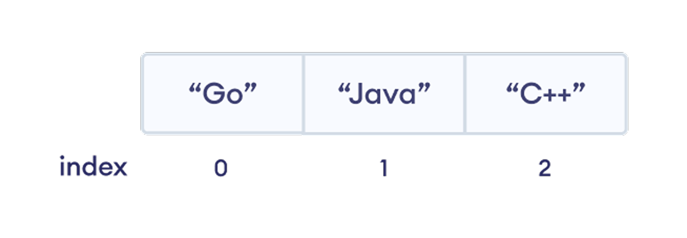
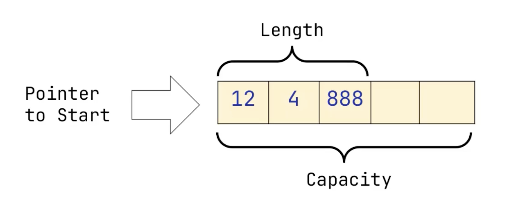
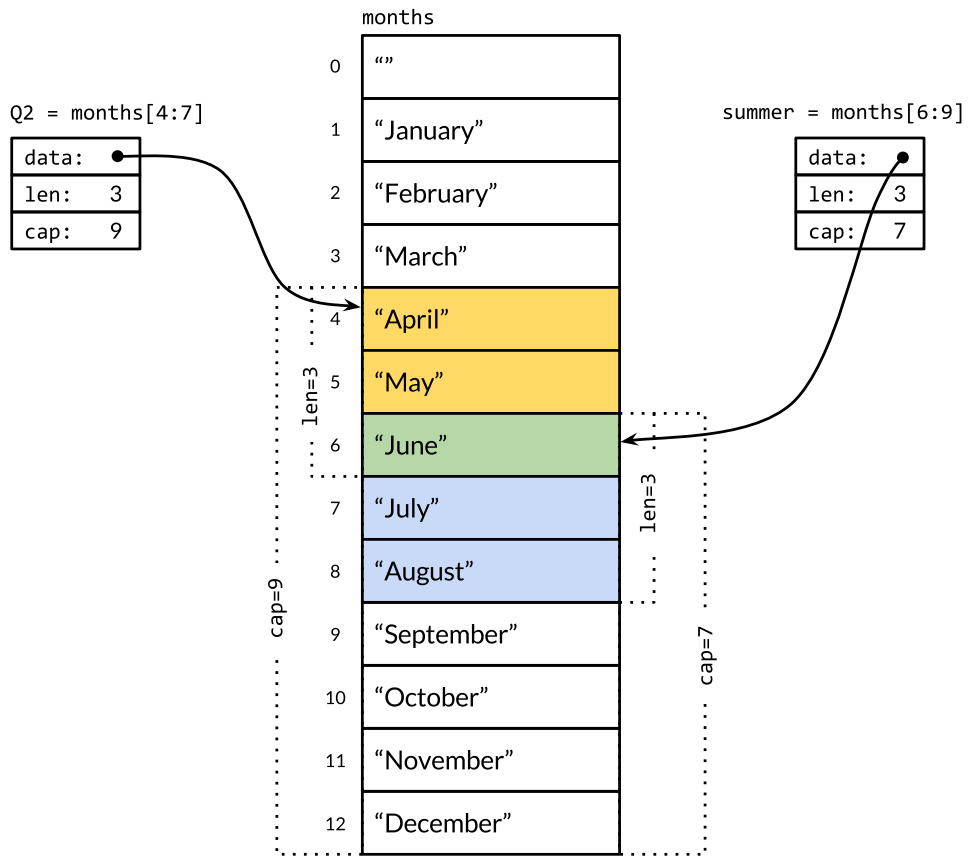

# Лекция: Массивы и слайсы в Go

## Зачем нужны коллекции данных?

Представьте, что вы пишете программу для учёта студентов в группе. У вас 30 студентов, и для каждого нужно хранить имя. Можно создать 30 отдельных переменных:

```go
student1 := "Алексей"
student2 := "Мария"
student3 := "Дмитрий"
// ... ещё 27 переменных
```

Но что если студентов станет 100? Или 1000? А что если нужно найти конкретного студента или вывести всех по алфавиту? Работать с отдельными переменными станет невозможно.



Для таких случаев в программировании существуют **коллекции** - структуры данных, которые позволяют хранить множество значений в одной переменной. В Go для упорядоченных данных используют два базовых типа: **массивы** и **слайсы**. В русском сообществе для последнего встречаются оба названия - «срез» (перевод от англ. _slice_) и «слайс»; в рамках курса мы будем использовать «слайс», потому что это слово лучше прижилось среди разработчиков.

---

## Массивы: фундамент для понимания

**Массив** в Go - это контейнер фиксированного размера, который хранит элементы одного типа в последовательной области памяти. Размер массива задаётся при создании и не меняется.

### Ключевая особенность: размер — часть типа

В отличие от многих других языков, в Go размер массива является частью его типа. Это означает, что `[3]int` и `[5]int` - это **разные типы**!

```go
var numbers3 [3]int  // Массив из 3 целых чисел
var numbers5 [5]int  // Массив из 5 целых чисел

// numbers3 = numbers5 // Ошибка компиляции: разные типы
```

### Создание массивов

Для создания массива в Go есть несколько способов. Начнём с самого простого - объявления пустого массива (массива без указания начальных значений).

#### Объявление пустого массива

Когда мы объявляем массив без указания начальных значений, Go автоматически заполняет его нулевыми значениями соответствующего типа:

```go
var temperatures [7]float64  // 7 температур на неделю
var scores [5]int           // 5 оценок студента

fmt.Println(temperatures)   // [0 0 0 0 0 0 0] - нулевые значения для float64
fmt.Println(scores)         // [0 0 0 0 0] - нулевые значения для int
```

Что происходит: создаются массивы нужной длины, каждый элемент инициализируется значением по умолчанию (к примеру это `0` для числовых типов, `""` для строк, `false` для `bool`).


#### Инициализация массива со значениями

Часто мы заранее знаем, какие значения должны быть в массиве. В этом случае можно инициализировать массив сразу при создании:

```go
// Все значения сразу
weekdays := [7]string{
    "Понедельник", "Вторник", "Среда", "Четверг",
    "Пятница", "Суббота", "Воскресенье",
}

// Частичная инициализация значений
grades := [5]int{95, 87, 92} // [95 87 92 0 0] - остальные нули

// Автоматическое определение длины массива
months := [...]string{
    "Январь", "Февраль", "Март", "Апрель",
    "Май", "Июнь", "Июль", "Август",
    "Сентябрь", "Октябрь", "Ноябрь", "Декабрь",
}
```

Встроенная функция `len()` возвращает длину значения. Она работает для строк, массивов и слайсов. Для массива длина всегда фиксирована и равна размеру, указанному при объявлении:

```go
fmt.Println("Месяцев:", len(months)) // 12
```

Обратите внимание на `[...]` - такая запись говорят компилятору: "определи длину по числу элементов". Это удобно, когда не хочется вручную подсчитывать кол-во элементов при инициализации массива со значениями.

### Работа с элементами массива

Создать массив - лишь первый шаг; важно уметь читать и изменять его элементы.

Доступ к элементам осуществляется по **индексу**, начиная с `0`:

```go
cities := [3]string{"Москва", "СПб", "Казань"}

fmt.Println("Первый город:", cities[0]) // Москва
fmt.Println("Второй город:", cities[1]) // СПб
fmt.Println("Третий город:", cities[2]) // Казань

// Изменение элемента
cities[1] = "Санкт-Петербург"
fmt.Println(cities) // [Москва Санкт-Петербург Казань]
```

> [!NOTE]
> **Важно**
> 
> Индекс должен быть в диапазоне `[0, len(cities)-1]`.
> Обращение вне диапазона вызовет панику во время выполнения программы:
> ```go
> n := 5
> fmt.Println(cities[n]) // panic: runtime error: index out of range [5] with length 3
> ```
> **Интересный факт**
>
> Компилятор Go попытается предотвратить явные ошибки: если индекс получаемого элемента в массиве - константа, а длина массива известна на этапе компиляции, код не скомпилируется:
> ```go
> fmt.Println(cities[5]) // invalid argument: index 5 out of bounds [0:3]
> ```


### Итерация по массиву

Когда нужно обработать все элементы массива по очереди, мы используем циклы. В Go есть два основных способа пройтись по массиву.

#### Цикл по количеству элементов

Классический подход - используем счётчик и обращаемся к элементам по индексу:

```go
prices := [4]float64{19.99, 25.50, 12.30, 45.00}

for i := 0; i < len(prices); i++ {
    fmt.Printf("Товар %d стоит %.2f руб.\n", i+1, prices[i])
}
```

В таком цикле индекс можно задавать самостоятельно, и привязываться к длине конкретного массива вовсе не обязательно: например, если потребуется на каждой итерации брать значение по индексу из трёх массивов одинаковой длины.

#### Цикл for-range (рекомендуемый)

Более идиоматичный способ в Go - использовать конструкцию оператора `for` вместе с оператором `range`. Она автоматически проходит по всем элементам и может возвращать как индекс, так и значение:

```go
fruits := [4]string{"яблоко", "банан", "апельсин", "груша"}

// С индексом и значением
for index, fruit := range fruits {
    fmt.Printf("%d. %s\n", index+1, fruit)
}

// Только значения (если индекс не нужен)
for _, fruit := range fruits {
    fmt.Println("Фрукт:", fruit)
}

// Только индексы (если значение не нужно)
for index := range fruits {
    fmt.Printf("Индекс %d\n", index)
}
```

Символ `_` - это "пустой идентификатор", который сообщает компилятору, что требуется игнорировать значение.

Важно также знать про следующие тонкости:
- `range` по массиву создаёт копию массива для цикла. Если массив большой, для эффективного потребления памяти из массива возвращают срез и итерируются по нему: `for index, fruit := range fruits[:]`. Объяснение почему так происходит раскрывается в следующей секции.
- На каждой итерации значение (в нашем примере переменная `fruit`) является копией элемента. По этой причине для эффективности может потребоваться опускать использование значения в конструкции `for-range` для избежания копирования и получать значение элемента по индексу.

---

## Критически важная особенность массивов

### Массивы — передаются по значению!

> **Для тех, кто пришёл из Python:** в программировании принято различать две модели работы с данными - **по значению** и **по указателю**. При работе **по значению** данные полностью копируются, в то время как при работе **по указателю** мы обращаемся к исходным данным через их адрес в памяти. Подробнее с этими концепции мы познакомимся на будущих лекциях, а пока важно запомнить: массивы в Go **всегда** копируются целиком - через передачу _по значению_.
> **Для тех, кто пришёл из C++:** в Go нет концепции ссылок, только указатели. При этом такой тип как слайс (о них будет дальше) является ссылочным типом, который фактически работает со ссылкой на внутреннюю память, однако происходит это без нашего ведома.

Эти концепции - одни из ключевых в Go и часто удивляют разработчиков, пришедших из разных языков.

```go
package main

import "fmt"

func main() {
	original := [3]int{10, 20, 30}
	copy := original // Полное копирование всех элементов!

	// Изменяем копию
	copy[0] = 999

	fmt.Println("Оригинал:", original) // [10 20 30] - не изменился!
	fmt.Println("Копия:   ", copy)     // [999 20 30] - изменилась
}
```

**Что происходит:** при присваивании `copy := original` Go создаёт **полную копию** всех элементов массива. Это не указатель на тот же массив!

### Передача массивов в функции

Когда мы передаём массив в функцию, важно понимать, что происходит с данными.

При стандартной передаче массива в функцию, весь массив будет скопирован:

```go
func modifyByValue(arr [3]int) {
	arr[0] = 999 // Изменяется только локальная копия

	fmt.Println("Внутри функции:", arr) // [999 20 30]
}

func main() {
	numbers := [3]int{10, 20, 30}

	modifyByValue(numbers)
	fmt.Println("После функции:", numbers) // [10 20 30] - не изменился
}
```

Чтобы изменить исходный массив, передают указатель на массив:

```go
func modifyByPointer(arr *[3]int) {
	(*arr)[0] = 999 // Изменяется оригинальный массив

	fmt.Println("Внутри функции:", *arr) // [999 20 30]
}

func main() {
	numbers := [3]int{10, 20, 30}

	modifyByPointer(&numbers)
	fmt.Println("После указателя:", numbers) // [999 20 30] - изменился!
}
```

В примере выше в параметре функции использовался указатель на массив: символ `*` в объявлении параметра означает «указатель» - специальную переменную, которая хранит адрес другой переменной в памяти (как почтовый адрес дома). А символ `&` используется, чтобы получить адрес переменной («узнать адрес дома»). Указатели мы изучим подробно на будущих лекциях; а пока достаточно знать, что они позволяют работать с оригинальными данными, а не с их копиями.

<details>
<summary><strong>Почему так сделано в Go?</strong></summary>

Такое поведение обеспечивает **предсказуемость** и **безопасность**:
- Нет неожиданных изменений (побочных эффектов) данных
- Проще понять, что происходит с переменными
- Меньше ошибок, связанных с разделяемым состоянием

Но есть и недостаток: копирование больших массивов может быть дорогой операцией.
</details>

---

## Многомерные массивы

Go позволяет создавать массивы массивов - многомерные структуры данных.

### Двумерные массивы

Иногда данные удобно организовать в виде таблицы (строки × столбцы):

```go
// Матрица 3x3
table := [3][3]int{
    {1, 2, 3},
    {4, 5, 6},
    {7, 8, 9},
}

fmt.Println("Матрица 3×3:")
for _, row := range table {
    for _, value := range row {
        fmt.Printf("%2d ", value)
    }
    fmt.Println()
}
```

Здесь `[3][3]int` означает «массив из 3 элементов, каждый из которых является массивом из 3 целых чисел».

**Вывод:**
```
Матрица 3×3:
 1  2  3 
 4  5  6 
 7  8  9 
```

### Инициализация в циклах

Когда нужно заполнить многомерный массив по определённому правилу, удобно использовать вложенные циклы:

```go
// Создание и заполнение матрицы 4×4
var matrix [4][4]int

counter := 1
for row := range len(matrix) {
    for col := range len(matrix[row]) {
        matrix[row][col] = counter
        counter++
    }
}

fmt.Println("Матрица:", matrix)
// Матрица: [[1 2 3 4] [5 6 7 8] [9 10 11 12] [13 14 15 16]]
```

Такой способ удобен для инициализации матрицы: можно заполнять её последовательными числами, значениями по формуле или любыми другими данными, зависящими от индексов.

---

## Ограничения массивов и переход к слайсам

### Проблемы практического применения массивов

- **Фиксированный размер**: после объявления массива изменить его размер нельзя
- **Размер - часть типа**: `[10]int` и `[20]int` несовместимы
- **Копирование при передаче**: дорого для больших массивов

```go
func processNumbers(numbers [100]int) { // Что если нужно 200 чисел?
    // обработка 100 чисел
}

func processMoreNumbers(numbers [200]int) { // Другая функция!
    // обработка 200 чисел
}

// Нужно две разные функции для разных размеров массивов!
```

Именно поэтому массивы в Go редко находят практическое применение в чистом виде, и вместо них почти всегда используют **слайсы**.

---

## Слайсы: гибкая альтернатива массивам

**Слайс** - это как массив, но с динамическим размером. Если массив имеет фиксированное количество элементов, то слайс может расти и уменьшаться во время выполнения программы. Представьте массив как железнодорожный состав с фиксированным числом вагонов, а слайс - как резиновую ленту, которая может растягиваться и сжиматься по мере необходимости.



### Создание слайсов

Есть несколько способов создания слайса.

#### Неинициализированный слайс (нулевое значение)

Данный способ объявляет слайс без инициализации его значения: 

```go
var numbers []int  // пустой слайс целых чисел
var names []string // пустой слайс строк
```

Такой слайс пока не содержит элементов, но мы сможем добавить их по мере необходимости.

**Важно**: слайсы, объявленные таким образом, будут неинициализированными и иметь значение `nil`. К этой особенности мы ещё вернёмся.

#### Литералы слайсов

Если элементы слайса известны заранее, его удобно создать с помощью литерала. Синтаксис похож на инициализацию массива, только в квадратных скобках размер не указывается:

```go
cities := []string{"Москва", "СПб", "Казань"}
prices := []float64{19.99, 25.50, 12.30}

fmt.Println("Города:", cities) // [Москва СПб Казань]
fmt.Println("Цены:", prices)   // [19.99 25.5 12.3]
```

Создать по-настоящему пустой слайс можно так:

```go
empty := []int{}
```

Различие неинициализированного и пустого слайсов упоминается далее в лонгриде.

### Обращение к элементам слайса

Как и в массивах, мы можем обращаться к элементам слайса по индексу и изменять их:

```go
fruits := []string{"яблоко", "банан", "груша"}

fmt.Println("Первый фрукт:", fruits[0]) // яблоко
fmt.Println("Второй фрукт:", fruits[1]) // банан

// Изменяем элемент
fruits[1] = "апельсин"
fmt.Println("Изменили:", fruits) // [яблоко апельсин груша]

// Итерация по слайсу
for i, fruit := range fruits {
    fmt.Printf("%d: %s\n", i, fruit)
}
```

### Функция append — добавление элементов

Главное преимущество слайсов - возможность динамического изменения размера для добавления новых элементов. Для этого используется встроенная функция `append`:

```go
var shopping []string
fmt.Println("Список покупок:", shopping) // []

shopping = append(shopping, "хлеб")
fmt.Println("Добавили хлеб:", shopping) // [хлеб]

shopping = append(shopping, "молоко", "яйца")
fmt.Println("Добавили еще:", shopping) // [хлеб молоко яйца]
```

Функция `append` принимает первым аргументом исходный слайс, а далее - произвольное количество элементов для добавления (вариадический параметр).

**Важно:** `append` возвращает слайс - поэтому результат нужно присваивать обратно переменной! Почему эта функция так себя ведёт узнаете далее в лонгриде.

---

## Устройство слайса под капотом

Теперь давайте посмотрим, что представляет собой слайс изнутри. Понимание внутреннего устройства поможет эффективно работать со слайсами.

### Внутренняя структура слайса

Слайс - это небольшая структура данных из трёх полей:

1. **Указатель** - адрес в памяти, указывающий на первый элемент базового массива
2. **Длина** (length) - текущее количество элементов в слайсе, то есть его «видимая» часть
3. **Ёмкость** (capacity) - сколько элементов можно разместить от начала слайса до конца базового массива

```go
// Упрощенная концепция представления слайса выглядит так:
type slice struct {
    ptr *Element // указатель на первый элемент
    len int      // длина
    cap int      // ёмкость
}
```

### Что такое длина и ёмкость?

**Длина** (**len**gth) - это количество элементов, которые сейчас находятся в слайсе. Получается функцией `len()`.

**Ёмкость** (**cap**acity) - это максимальное количество элементов, которое может поместиться в базовый массив от начала слайса до конца массива. Получается функцией `cap()`.

Давайте посмотрим на примере:

```go
fruits := []string{"яблоко", "банан", "груша"}

fmt.Println("Длина слайса:", len(fruits))  // 3
fmt.Println("Ёмкость слайса:", cap(fruits)) // 3
```

Длина показывает текущее количество элементов в слайсе, а ёмкость - максимальное число элементов, которое он может вместить до выделения нового базового массива большей длины.

### Продвинутое создание слайсов с make

Теперь, когда мы понимаем концепцию длины и ёмкости, рассмотрим функцию `make` - продвинутый способ создания слайсов:

```go
// make([]T, length) - создать слайс с заданной длиной
numbers := make([]int, 5) // [0 0 0 0 0], len=5, cap=5

// make([]T, length, capacity) - создать слайс с заданной длиной и ёмкостью
buffer := make([]int, 0, 10) // [], len=0, cap=10

fmt.Printf("numbers: len=%d, cap=%d, %v\n", len(numbers), cap(numbers), numbers)
// numbers: len=5, cap=5, [0 0 0 0 0]
fmt.Printf("buffer: len=%d, cap=%d, %v\n", len(buffer), cap(buffer), buffer)
// buffer: len=0, cap=10, []
```

Первый вариант создаёт слайс с 5 нулевыми элементами, готовый к использованию. Второй вариант создаёт пустой слайс (длиной 0), но резервирует место для 10 элементов (ёмкость 10) - это помогает избежать перевыделения памяти при добавлении элементов.

### Создание слайсов из массивов (реслайс)

Один из самых интересных способов - создание слайсов из существующих массивов или других слайсов с помощью операции «среза» или «реслайса»:



В данном примере мы специально добавили первым элементом пустую строку, чтобы индекс внутри слайса соответствовал порядковому номеру месяца в году и было проще ориентироваться.

```go
months := [12 + 1]string{
    "", "January", "February", "March", "April", "May", "June",
    "July", "August", "September", "October", "November", "December",
}

var (
    allMonths  = months[:]       // Все элементы
    firstHalf  = months[1 : 6+1] // Первые 6 месяцев года
    secondHalf = months[7:]      // Последние 6 месяцев года
    summer     = months[6 : 8+1] // Июнь, июль, август
)
fmt.Println("Лето:", summer)   // [June July August]
fmt.Println("Первая половина:", firstHalf) // [January February Match April May June]
```

Синтаксис среза `[start:end]` означает "взять элементы начиная с индекса `start` до индекса `end`, не включая `end`". Если `start` опущен - берём с начала, если `end` опущен - до конца.

**Важно:** все эти слайсы ссылаются на **один и тот же** базовый массив!

```go
summer[0] = "ИЮНЬ"                              // Изменяем слайс
fmt.Println("Исходный массив:", months[6])      // ИЮНЬ - массив изменился!
fmt.Println("Первая половина:", firstHalf[6-1]) // ИЮНЬ - и тут изменилось!
```

Это показывает, что если изменить элемент через один слайс, то это сразу повлияет на базовый массив и станет видно во всех остальных слайсах! Такое поведение называется «ссылочной семантикой» - слайс лишь указывает на данные в памяти, а не копирует их.

В этом же примере мы можем наглядно наблюдать как работает capacity - это длина от первого элемента слайса до конца базового массива внутри слайса.

---

## Функция append в деталях

Теперь, понимая устройство слайсов, давайте подробнее разберём, как работает функция `append` и как она взаимодействует с ёмкостью.

### Как работает append с capacity?

Чтобы эффективно использовать слайсы, полезно понимать механизм работы `append`. Проследим, что происходит при каждом добавлении элемента:

```go
func demonstrateAppend() {
    s := make([]int, 0, 2) // len=0, cap=2
    fmt.Printf("Начало: len=%d, cap=%d, %v\n", len(s), cap(s), s)

    s = append(s, 1) // Помещается в существующий массив
    fmt.Printf("+ 1:   len=%d, cap=%d, %v\n", len(s), cap(s), s)

    s = append(s, 2) // Ещё помещается
    fmt.Printf("+ 2:   len=%d, cap=%d, %v\n", len(s), cap(s), s)

    s = append(s, 3) // Capacity исчерпана! Нужен новый массив
    fmt.Printf("+ 3:   len=%d, cap=%d, %v\n", len(s), cap(s), s)
    // Вывод: len=3, cap=4 (capacity удвоилась!)
}
```

**Что происходит внутри:**
1. Если в базовом массиве есть свободное место (`len < cap`) - увеличивается длина слайса, новый элемент записывается в тот же массив.
2. Если места нет (`len == cap`) - создаётся новый массив (обычно в 2 раза больше предыдущего), туда копируются старые элементы и добавляется новый.

Это объясняет, почему `cap` иногда «прыгает» - Go заранее выделяет больше места, чтобы последующие операции `append` были эффективней. Именно из-за возможного выделения функцией `append` нового базового массива возвращаемый слайс требуется переприсваивать переменной.

<details>
<summary><strong>Стратегия роста capacity</strong></summary>

Для маленьких слайсов стратегия роста `cap` часто ~ `×2`, однако для больших она будет меньше. Точная стратегия роста - деталь реализации рантайма и может отличаться между версиями Go.

```go
func showGrowth() {
	var s []int
	for i := range 10 {
		prevCap := cap(s)
		s = append(s, i)
		if cap(s) != prevCap {
			fmt.Printf("Добавили %d: len=%d, cap=%d (было %d)\n",
				i, len(s), cap(s), prevCap)
		}
	}
}
// Вывод:
// Добавили 0: len=1, cap=1 (было 0)
// Добавили 1: len=2, cap=2 (было 1)
// Добавили 2: len=3, cap=4 (было 2)
// Добавили 4: len=5, cap=8 (было 4)
// Добавили 8: len=9, cap=16 (было 8)
```
</details>

### Копирование слайсов

Иногда нужно создать независимую копию слайса, чтобы изменения в одном не повлияли на другой. Помните, как мы видели, что слайсы ссылаются на один базовый массив? Чтобы этого избежать, используется встроенная функция `copy`:

```go
func copyExample() {
    original := []string{"a", "b", "c", "d", "e"}

    // Создаём слайс-получатель нужного размера
    destination := make([]string, len(original))

    // Копируем элементы
    n := copy(destination, original)
    fmt.Printf("Скопировано %d элементов\n", n) // 5

    // Изменяем копию - оригинал не изменится
    destination[0] = "MODIFIED"

    fmt.Println("Оригинал:", original)     // [a b c d e]
    fmt.Println("Копия:   ", destination)  // [MODIFIED b c d e]
}
```

Функция `copy` безопасно копирует `min(len(src), len(dst))` элементов. Это значит, что она скопирует столько элементов, сколько поместится в слайс-получатель.

### Удаление элементов из слайса

В Go нет встроенной функции для удаления элементов из слайса, но мы можем «склеить» части слайса до и после удаляемого элемента с помощью `append`:

```go
func removeElement(slice []string, index int) []string {
    // Объединяем части до и после удаляемого элемента
    return append(slice[:index], slice[index+1:]...)
}

func main() {
    fruits := []string{"яблоко", "банан", "апельсин", "груша", "киви"}
    fmt.Println("До удаления:", fruits)

    // Удаляем элемент с индексом 2 (апельсин)
    fruits = removeElement(fruits, 2)
    fmt.Println("После удаления:", fruits) // [яблоко банан груша киви]
}
```

Что происходит в функции `removeElement`:
1. `slice[:index]` — все элементы до удаляемого
2. `slice[index+1:]` — все элементы после удаляемого
3. `append` склеивает эти две части

Оператор `...` в данном случае распаковывает слайс в вариадический параметр.

---

## Практические примеры

Теперь, когда мы изучили основы работы со слайсами, посмотрим на реальные задачи, которые часто возникают при работе с ними.

### Фильтрация слайса

Одна из частых задач - отфильтровать элементы слайса по некоторому условию. Например, оставить только положительные числа.

```go
func filterPositive(numbers []int) []int {
    result := make([]int, 0, len(numbers)) // Резервируем максимум элементов (оптимально для случая "все положительные")

    for _, num := range numbers {
        if num > 0 {
            result = append(result, num)
        }
    }

    return result
}

func main() {
    numbers := []int{-3, 5, -1, 0, 8, -7, 2}
    positive := filterPositive(numbers)
    fmt.Println("Положительные:", positive) // [5 8 2]
}
```

В функции `filterPositive` мы создаём новый слайс и добавляем в него только те элементы, которые проходят проверку. Использование `make([]int, 0, len(numbers))` - это оптимизация: мы заранее резервируем место для возможного случая, когда все числа окажутся положительными, чтобы избежать лишних реаллокаций при `append`.

### Поиск в слайсе

Ещё одна частая задача - найти элемент в слайсе или определить его индекс:

```go
func contains(slice []string, item string) bool {
	for _, v := range slice {
		if v == item {
			return true
		}
	}
	return false
}

func findIndex(slice []string, item string) int {
	for i, v := range slice {
		if v == item {
			return i
		}
	}
	return -1 // Не найдено
}

func main() {
	cities := []string{"Москва", "СПб", "Казань", "Новосибирск"}

	fmt.Println(contains(cities, "Казань")) // true
	fmt.Println(findIndex(cities, "СПб"))   // 1
	fmt.Println(findIndex(cities, "Уфа"))   // -1
}
```

Функция `contains` возвращает `true`, если элемент найден, в противном случае `false`. Функция `findIndex` возвращает индекс элемента в слайсе или `-1`, если элемент не найден (это стандартная конвенция в программировании).

### Многомерные слайсы

Как и массивы, слайсы могут быть многомерными. Это полезно для создания матриц, таблиц и других двумерных и более структур данных:

```go
func createMatrix(rows, cols int) [][]int {
    matrix := make([][]int, rows)

    for i := range matrix {
        matrix[i] = make([]int, cols)
    }

    return matrix
}

func main() {
    rows, cols := 3, 4

    // Создаём матрицу 3x4
    matrix := createMatrix(rows, cols)

    // Заполняем числами
    counter := 1
    for i := range rows {
        for j := range cols {
            matrix[i][j] = counter
            counter++
        }
    }

    // Выводим строки матрицы
    for _, row := range matrix {
        fmt.Println(row)
    }
    // [1 2 3 4]
    // [5 6 7 8]
    // [9 10 11 12]
}
```

Важно понимать, что `[][]int` — это слайс слайсов. Каждая "строка" матрицы - это отдельный слайс, который может иметь разную длину. В отличие от массивов, где все строки имеют одинаковую длину, слайсы позволяют создавать "неровные" матрицы.

---

## Пакет slices (Go 1.21+)

С выходом Go `1.21` появился стандартный пакет `slices`, который содержит множество полезных функций для работы со слайсами. Теперь не нужно писать многие алгоритмы самостоятельно:

```go
import "slices"

func slicesPackageDemonstration() {
	numbers := []int{3, 1, 4, 1, 5, 9, 2, 6}

	// Сортировка (для упорядочиваемых типов)
	sorted := slices.Clone(numbers) // Для копии слайса
	slices.Sort(sorted)
	fmt.Println("Отсортировано:", sorted) // [1 1 2 3 4 5 6 9]

	// Поиск элемента
	fmt.Println("Есть ли 5:", slices.Contains(numbers, 5)) // true

	// Максимальный элемент
	fmt.Println("Максимум:", slices.Max(numbers)) // 9

	// Удаление дубликатов (требуется отсортированный слайс)
	numbers = slices.Compact(sorted)
	fmt.Println("Без дубликатов:", numbers) // [1 2 3 4 5 6 9]

	// Развернуть слайс
	slices.Reverse(numbers)
	fmt.Println("Развернутый:", numbers) // [9 6 5 4 3 2 1]

	// Вставка элементов по индексу 1
	numbers = slices.Insert(numbers, 1, 100, 200)
	fmt.Println("После вставки:", numbers) // [9 100 200 6 5 4 3 2 1]
	// Удаление диапазона [2:4)
	numbers = slices.Delete(numbers, 2, 4)
	fmt.Println("После удаления:", numbers) // [9 100 5 4 3 2 1]

	// Бинарный поиск (требуется отсортированный слайс)
	slices.Sort(sorted)
	i, found := slices.BinarySearch(sorted, 5)
	fmt.Println("Бинарный поиск 5:", i, found) // 5 true
}
```

---

Этот пакет значительно упрощает работу со слайсами и делает код более читаемым. До появления этого пакета разработчикам приходилось реализовывать эти функции самостоятельно.

## Рекомендации и best practices

### Производительность

Понимание того, как работают слайсы изнутри, поможет писать более эффективный код.

1. **Предварительно выделяйте память**, если знаете примерный размер:

    Каждый раз, когда `append` превышает `cap`, создаётся новый массив и копируются данные - это дорогая операция.

    ```go
    // Плохо - много перевыделений памяти
    var result []int
    for i := range 1000 {
        result = append(result, i)
    }

    // Хорошо - одно выделение памяти
    result := make([]int, 0, 1000)
    for i := range 1000 {
        result = append(result, i)
    }
    ```

2. **Для больших данных используйте указатели** вместо копирования:

    Когда элементы слайса - это большие структуры, эффективней хранить в слайсе указатели:
    ```go
    type LargeStruct struct {
        data [1000]int
    }

    // Плохо - копирование каждой структуры в слайсе
    func processBad(items []LargeStruct) {}

    // Хорошо - передача указателей
    func processGood(items []*LargeStruct) {}
    ```

### Безопасность

При работе со слайсами важно помнить о возможных ошибках во время выполнения программы.

1. **Проверяйте границы** при работе с индексами:

    Go автоматически вызывает панику при выходе за границы массивов и слайсов, поэтому чтобы лишний раз не "паниковать" проверяйте границы где есть возможность выйти за границы:
    ```go
    func safeGet(slice []int, index int) (int, bool) {
        if index < 0 || index >= len(slice) {
            return 0, false
        }
        return slice[index], true
    }
    ```

2. **Проверяйте на nil** перед использованием:

    Неинициализированный слайс равен `nil` (имеет нулевое значение), и обращение к его элементам вызовет панику. В то же время итерирование по такому слайсу с помощью оператора `range` - безопасно.

    ```go
    func processSlice(data []int) {
        if data == nil {
            return
        }
        
        // Безопасная обработка
    }
    ```

    > **Справка:** `nil` - специальное нулевое значение для _ссылочных типов_. Оно означает «ничего» или «пустой указатель». Можно думать о `nil` как о «несуществующем значении». Концепцию `nil` мы подробно изучим в будущих лекциях про указатели и интерфейсы. Слайс со значением `nil` имеет `len` и `cap` равные `0`. Такой слайс также может быть передан в функцию `append`.

## Заключение

В этой лекции мы подробно изучили две фундаментальные структуры данных Go - **массивы** и **слайсы**.
