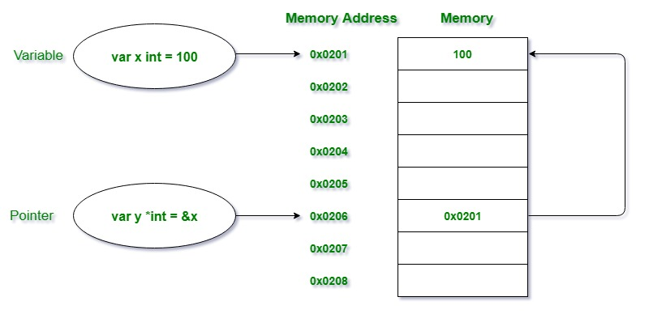
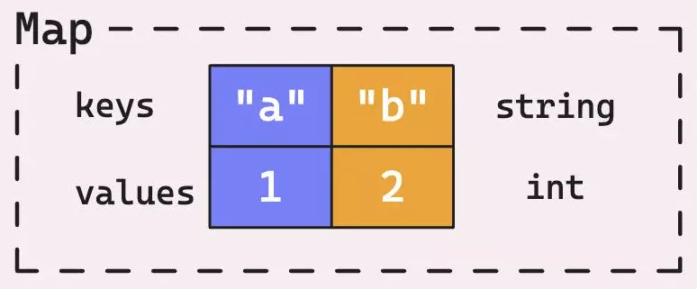

# Лекция: Указатели и мапы в Go

## Зачем нужны указатели?

Представьте ситуацию: вы пишете функцию для увеличения числа на единицу. Казалось бы, всё просто:

```go
func increment(x int) {
    x++
    fmt.Println("Внутри функции:", x) // 11
}

func main() {
    number := 10
    increment(number)
    fmt.Println("В main:", number) // 10 - не изменилось!
}
```

Число внутри функции увеличилось, но оригинальная переменная осталась неизмененной. Почему? Потому что в Go все параметры передаются **по значению** — функция получает копию данных, а не сами данные.

Но что если нам нужно изменить оригинальную переменную? Что если у нас большая структура данных, и копирование её при каждом вызове функции съедает всю память? Именно для решения этих проблем в программировании существуют **указатели**.



---

## Указатели: работа с адресами памяти

**Указатель** — это переменная, которая хранит не значение, а **адрес в памяти**, где это значение находится. Можно думать об указателе как о "почтовом адресе" — он говорит нам, где найти нужные данные, но сам данными не является.

### Основные операторы для работы с указателями

В Go есть два ключевых оператора для работы с указателями:

**Оператор `&` — получение адреса**
```go
number := 42
address := &number                   // получаем адрес переменной number
fmt.Printf("Значение: %d\n", number) // 42
fmt.Printf("Адрес: %p\n", address)   // 0xc000010098 (пример)
```

**Оператор `*` — разыменование (получение значения по адресу)**
```go
number := 42
ptr := &number      // ptr содержит адрес number
value := *ptr       // получаем значение по адресу
fmt.Println(value)  // 42

*ptr = 100          // изменяем значение по адресу
fmt.Println(number) // 100 - оригинальная переменная изменилась!
```

### Объявление указателей

Для объявления указателя используется символ `*` перед типом:

```go
var ptr *int        // указатель на int
var strPtr *string  // указатель на string
var boolPtr *bool   // указатель на bool

fmt.Println(ptr)    // <nil> - указатель не инициализирован
```

Неинициализированный указатель имеет значение `nil` — это означает, что он не указывает ни на какой адрес в памяти.

> [!IMPORTANT]
> Разыменование `nil` указателя вызывает панику, так как мы пытаемся получить значение из участка памяти, который не существует!
> ```go
> var ptr *int
> fmt.Println(*ptr) // panic: runtime error: invalid memory address or nil pointer dereference
> ```

### Создание указателей с помощью new

Функция `new()` создаёт переменную в памяти, инициализирует её нулевым значением и возвращает указатель на неё:

```go
type Person struct{
    Name string
    Age int
}

func main() {
    // Создание указателя на int с помощью new
    ptr := new(int)
    fmt.Println(*ptr) // 0 (нулевое значение для int)
    
    *ptr = 42
    fmt.Println(*ptr) // 42
    
    // Создание указателя на структуру
    personPtr := new(Person)
    personPtr.Name = "Мария"
    personPtr.Age = 30
    
    fmt.Printf("%+v\n", *personPtr) // {Name:Мария Age:30}
}
```

### Практический пример: исправляем функцию increment

Теперь мы можем исправить нашу функцию, чтобы она изменяла оригинальную переменную:

```go
func increment(x *int) {  // принимаем указатель на int
    *x++                  // увеличиваем значение по адресу
    fmt.Println("Внутри функции:", *x) // 11
}

func main() {
    number := 10
    increment(&number)    // передаём адрес переменной
    fmt.Println("В main:", number) // 11 - изменилось!
}
```

**Что происходит:**
1. `&number` получает адрес переменной `number`
2. Функция `increment` получает этот адрес в параметр `x`
3. `*x++` изменяет значение по адресу
4. Поскольку адрес указывает на оригинальную переменную, она изменяется

---

## Указатели на слайсы и их особенности

Помните, что слайсы уже содержат указатель на базовый массив? Это означает, что поведение слайсов с указателями может быть неожиданным:

```go
func modifySlice(s []int) {
    s[0] = 999  // изменяет оригинальный слайс
}

func appendToSlice(s []int) {
    s = append(s, 100)  // не изменит оригинальный слайс!
}

func appendToSlicePtr(s *[]int) {
    *s = append(*s, 100)  // гарантированно изменит оригинальный слайс
}

func main() {
    numbers := []int{1, 2, 3}
    
    modifySlice(numbers)
    fmt.Println("После изменения:", numbers) // [999 2 3]
    
    appendToSlice(numbers)
    fmt.Println("После append:", numbers)    // [999 2 3] - не изменился!
    
    appendToSlicePtr(&numbers)
    fmt.Println("После append ptr:", numbers) // [999 2 3 100]
}
```

**Почему так происходит?**

Функция `append` всегда возвращает новое значение слайса (который как мы обсудили на прошлой неделе является лишь "заголовком", указывающим на базовый массив), из-за этого новый заголовок может указывать на новый базовый массив при нехватке `capacity` (что и происходит в примере выше). Однако функция получила лишь копию заголовка слайса и не может обновить оригинальный слайс. Даже если бы нам хватило `capacity` исходного слайса, `length` оригинального слайса не была бы обновлена - таким образом, исходный слайс всё равно остался точно таким же (несмотря на то, что в его базовом массиве был бы добавлен новый элемент).

---

## Мапы в Go

Теперь, когда мы понимаем указатели, перейдём к ещё одному важному встроенному составному типу Go — **мапам** (maps).

Представьте, что вы хотите создать телефонную книгу. Массив или слайс не подходят, потому что вам нужно искать номер телефона по имени, а не по числовому индексу. Для такой задачи подойдут **мапы** — структуры данных, которые позволяют связывать **ключи** с **значениями**.



**Мапа** в Go — это ассоциативный массив пар "ключ-значение", где каждый ключ уникален и связан с определённым значением. Это как телефонная книжка, где номер (ключ) связан с определённым абонентом (значением).

### Создание и инициализация мап

**Объявление пустой мапы:**
```go
var phoneBook map[string]string // объявление неинициализированной мапы с ключами типа string и значениями типа string
fmt.Println(phoneBook)          // map[] (в fmt.Println отображается как пустая мапа)
fmt.Printf("%#v\n", phoneBook)  // map[string]string(nil)
fmt.Println(phoneBook == nil)   // true - неинициализированная мапа равна nil
```

> [!IMPORTANT]
> В неинициализированную мапу нельзя записывать данные, это вызовет панику!
> Однако читать из такой мапы можно - возвращаться будут нулевые значения.

**Инициализация с помощью make:**

Функция `make` объявляет и инициализирует пустую мапу. В отличие от неинициализированной мапы, в неё можно записывать данные:

```go
phoneBook := make(map[string]string)
phoneBook["Алексей"] = "+7-900-123-45-67"
phoneBook["Мария"] = "+7-900-765-43-21"
fmt.Println(phoneBook) // map[Алексей:+7-900-123-45-67 Мария:+7-900-765-43-21]
```

**Инициализация с начальными значениями:**

Самый удобный способ — создать мапу сразу с данными. Это компактнее и нагляднее, чем последовательные вызовы `make` и присваиваний:

```go
scores := map[string]int{
    "Математика": 95,
    "Физика":     87,
    "Химия":      92,
}
fmt.Println(scores) // map[Математика:95 Физика:87 Химия:92]
```

### Основные операции с мапами

**Добавление и изменение элементов:**

Синтаксис добавления и изменения элементов в мапе одинаков. Go автоматически определяет, существует ли ключ:

```go
ages := make(map[string]int)
ages["Анна"] = 25      // добавление нового ключа
ages["Борис"] = 30     // добавление ещё одного ключа
ages["Анна"] = 26      // изменение существующего значения

fmt.Println(ages)      // map[Анна:26 Борис:30]
```

**Получение значений:**

При чтении из мапы Go возвращает значение по ключу. Если ключ не существует, возвращается нулевое значение для типа значений мапы:

```go
age := ages["Анна"]
fmt.Println("Возраст Анны:", age) // 26

// Что если ключ не существует?
unknown := ages["Виктор"]
fmt.Println("Возраст Виктора:", unknown) // 0 (нулевое значение для int)
```

Это поведение может быть проблематичным: мы не знаем, хранится ли в мапе реальный ноль или ключа просто нет. Как же различить эти два случая? Для этого Go предоставляет специальный синтаксис:

```go
age, exists := ages["Анна"]
if exists {
    fmt.Println("Возраст Анны:", age)
} else {
    fmt.Println("Анна не найдена в мапе")
}

// Короткая форма для проверки существования
if age, ok := ages["Виктор"]; ok {
    fmt.Println("Возраст Виктора:", age)
} else {
    fmt.Println("Виктор не найден") // эта строка выполнится
}
```

**Удаление элементов:**

Для удаления элементов из мапы используется встроенная функция `delete`. Она принимает мапу и ключ для удаления:

```go
delete(ages, "Борис")  // удаляем ключ "Борис"
fmt.Println(ages)      // map[Анна:26]

// Удаление несуществующего ключа безопасно
delete(ages, "Несуществующий") // не вызовет ошибку
```

Функция `delete` безопасна — она не паникует, если ключ не существует в мапе.

### Итерация по мапам

Для обхода всех элементов мапы используется цикл `for-range`. Как и со слайсами, можно получать ключи и значения или только одну из этих составляющих:

```go
studentGrades := map[string]int{
    "Иван":   85,
    "Мария":  92,
    "Петр":   78,
    "Елена":  96,
}

// Обход ключей и значений
for name, grade := range studentGrades {
    fmt.Printf("%s получил оценку %d\n", name, grade)
}

// Только ключи
for name := range studentGrades {
    fmt.Printf("Студент: %s\n", name)
}

// Только значения
for _, grade := range studentGrades {
    fmt.Printf("Оценка: %d\n", grade)
}
```

> [!WARNING]
> В Go порядок обхода элементов в мапе **не гарантирован** и может изменяться между запусками программы! Go специально рандомизирует порядок, чтобы разработчики не полагались на него.

---

## Внутреннее устройство мап: как это работает под капотом

Чтобы эффективно использовать мапы, полезно понимать, как они устроены изнутри. Это поможет избегать неожиданного поведения и писать более производительный код.

### Мапы — это ссылочный тип

В отличие от массивов, мапы ведут себя как ссылочные типы, точно так же как слайсы.
Когда вы присваиваете мапу другой переменной или передаёте в функцию, копируется не её содержимое, а заголовок мапы:

```go
func modifyMap(m map[string]int) {
	m["новый ключ"] = 100
}

func main() {
	original := map[string]int{
		"a": 1,
		"b": 2,
	}

	copy := original // копируется заголовок, не содержимое
	copy["c"] = 3

	fmt.Println("Оригинал:", original) // map[a:1 b:2 c:3] - изменился!

	modifyMap(original)
	fmt.Println("После функции:", original) // map[a:1 b:2 c:3 новый ключ:100]
}
```

Это означает, что изменения в одной переменной-мапе отражаются во всех остальных переменных, ссылающихся на ту же мапу.

### Эволюция внутреннего устройства: до Go 1.24

До версии Go 1.24 мапы использовали классическую hash table реализацию с бакетами (buckets). Давайте разберём, как это работало:

**Структура классической hash table:**

1. **Хеширование ключа**: Каждый ключ преобразуется в hash-значение с помощью хеш-функции
2. **Определение бакета**: Hash используется для определения, в какой бакет поместить пару ключ-значение
3. **Бакеты**: Каждый бакет может содержать несколько пар ключ-значение
4. **Коллизии**: Если несколько ключей попадают в один бакет, создаётся цепочка overflow-бакетов в виде связного списка

```
Hash Table (до Go 1.24):
┌─────────────────────────────────────────┐
│  Bucket 0   Bucket 1   Bucket 2   ...   │
│  ┌─────┐    ┌─────┐    ┌─────┐          │
│  │ k:v │    │ k:v │    │ k:v │          │
│  │  ↓  │    │  ↓  │    │  ↓  │          │
│  │ k:v │    │ nil │    │ k:v │          │
│  └─────┘    └─────┘    └─────┘          │
└─────────────────────────────────────────┘
```

**Проблемы классической реализации:**

- **Переполнение бакетов**: Когда много ключей попадает в один бакет, производительность поиска деградирует до O(n)
- **Операция эвакуации**: При росте мапы нужно перехешировать все элементы в новую, более большую структуру (но делать это постепенно)
- **Память**: Неэффективное использование кэша процессора из-за разбросанных по памяти данных

### Новая реализация: Swiss Tables (Go 1.24+)

Начиная с Go 1.24, внутреннее устройство мап кардинально изменилось. Теперь используется модифицированная версия **Swiss Tables** — современный алгоритм, разработанный в Google.

**Ключевые особенности Swiss Tables:**

1. **Группы по 8 элементов**: Данные организованы в группы по 8 пар ключ-значение
2. **Контрольные байты**: Для каждой группы хранится 8 контрольных байтов (по одному на элемент)
3. **SIMD оптимизации**: Поиск использует векторные инструкции процессора для одновременной проверки всех 8 контрольных байтов
4. **Linear probing**: Если группа заполнена, поиск продолжается в следующей группе

```
Swiss Tables (Go 1.24+):
┌─────────────────────────────────────────────────────────┐
│  Group 0              Group 1              Group 2      │
│  ┌─────────────────┐  ┌─────────────────┐  ┌──────...   │
│  │ ctrl: 8 bytes   │  │ ctrl: 8 bytes   │  │ ctrl: ...  │
│  │ [h₁|h₂|h₃|..h₈] │  │ [h₁|h₂|h₃|..h₈] │  │ [h₁|h₂...  │
│  │ ┌─┬─┬─┬───────┐ │  │ ┌─┬─┬─┬───────┐ │  │ ┌─┬─...    │
│  │ │k│k│k│  ...  │ │  │ │k│k│k│  ...  │ │  │ │k│...     │
│  │ │v│v│v│       │ │  │ │v│v│v│       │ │  │ │v│        │
│  │ └─┴─┴─┴───────┘ │  │ └─┴─┴─┴───────┘ │  │ └─┴─       │
│  └─────────────────┘  └─────────────────┘  └──────      │
└─────────────────────────────────────────────────────────┘
```

**Преимущества Swiss Tables:**

- **Лучшая производительность**: Поиск стал быстрее за счёт SIMD инструкций
- **Лучшее использование кэша**: Данные расположены компактно в памяти
- **Меньше коллизий**: Более эффективное распределение элементов
- **Предсказуемая производительность**: Нет деградации при плохом распределении хешей

### Интересная особенность

Одна из важных особенностей мап в Go — нельзя получить указатель на элемент мапы. Следующий код не скомпилируется:

```go
m := map[string]int{"key": 42}
ptr := &m["key"] // Ошибка компиляции!
fmt.Println(ptr)
```

**Почему это запрещено?**

Причина связана с внутренним устройством мап. Когда мапа растёт или реорганизуется (особенно в старых версиях Go при операции эвакуации, или в новых при перестройке Swiss Tables), элементы могут физически перемещаться в памяти. Если бы существовали указатели на эти элементы, они бы стали недействительными после реорганизации структуры.

```go
// Следующий код был бы опасен, если бы компилировался :)

m := make(map[string]int)
m["key"] = 42
ptr := &m["key"] // Получаем указатель на элемент

// Добавляем много элементов, мапа может реорганизоваться
for i := range 10000 {
	m[fmt.Sprintf("key%d", i)] = i
}

fmt.Println(ptr) // ptr теперь указывает в никуда - данные могли переместиться!
```

### Длина мапы

Функция `len()` возвращает количество пар ключ-значение в мапе:

```go
cities := map[string]string{
    "RU": "Россия",
    "US": "США", 
    "DE": "Германия",
}

fmt.Println("Количество стран:", len(cities)) // 3
```

> [!NOTE]
> Применение `len()` всегда будет возвращать точное кол-во ключей в мапе, ибо кол-во ключей хранится во внутренней структуре состояния мапы, на которую указывает заголовок мапы.
>
> На примере слайсов и мап:
> ```go
> func sliceAppend(s []string) {
> 	s = append(s, "new element")
> 	fmt.Printf("slice len inside: %d\n", len(s)) // 4
> }
> 
> func mapSet(m map[int]string) {
> 	m[3] = "new element"
> 	fmt.Printf("map len inside: %d\n", len(m)) // 4
> }
> 
> func main() {
> 	s := make([]string, 0, 4)
> 	s = append(s, "el1", "el2", "el3")
> 	sliceAppend(s)
> 	fmt.Printf("slice len outside: %d\n", len(s)) // 3
> 
> 	m := map[int]string{
> 		0: "el1",
> 		1: "el2",
> 		2: "el3",
> 	}
> 	mapSet(m)
> 	fmt.Printf("map len outside: %d\n", len(m)) // 4
> }
> ```

---

## Сравнимые типы: что может быть ключом мапы

Для понимания ограничений на ключи мап важно разобраться в концепции **сравнимые типов** (comparable types) в Go.

### Что такое сравнимые типы

**Сравнимый тип** — это тип, значения которого можно сравнивать на равенство с помощью операторов `==` и `!=`. Go должен уметь точно определить, равны ли два ключа, чтобы правильно найти элемент в мапе.

### Категории сравнимых типов

**Базовые типы (всегда сравнимы):**
```go
var intMap map[int]string      // ✅
var stringMap map[string]int   // ✅
var boolMap map[bool]string    // ✅
var float64Map map[float64]int // ✅ (но осторожно с точностью!)
```

**Указатели (всегда сравнимы):**
```go
type Person struct{
    Name string
}

var ptrMap map[*Person]string // ✅
var intPtrMap map[*int]bool   // ✅
```

Два указателя равны, если они указывают на один и тот же адрес в памяти.

**Каналы (сравнимы):**
```go
var chanMap map[chan int]string // ✅ (каналы изучим в следующих лекциях)
```

**Массивы (сравнимы, если сравнимы их элементы):**
```go
var arrayMap map[[3]int]string   // ✅
var stringArrayMap map[[2]string]int // ✅

// Но будьте осторожны с размерами:
// map[[3]int]string и map[[4]int]string - разные типы!
```

**Структуры (сравнимы, если сравнимы все поля):**

О структурах мы поговорим в следующих лекциях, но для полного понимания о сравнимых типах, мы должны рассказать и про них.

```go
type Point struct {
    X, Y int // int сравнимы
}

type BasicConfig struct {
    Enabled bool   // bool сравним
    Name    string // string сравним
}

var pointMap map[Point]string     // ✅
var configMap map[BasicConfig]int // ✅
```

### Несравнимые типы

**Слайсы (несравнимы):**
```go
var sliceMap map[[]int]string // ❌ Не скомпилируется!
```

> [!NOTE]
> Слайсы можно сравнивать только с `nil`, но сравнивать слайсы между собой нельзя. Это же правило действует для всех остальных несравнимых типов.

**Мапы (несравнимы):**
```go  
var mapMap map[map[string]int]string // ❌ Не скомпилируется!
```

**Функции (несравнимы):**
```go
var funcMap map[func()]string // ❌ Не скомпилируется!
```

**Структуры с несравнимыми полями:**
```go
type UncomparableStruct struct {
	Name   string
	Values []int // слайс делает всю структуру несравнимой
}

var uncompStructMap map[UncomparableStruct]string // ❌ Не скомпилируется!
```

### Особые случаи и подводные камни

**Проблемы с float в качестве ключей:**
```go
m := make(map[float64]string)
m[0.3] = "direct"
m[0.1+0.2] = "sum1"
var a, b = 0.1, 0.2
m[a+b] = "sum2"

fmt.Println(m) // map[0.3:sum1 0.30000000000000004:sum2]
```

> [!NOTE]
> Сложение констант `0.1` и `0.2` на этапе компиляции даёт `0.3`, однако сложение переменных даст `0.30000000000000004`. Почему так происходит можно почитать на следующем сайте: [0.30000000000000004.com](https://0.30000000000000004.com)

## Практические примеры работы с мапами

Теперь, когда мы понимаем теорию, рассмотрим несколько практических сценариев использования мап, которые часто встречаются в реальной разработке.

### Подсчёт частоты слов

Одна из классических задач программирования — подсчёт количества вхождений элементов в коллекции. Мапы идеально подходят для этой задачи, так как позволяют быстро увеличивать счётчик для каждого встретившегося элемента:

```go
func countWords(text string) map[string]int {
	words := strings.Fields(text) // разбиваем на слова
	wordCount := make(map[string]int)

	for _, word := range words {
		wordCount[word]++ // данная конструкция работает, потому что при несуществующем ключе возвращается нулевое значение
	}

	return wordCount
}

func main() {
	text := "go is great go is simple go is fast"
	counts := countWords(text)

	for word, count := range counts {
		fmt.Printf("%q встречается %d раз\n", word, count)
	}
	// Вывод (порядок недетерминирован):
	// "go" встречается 3 раз
	// "is" встречается 3 раз
	// "great" встречается 1 раз
	// "simple" встречается 1 раз
	// "fast" встречается 1 раз
}
```

### Группировка данных

Часто в программировании нужно сгруппировать данные по какому-то признаку. Например, студентов по оценкам, товары по категориям, или заказы по статусам. Мапы предоставляют элегантное решение для таких задач:

```go
type Student struct {
    Name  string
    Grade int
}

func groupByGrade(students []Student) map[int][]string {
    groups := make(map[int][]string)
    
    for _, student := range students {
        grade := student.Grade
        groups[grade] = append(groups[grade], student.Name)
    }
    
    return groups
}

func main() {
    students := []Student{
        {"Алексей", 5},
        {"Мария", 4},
        {"Иван", 5},
        {"Елена", 3},
        {"Петр", 4},
    }
    
    grouped := groupByGrade(students)
    
    for grade, names := range grouped {
        fmt.Printf("Оценка %d: %v\n", grade, names)
    }
    // Вывод (порядок недетерминирован):
    // Оценка 5: [Алексей Иван]
    // Оценка 4: [Мария Петр]
    // Оценка 3: [Елена]
}
```

### Кэширование результатов вычислений

Вычисление некоторых функций может быть очень дорогим по времени. Классический пример — последовательность Фибоначчи, где каждое число вычисляется как сумма двух предыдущих. Без кэширования алгоритм будет пересчитывать одни и те же значения множество раз. Мапы позволяют реализовать мемоизацию — сохранение уже вычисленных результатов:

```go
var fibCache = make(map[int]int)

func fibonacci(n int) int {
	if n <= 1 {
		return n
	}

	// Проверяем, есть ли результат в кэше
	if result, exists := fibCache[n]; exists {
		fmt.Printf("Из кэша: fib(%d) = %d\n", n, result)
		return result
	}

	// Вычисляем и сохраняем в кэш
	result := fibonacci(n-1) + fibonacci(n-2)
	fibCache[n] = result
	fmt.Printf("Вычислено: fib(%d) = %d\n", n, result)
	return result
}

func main() {
	fmt.Println("Fibonacci(10) =", fibonacci(10)) // прогреваем кэш
	fmt.Println("Fibonacci(10) =", fibonacci(10)) // второй раз полностью из кэша
}
```

## Производительность и лучшие практики

Понимание внутреннего устройства мап помогает писать более эффективный код. Рассмотрим основные рекомендации по оптимизации работы с мапами.

### Предварительное выделение памяти

Если вы знаете примерное кол-во ключей мапы заранее, можно подсказать рантайму Go, сколько памяти выделить сразу. Это избавит от необходимости многократно перевыделять память по мере роста мапы:

```go
// Если ожидается около 1000 пар ключ-значение
cache := make(map[string]int, 1000)
```

### Безопасная работа с мапами

Мапы могут вести себя неожиданно, если не учитывать их особенности. Вот основные правила безопасной работы:

**Всегда проверяйте существование ключа при необходимости:**
```go
// ❌ Небезопасно
value := myMap[key] // Может вернуть нулевое значение, если ключа не существует

// ✅ Безопасно
if value, ok := myMap[key]; ok {
    // Ключ существует, используем value
} else {
    // Ключ не существует
}
```

**Обработка nil мап:**

Помните, что неинициализированная мапа равна `nil`, и попытка записи в неё вызовет панику:
```go
func safeMapOperation(m map[string]int, key string) bool {
	if m == nil {
		return false
	}
	m[key] = 1
	return true
}
```

## Заключение

В этой лекции мы изучили две важные концепции Go:

### **Указатели:**
- Дают доступ к одному и тому же значению по адресу
- Используют операторы `&` (получение адреса) и `*` (разыменование)
- Нужны, когда нужно менять оригинальное значение
- Помогают экономить память при работе с большими структурами
- Требуют осторожности: разыменовывание `nil` указателя вызывает панику

### **Мапы:**
- Ассоциативный массив пар "ключ-значение" для быстрого поиска данных
- Имеют ссылочную семантику: копия мапы разделяет те же данные
- Поддерживают только сравнимые типы в качестве ключей
- Не гарантируют порядок элементов
- Идеальны для группировки, кэширования и индексации данных
