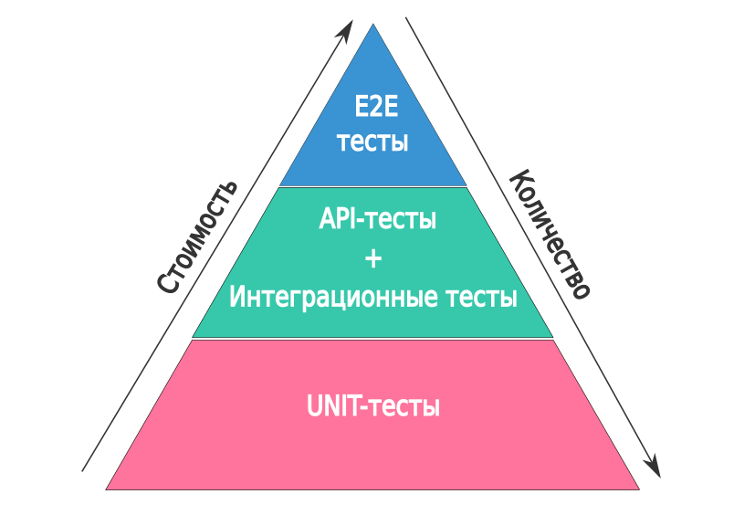

# Лекция: Unit-тесты в Go

## Введение в мир тестирования

Сейчас мы поговорим о одной из самых важных тем в современной разработке — о тестировании. Представьте, что вы строите дом. Вы же не начнёте жить в нём, не проверив, что стены стоят ровно, крыша не протекает, а двери открываются и закрываются? Тестирование в программировании — это именно такая проверка надёжности того, что мы создаём.

### Зачем вообще нужно тестирование?

Давайте по-честному — каждый из нас писал код, который "должен работать", но при этом падал в самый неподходящий момент. Тестирование помогает нам быть уверенными в своём коде, экономит время на отладку и защищает от регрессий (когда новые изменения ломают старую функциональность).



В мире разработки ПО есть несколько уровней тестирования, и давайте представим их на примере автомобиля:

**Unit-тесты** — это как проверить, что отдельный двигатель заводится и работает правильно. Мы изолируем его от всего автомобиля и проверяем конкретную функциональность. Такие тесты очень быстрые, дёшевые в поддержке и помогают находить проблемы на самом раннем этапе.

**Интеграционные тесты** — это уже проверка того, как двигатель работает вместе с трансмиссией и колёсами. Мы тестируем взаимодействие нескольких компонентов системы. Эти тесты медленнее, но важны для проверки корректности совместной работы.

**End-to-end тесты** — это полноценная поездка на автомобиле по городу. Мы проверяем всю систему целиком, имитируя реальные сценарии использования. Такие тесты самые медленные и дорогие, но они дают уверенность, что вся система работает как надо.

### Каким должен быть хороший тест?

Теперь давайте поговорим о том, что делает тест по-настоящему полезным. Представьте, что вы пишете тест, а через месяц ваш коллега должен в нём разобраться. Что вы хотите, чтобы он увидел?

Хороший тест похож на хорошую документацию — он быстро рассказывает о трёх вещах:

- **Что** мы тестируем
- **Как** мы это тестируем
- **Почему** мы ожидаем именно такой результат

Он должен быть **быстрым** — unit-тесты выполняются за доли секунды, иначе мы будем избегать их запускать. Он должен быть **детерминированным** — при одинаковых входных данных всегда давать одинаковый результат. Представьте, что тест иногда проходит, а иногда нет — это кошмар для отладки!

Тест должен быть **изолированным** от внешнего мира — не зависеть от базы данных, сети или файловой системы. Иначе он может падать не потому, что ваш код сломался, а потому что сервер базы данных недоступен.

И конечно, хороший тест должен быть **читаемым**. Когда через полгода вы (или ваша коллега) посмотрите на тест, должно быть сразу понятно, что именно проверяется.

### А что делать, если тест плохой?

Плохие тесты могут быть хуже, чем их отсутствие. Если тест постоянно падает "просто так", разработчики перестают ему доверять и начинают игнорировать красные failing тесты. Если тест зависит от внешних ресурсов, он становится хрупким и ненадёжным. Если в тесте слишком сложная логика, то его становится сложнее поддерживать, чем сам код, который он тестирует.

### Практическая польза тестов

Так зачем же мы тратим время на написание тестов?

Во-первых, **раннее обнаружение ошибок**. Гораздо дешевле найти проблему на этапе разработки, чем после релиза в продакшн.

Во-вторых, **документация кода**. Хорошо написанные тесты показывают, как именно должен использоваться ваш код. Новые разработчики в команде могут посмотреть на тесты и быстро понять, как работает система.

В-третьих, **уверенность при рефакторинге**. Когда мы хотим улучшить или изменить существующий код, тесты дают нам уверенность, что мы ничего не сломали.

В-четвёртых, **улучшение архитектуры**. Код, который сложно протестировать, обычно имеет проблемы с архитектурой. Тестирование заставляет нас писать более структурированный и модульный код.

Ну и в-пятых, это просто **экономия времени** в долгосрочной перспективе. Меньше ручного тестирования, меньше отладки, меньше "внезапных" проблем в продакшене.

---

## Наш первый проект: сервис калькулятора

Давайте начнём с реального примера, который мы будем развивать на протяжении всей лекции. Представьте, что мы пишем сервис калькулятора, который может выполнять базовые математические операции. Мы начнём с простой функции и постепенно будем усложнять её, добавляя новые возможности и соответственно новые тесты.

### Шаг 1: Простейший калькулятор

Начнём с самой простой функции сложения:

```go
// calculator.go
package main

func Add(a, b int) int {
    return a + b
}
```

А теперь напишем наш первый тест:

```go
// calculator_test.go
package main

import "testing"

func TestAdd(t *testing.T) {
    result := Add(2, 3)
    expected := 5

    if result != expected {
        t.Errorf("Add(2, 3) = %d; want %d", result, expected)
    }
}
```

Обратите внимание на несколько важных моментов:

- Файл с тестом называется `calculator_test.go` — именно такое имя требует Go
- Тестовая функция начинается с `Test` и принимает параметр `*testing.T`
- Мы вызываем `t.Errorf()` если результат не совпадает с ожидаемым

### Давайте запустим наш тест!

```bash
# Запустить все тесты в текущем пакете
go test

# Запустить с подробным выводом (больше информации)
go test -v

# Запустить конкретный тест
go test -run TestAdd

# Запустить все тесты проекта
go test ./...
```

Если всё правильно, вы увидите что-то вроде:

```
=== RUN   TestAdd
--- PASS: TestAdd (0.00s)
PASS
ok      example/calculator    0.002s
```

### Добавляем больше функций

Наш калькулятор пока не очень полезен. Давайте добавим вычитание, умножение и деление:

```go
// calculator.go
package main

func Add(a, b int) int {
    return a + b
}

func Subtract(a, b int) int {
    return a - b
}

func Multiply(a, b int) int {
    return a * b
}

func Divide(a, b int) (int, error) {
    if b == 0 {
        return 0, fmt.Errorf("деление на ноль")
    }
    return a / b, nil
}
```

Теперь давайте напишем тесты для этих функций:

```go
// calculator_test.go
package main

import (
    "fmt"
    "testing"
)

func TestAdd(t *testing.T) {
    result := Add(2, 3)
    expected := 5

    if result != expected {
        t.Errorf("Add(2, 3) = %d; want %d", result, expected)
    }
}

func TestSubtract(t *testing.T) {
    result := Subtract(5, 3)
    expected := 2

    if result != expected {
        t.Errorf("Subtract(5, 3) = %d; want %d", result, expected)
    }
}

func TestMultiply(t *testing.T) {
    result := Multiply(4, 3)
    expected := 12

    if result != expected {
        t.Errorf("Multiply(4, 3) = %d; want %d", result, expected)
    }
}

func TestDivide(t *testing.T) {
    // Тест для успешного деления
    result, err := Divide(6, 2)
    if err != nil {
        t.Errorf("Divide(6, 2) вернул ошибку: %v", err)
    }
    if result != 3 {
        t.Errorf("Divide(6, 2) = %d; want 3", result)
    }

    // Тест для деления на ноль
    _, err = Divide(5, 0)
    if err == nil {
        t.Error("Divide(5, 0) должен был вернуть ошибку")
    }
    if err.Error() != "деление на ноль" {
        t.Errorf("Divide(5, 0) вернул неправильную ошибку: %v", err)
    }
}
```

Запустим тесты и посмотрим, что у нас получилось:

```bash
go test -v
```

Вы должны увидеть, что все тесты проходят! Поздравляю, вы только что написали свой первый набор unit-тестов.

---

## Улучшаем наши тесты с помощью testify

Наши тесты работают, но выглядят они немного громоздко. Давайте используем популярную библиотеку `testify`, чтобы сделать их более читаемыми и выразительными.

### Установка testify

```bash
go get github.com/stretchr/testify
```

### Переписываем тесты с использованием testify/assert

```go
// calculator_test.go
package main

import (
    "testing"
    "github.com/stretchr/testify/assert"
)

func TestAdd_WithAssert(t *testing.T) {
    result := Add(2, 3)
    assert.Equal(t, 5, result, "Сложение должно работать правильно")
}

func TestSubtract_WithAssert(t *testing.T) {
    result := Subtract(5, 3)
    assert.Equal(t, 2, result, "Вычитание должно работать правильно")
}

func TestMultiply_WithAssert(t *testing.T) {
    result := Multiply(4, 3)
    assert.Equal(t, 12, result, "Умножение должно работать правильно")
}

func TestDivide_WithAssert(t *testing.T) {
    // Успешное деление
    result, err := Divide(6, 2)
    assert.NoError(t, err, "Деление 6 на 2 не должно возвращать ошибку")
    assert.Equal(t, 3, result, "Результат деления 6 на 2 должен быть 3")

    // Деление на ноль
    result, err = Divide(5, 0)
    assert.Error(t, err, "Деление на ноль должно возвращать ошибку")
    assert.Equal(t, 0, result, "При делении на ноль результат должен быть 0")
    assert.EqualError(t, err, "деление на ноль", "Текст ошибки должен быть 'деление на ноль'")
}
```

Согласитесь, так стало гораздо чище и понятнее! Функции `assert.Equal`, `assert.NoError`, `assert.Error` и другие делают код тестов более декларативным — мы говорим что мы ожидаем, а не как мы это проверяем.

### Больше возможностей testify

Testify предоставляет множество полезных функций для тестирования:

```go
func TestAdvancedAssertions(t *testing.T) {
    // Проверка условий
    assert.True(t, Add(1, 2) > 0, "Сумма положительных чисел должна быть положительной")
    assert.False(t, Add(-1, -2) > 0, "Сумма отрицательных чисел не должна быть положительной")

    // Проверка на nil
    var result int
    assert.Nil(t, nil, "Nil должен быть nil") // просто пример
    assert.NotNil(t, result, "Результат не должен быть nil")

    // Проверка типов
    assert.IsType(t, 0, Add(1, 2), "Результат должен быть int")

    // Сравнение с сообщением об ошибке
    assert.NotEqual(t, Add(1, 2), 0, "Сумма не должна быть нулём")
}
```

---

## Организация тестов: паттерн AAA и табличные тесты

Теперь, когда у нас есть базовые тесты, давайте сделаем их более структурированными и масштабируемыми.

### Паттерн AAA (Arrange-Act-Assert)

AAA — это простой, но мощный паттерн организации тестов, который делает их более читаемыми:

```go
func TestAdd_AAA_Pattern(t *testing.T) {
    // Arrange (Подготовка) - готовим всё для теста
    a := 10
    b := 20
    expected := 30

    // Act (Действие) - выполняем тестируемую операцию
    result := Add(a, b)

    // Assert (Проверка) - проверяем результаты
    assert.Equal(t, expected, result, "Результат сложения должен быть правильным")
}
```

Такая структура делает тест очень понятным — любой, кто прочитает его, сразу поймёт, где подготовка данных, где выполнение тестируемого кода, а где проверка результатов.

### Табличные тесты: когда нужно протестировать много сценариев

А что если нам нужно протестировать нашу функцию с множеством разных входных данных? Писать отдельный тест для каждого случая — долго и неудобно. Здесь на помощь приходят табличные тесты:

```go
func TestAdd_TableDriven(t *testing.T) {
    // Arrange: готовим таблицу тестовых случаев
    testCases := []struct {
        name     string        // название теста
        a, b     int          // входные данные
        expected int          // ожидаемый результат
    }{
        {"простое сложение", 2, 3, 5},
        {"сложение отрицательных чисел", -2, -3, -5},
        {"сложение с нулём", 5, 0, 5},
        {"сложение двух нулей", 0, 0, 0},
        {"большие числа", 1000000, 2000000, 3000000},
        {"смешанные числа", -10, 15, 5},
    }

    for _, tc := range testCases {
        t.Run(tc.name, func(t *testing.T) {
            // Act: выполняем операцию
            result := Add(tc.a, tc.b)

            // Assert: проверяем результат
            assert.Equal(t, tc.expected, result,
                "Add(%d, %d) должен дать %d", tc.a, tc.b, tc.expected)
        })
    }
}
```

Это гораздо мощнее, чем отдельные тесты! Мы можем легко добавлять новые тестовые случаи, и они будут автоматически выполняться. А `t.Run()` позволяет запускать отдельные тесты:

```bash
# Запустить только тест с отрицательными числами
go test -run TestAdd_TableDriven/сложение_отрицательных_чисел
```

### Комбинируем AAA и табличные тесты

Давайте перепишем тесты для всех наших операций, используя оба подхода:

```go
func TestCalculator_AllOperations_TableDriven(t *testing.T) {
    testCases := []struct {
        name        string
        operation   func(int, int) int
        a, b        int
        expected    int
    }{
        {"Add_положительные", Add, 2, 3, 5},
        {"Add_отрицательные", Add, -2, -3, -5},
        {"Subtract_положительные", Subtract, 5, 3, 2},
        {"Subtract_с_результатом_отрицательным", Subtract, 3, 5, -2},
        {"Multiply_простое", Multiply, 4, 3, 12},
        {"Multiply_с_нулем", Multiply, 4, 0, 0},
    }

    for _, tc := range testCases {
        t.Run(tc.name, func(t *testing.T) {
            // Arrange: входные данные уже подготовлены

            // Act
            result := tc.operation(tc.a, tc.b)

            // Assert
            assert.Equal(t, tc.expected, result,
                "%s(%d, %d) должен дать %d", tc.name, tc.a, tc.b, tc.expected)
        })
    }
}
```

### Тестирование с ошибками

Для функции деления, которая может возвращать ошибку, нужна немного другая структура:

```go
func TestDivide_TableDriven(t *testing.T) {
    testCases := []struct {
        name         string
        a, b         int
        expectedResult int
        expectError   bool
        expectedError string
    }{
        {
            name:         "успешное_деление",
            a:           6,
            b:           2,
            expectedResult: 3,
            expectError:   false,
        },
        {
            name:         "деление_с_остатком",
            a:           7,
            b:           2,
            expectedResult: 3,
            expectError:   false,
        },
        {
            name:         "деление_на_ноль",
            a:           5,
            b:           0,
            expectedResult: 0,
            expectError:   true,
            expectedError: "деление на ноль",
        },
    }

    for _, tc := range testCases {
        t.Run(tc.name, func(t *testing.T) {
            // Arrange & Act
            result, err := Divide(tc.a, tc.b)

            // Assert
            if tc.expectError {
                assert.Error(t, err, "Ожидалась ошибка")
                if tc.expectedError != "" {
                    assert.EqualError(t, err, tc.expectedError,
                        "Текст ошибки должен быть '%s'", tc.expectedError)
                }
                assert.Equal(t, tc.expectedResult, result,
                    "Результат при ошибке должен быть %d", tc.expectedResult)
            } else {
                assert.NoError(t, err, "Не ожидалось ошибки")
                assert.Equal(t, tc.expectedResult, result,
                    "Результат должен быть %d", tc.expectedResult)
            }
        })
    }
}
```

---

## Продвинутые техники: Mock-объекты

Наш калькулятор пока работает с простыми математическими операциями. Но что если мы добавим более сложную логику, которая зависит от внешних сервисов? Например, давайте создадим сервис, который не только выполняет математические операции, но и логирует их в базу данных.

### Усложняем наш пример

```go
// logger.go
package main

import "fmt"

// Logger интерфейс для логирования операций
type Logger interface {
    LogOperation(operation string, a, b, result int) error
}

// DatabaseLogger реализация, которая пишет в базу данных
type DatabaseLogger struct {
    // представим, что здесь подключение к базе данных
}

func (dl *DatabaseLogger) LogOperation(operation string, a, b, result int) error {
    // В реальной жизни здесь был бы код для записи в БД
    fmt.Printf("Logging: %s(%d, %d) = %d\n", operation, a, b, result)
    return nil
}

// EnhancedCalculator калькулятор с логированием
type EnhancedCalculator struct {
    logger Logger
}

func NewEnhancedCalculator(logger Logger) *EnhancedCalculator {
    return &EnhancedCalculator{logger: logger}
}

func (ec *EnhancedCalculator) AddAndLog(a, b int) (int, error) {
    result := Add(a, b)

    if err := ec.logger.LogOperation("Add", a, b, result); err != nil {
        return 0, fmt.Errorf("ошибка логирования: %w", err)
    }

    return result, nil
}
```

### Проблема с тестированием

Как нам протестировать `EnhancedCalculator`? Если мы используем реальный `DatabaseLogger`, наш тест будет зависеть от базы данных, что делает его медленным и ненадёжным. Что если база данных недоступна?

Здесь на помощь приходят mock-объекты!

### Создаём mock с testify/mock

```go
// logger_mock_test.go
package main

import (
    "github.com/stretchr/testify/mock"
)

// MockLogger наш мок для интерфейса Logger
type MockLogger struct {
    mock.Mock
}

func (m *MockLogger) LogOperation(operation string, a, b, result int) error {
    args := m.Called(operation, a, b, result)
    return args.Error(0)
}
```

### Тестируем с моками

```go
func TestEnhancedCalculator_AddAndLog_WithMock(t *testing.T) {
    // Arrange
    mockLogger := new(MockLogger)
    calculator := NewEnhancedCalculator(mockLogger)

    // Настраиваем ожидания для мока
    mockLogger.On("LogOperation", "Add", 2, 3, 5).Return(nil)

    // Act
    result, err := calculator.AddAndLog(2, 3)

    // Assert
    assert.NoError(t, err, "Операция должна выполниться без ошибок")
    assert.Equal(t, 5, result, "Результат сложения должен быть 5")

    // Проверяем, что все ожидания для мока выполнены
    mockLogger.AssertExpectations(t)
}

func TestEnhancedCalculator_AddAndLog_LoggingError(t *testing.T) {
    // Arrange
    mockLogger := new(MockLogger)
    calculator := NewEnhancedCalculator(mockLogger)

    // Настраиваем мок так, чтобы он возвращал ошибку
    expectedError := fmt.Errorf("база данных недоступна")
    mockLogger.On("LogOperation", "Add", 2, 3, 5).Return(expectedError)

    // Act
    result, err := calculator.AddAndLog(2, 3)

    // Assert
    assert.Error(t, err, "Должна быть ошибка логирования")
    assert.Contains(t, err.Error(), "ошибка логирования",
        "Ошибка должна содержать информацию о логировании")
    assert.Equal(t, 0, result, "При ошибке результат должен быть 0")

    // Проверяем, что мок был вызван правильно
    mockLogger.AssertExpectations(t)
}
```

### Комбинируем табличные тесты с моками

```go
func TestEnhancedCalculator_AddAndLog_TableDriven_WithMocks(t *testing.T) {
    testCases := []struct {
        name          string
        a, b          int
        expectedResult int
        logError      error
        expectError   bool
    }{
        {
            name:          "успешная_операция",
            a:            2,
            b:            3,
            expectedResult: 5,
            logError:     nil,
            expectError:   false,
        },
        {
            name:          "ошибка_логирования",
            a:            5,
            b:            7,
            expectedResult: 0,
            logError:     fmt.Errorf("база данных недоступна"),
            expectError:   true,
        },
    }

    for _, tc := range testCases {
        t.Run(tc.name, func(t *testing.T) {
            // Arrange
            mockLogger := new(MockLogger)
            calculator := NewEnhancedCalculator(mockLogger)

            // Настраиваем ожидания для мока
            mockLogger.On("LogOperation", "Add", tc.a, tc.b, tc.expectedResult).
                Return(tc.logError)

            // Act
            result, err := calculator.AddAndLog(tc.a, tc.b)

            // Assert
            if tc.expectError {
                assert.Error(t, err, "Ожидалась ошибка")
                assert.Equal(t, 0, result, "При ошибке результат должен быть 0")
            } else {
                assert.NoError(t, err, "Не ожидалось ошибки")
                assert.Equal(t, tc.expectedResult, result,
                    "Результат должен быть %d", tc.expectedResult)
            }

            // Проверяем мок
            mockLogger.AssertExpectations(t)
        })
    }
}
```

Моки дают нам мощную возможность тестировать код в изоляции от внешних зависимостей. Мы можем симулировать любые сценарии — успешные операции, ошибки, таймауты — без необходимости настраивать реальное окружение.

### Продвинутый паттерн: Mock Behaviour

Но что если у нас сложная логика с множеством разных сценариев, и нам нужно гибко настраивать поведение моков для каждого тестового случая? Здесь на помощь приходит паттерн **Mock Behaviour** — способ инкапсулировать логику настройки моков в отдельные функции.

Давайте улучшим наш пример с калькулятором, добавив более сложные сценарии логирования:

```go
// logger_behaviour_test.go
package main

import (
    "fmt"
    "github.com/stretchr/testify/mock"
)

// MockBehaviour описывает, как должен вести себя мок
type MockBehaviour func(*MockLogger)
```

Теперь мы можем создавать очень гибкие тесты, где каждый случай может иметь свою собственную логику мока:

```go
func TestEnhancedCalculator_AdvancedScenarios_WithMockBehaviour(t *testing.T) {
    testCases := []struct {
        name             string
        a, b             int
        expectedResult   int
        mockBehaviour    MockBehaviour
        expectError      bool
        expectedErrorMsg string
    }{
        {
            name:           "успешное_сложение",
            a:             2,
            b:             3,
            expectedResult: 5,
            mockBehaviour:  func(m *MockLogger) {
                m.On("LogOperation", "Add", 2, 3, 5).Return(nil)
            },
            expectError:    false,
        },
        {
            name:             "ошибка_базы_данных",
            a:               5,
            b:               7,
            expectedResult:   0,
            mockBehaviour:    func(m *MockLogger) {
                m.On("LogOperation", "Add", 5, 7, 12).Return(fmt.Errorf("база данных недоступна"))
            },
            expectError:      true,
            expectedErrorMsg: "ошибка логирования",
        },
        {
            name:             "таймаут_логирования",
            a:               10,
            b:               20,
            expectedResult:   0,
            mockBehaviour:    func(m *MockLogger) {
                m.On("LogOperation", "Add", 10, 20, 30).Return(fmt.Errorf("timeout: операция превысила лимит времени"))
            },
            expectError:      true,
            expectedErrorMsg: "timeout",
        },
        {
            name:             "превышен_лимит_запросов",
            a:               1,
            b:               1,
            expectedResult:   0,
            mockBehaviour:    func(m *MockLogger) {
                m.On("LogOperation", "Add", 1, 1, 2).Return(fmt.Errorf("rate limit: слишком много запросов"))
            },
            expectError:      true,
            expectedErrorMsg: "rate limit",
        },
    }

    for _, tc := range testCases {
        t.Run(tc.name, func(t *testing.T) {
            // Arrange
            mockLogger := new(MockLogger)
            calculator := NewEnhancedCalculator(mockLogger)

            // Применяем поведение мока для данного тестового случая
            tc.mockBehaviour(mockLogger)

            // Act
            result, err := calculator.AddAndLog(tc.a, tc.b)

            // Assert
            if tc.expectError {
                assert.Error(t, err, "Ожидалась ошибка")
                if tc.expectedErrorMsg != "" {
                    assert.Contains(t, err.Error(), tc.expectedErrorMsg,
                        "Ошибка должна содержать '%s'", tc.expectedErrorMsg)
                }
                assert.Equal(t, 0, result, "При ошибке результат должен быть 0")
            } else {
                assert.NoError(t, err, "Не ожидалось ошибки")
                assert.Equal(t, tc.expectedResult, result,
                    "Результат должен быть %d", tc.expectedResult)
            }

            // Проверяем мок
            mockLogger.AssertExpectations(t)
        })
    }
}
```

### Преимущества паттерна Mock Behaviour

Этот паттерн даёт нам несколько важных преимуществ:

1. **Читаемость** — логика настройки мока вынесена в отдельные функции с понятными названиями
2. **Гибкость** — легко создавать сложные условные сценарии
3. **Разделение ответственности** — тест отвечает за бизнес-логику, behaviour — за настройку мока

### Когда использовать Mock Behaviour

- **Сложные зависимости** — когда у вас много разных сценариев работы внешних сервисов
- **Условная логика** — когда поведение мока должно зависеть от входных данных
- **Интеграционное тестирование** — когда нужно симулировать сложные взаимодействия между сервисами

Паттерн Mock Behaviour превращает настройку моков из рутинной задачи в мощный инструмент для создания выразительных и поддерживаемых тестов. Вы можете описывать сложные сценарии поведения внешних систем простыми и понятными функциями.

---

## Benchmark-тесты: измеряем производительность

Иногда нам важно не только то, что код работает правильно, но и то, насколько быстро он работает. Для этого в Go существуют бенчмарки.

### Что такое бенчмарки?

Бенчмарки — это специальные тесты, которые измеряют, сколько времени занимает выполнение вашего кода. В отличие от обычных тестов, которые проверяют правильность, бенчмарки проверяют производительность.

### Наш первый бенчмарк

Давайте добавим в наш калькулятор функцию, которая вычисляет сумму чисел от 1 до n:

```go
func SumUpTo(n int) int {
    sum := 0
    for i := 1; i <= n; i++ {
        sum += i
    }
    return sum
}
```

Теперь напишем бенчмарк для этой функции:

```go
func BenchmarkSumUpTo(b *testing.B) {
    // Готовим данные (это делается один раз)
    n := 1000

    // Сбрасываем таймер, чтобы не учитывать время подготовки
    b.ResetTimer()

    // Основной цикл - Go будет выполнять его много раз
    for i := 0; i < b.N; i++ {
        SumUpTo(n)
    }
}
```

### Запускаем бенчмарки

```bash
# Запустить все бенчмарки
go test -bench=.

# Запустить конкретный бенчмарк
go test -bench=BenchmarkSumUpTo

# Запустить с информацией о памяти
go test -bench=. -benchmem

# Запустить дольше (по умолчанию 1 секунда)
go test -bench=. -benchtime=5s
```

### Пример вывода бенчмарка

```
BenchmarkSumUpTo-8      1000000              1234 ns/op             0 B/op          0 allocs/op
```

Что здесь означают эти числа:

- `BenchmarkSumUpTo-8` — имя бенчмарка и количество CPU ядер
- `1000000` — сколько раз функция выполнилась за время теста
- `1234 ns/op` — наносекунд на одну операцию (примерно 1.2 микросекунды)
- `0 B/op` — байт памяти, выделяемых на одну операцию
- `0 allocs/op` — количество аллокаций памяти на одну операцию

### Сравниваем производительность

Давайте создадим два разных способа вычисления суммы чисел от 1 до n и сравним их:

```go
// Медленный способ: цикл
func SumUpToSlow(n int) int {
    sum := 0
    for i := 1; i <= n; i++ {
        sum += i
    }
    return sum
}

// Быстрый способ: математическая формула
func SumUpToFast(n int) int {
    return n * (n + 1) / 2
}
```

Бенчмарки для сравнения:

```go
func BenchmarkSumUpToSlow(b *testing.B) {
    n := 1000
    b.ResetTimer()

    for i := 0; i < b.N; i++ {
        SumUpToSlow(n)
    }
}

func BenchmarkSumUpToFast(b *testing.B) {
    n := 1000
    b.ResetTimer()

    for i := 0; i < b.N; i++ {
        SumUpToFast(n)
    }
}
```

Запустим и посмотрим на разницу:

```bash
go test -bench=BenchmarkSumUpTo -benchmem
```

Вывод может быть примерно таким:

```
BenchmarkSumUpToSlow-8     500000              3456 ns/op               0 B/op          0 allocs/op
BenchmarkSumUpToFast-8   100000000               12.3 ns/op             0 B/op          0 allocs/op
```

Результат поразительный! Математическая формула работает в ~280 раз быстрее!

### Бенчмарки с памятью

Давайте добавим функцию, которая работает с памятью, и посмотрим, как бенчмарки показывают аллокации:

```go
func CreateSlice(n int) []int {
    result := make([]int, 0, n)
    for i := 0; i < n; i++ {
        result = append(result, i)
    }
    return result
}

func CreateSlicePreallocated(n int) []int {
    result := make([]int, n)
    for i := 0; i < n; i++ {
        result[i] = i
    }
    return result
}

func BenchmarkCreateSlice(b *testing.B) {
    b.ResetTimer()
    for i := 0; i < b.N; i++ {
        CreateSlice(1000)
    }
}

func BenchmarkCreateSlicePreallocated(b *testing.B) {
    b.ResetTimer()
    for i := 0; i < b.N; i++ {
        CreateSlicePreallocated(1000)
    }
}
```

Запустим с флагом `-benchmem`:

```bash
go test -bench=BenchmarkCreateSlice -benchmem
```

Вывод может показать разницу в аллокациях памяти, что помогает оптимизировать код.

### Полезные приёмы для бенчмарков

```go
func BenchmarkAdvanced(b *testing.B) {
    // 1. Избегаем оптимизаций компилятора
    var result int
    for i := 0; i < b.N; i++ {
        result = SumUpToSlow(100)
    }
    _ = result // используем результат, чтобы компилятор не оптимизировал код

    // 2. Измеряем только важную часть
    expensiveData := prepareExpensiveData()
    b.ResetTimer() // сбрасываем таймер после подготовки

    for i := 0; i < b.N; i++ {
        ProcessData(expensiveData)
    }

    // 3. Параллельные бенчмарки
    b.RunParallel(func(pb *testing.PB) {
        for pb.Next() {
            SumUpToSlow(100)
        }
    })
}
```

### Бенчмарки vs Обычные тесты

| Что проверяем          | Обычные тесты                            | Бенчмарки                            |
| ---------------------- | ---------------------------------------- | ------------------------------------ |
| **Правильность**       | ✅ Проверяет, что код работает правильно | ❌ Не проверяет правильность         |
| **Производительность** | ❌ Не измеряет скорость                  | ✅ Измеряет скорость выполнения      |
| **Память**             | ❌ Не отслеживает аллокации              | ✅ Показывает использование памяти   |
| **Запуск**             | `go test`                                | `go test -bench`                     |
| **Цель**               | Найти ошибки                             | Найти узкие места производительности |

---

## Заключение: что мы сегодня узнали

Отлично! Мы прошли долгий путь от простого теста одной функции до сложных сценариев с моками и бенчмарками. Давайте подведём итоги:

1. **Простые тесты** — научились писать базовые проверки с помощью пакета `testing`
2. **Testify** — сделали тесты более читаемыми и выразительными
3. **AAA-паттерн** — придали тестам структуру и понятность
4. **Табличные тесты** — научились тестировать множество сценариев элегантно
5. **Моки** — освоили изоляцию зависимостей для тестирования сложного кода
5. **Mock Behaviour** — мощный паттерн для гибкой настройки моковых данных
6. **Бенчмарки** — научились измерять и оптимизировать производительность

### Ключевые принципы хорошего тестирования

Хорошие тесты — это не просто формальность, а важная часть разработки. Запомните эти принципы:

- **Тестируйте поведение, а не реализацию** — вас должно волновать что делает код, а не как он это делает
- **Делайте тесты быстрыми и надёжными** — медленные и нестабильные тесты никто не будет запускать
- **Пишите понятные тесты** — тест должен быть документацией к вашему коду
- **Используйте правильные инструменты** — testify для утверждений, моки для зависимостей, бенчмарки для производительности
- **Тестируйте на границах** — проверяйте нулевые значения, отрицательные числа, ошибки
