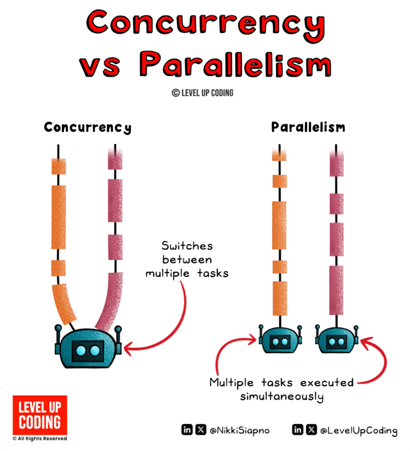
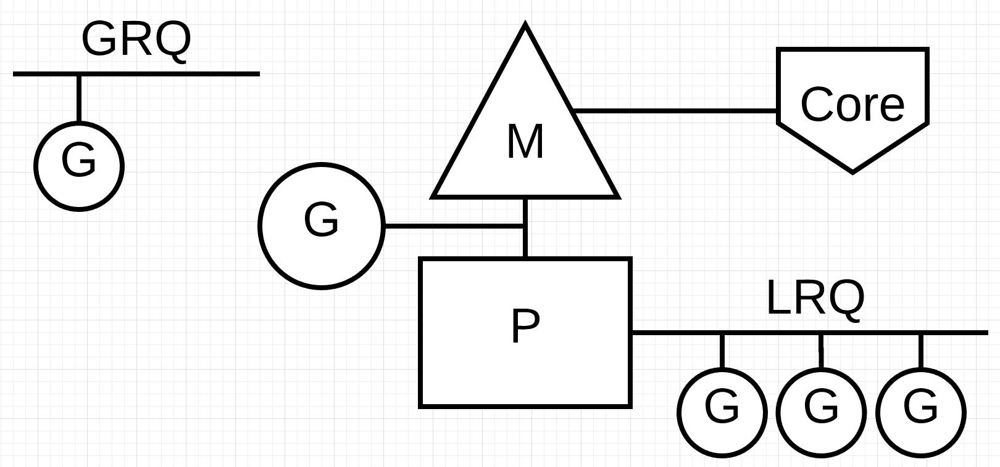
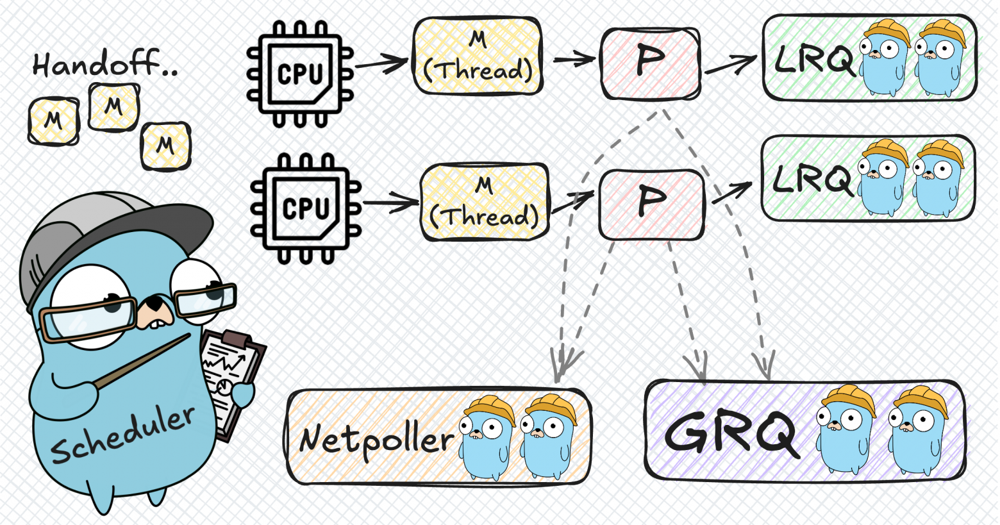

# Лекция: Горутины и каналы

## Введение в мир конкурентности

Представьте, что вы работаете на кухне в ресторане. Если вы готовите каждое блюдо последовательно — сначала суп, затем салат, потом горячее, — то гости будут ждать очень долго. Но если вы можете одновременно варить суп, резать салат и жарить мясо, используя разные конфорки и ножи, то вся кухня будет работать гораздо эффективнее.

В программировании то же самое! Большинство современных компьютеров имеют несколько ядер процессора, и если мы используем только одно ядро, мы теряем огромную часть производительности. Конкурентность в Go — это как умелый повар на кухне, который умеет готовить несколько блюд одновременно.

### Что такое конкурентность и параллелизм?

> [!NOTE]
> Хорошее видео на эту тему 
> https://www.youtube.com/watch?v=RlM9AfWf1WU


Давайте разберёмся в терминологии, потому что эти слова часто путают:

**Параллелизм** — это когда несколько задач выполняются **одновременно** на разных ядрах процессора. Представьте, что у вас есть две руки, и вы можете одновременно резать овощи левой рукой, а правой — перемешивать суп.

**Конкурентность** — это когда задачи **переключаются** в процессе выполнения. Представьте, что у вас только одна рука, но вы быстро переключаетесь между нарезкой овощей и помешиванием супа. В каждый момент времени вы делаете что-то одно, но за счёт быстрого переключения создаётся иллюзия одновременной работы.

> [!NOTE]
> В Go мы работаем с конкурентностью, а среда выполнения Go сама решает, когда запускать задачи параллельно на разных ядрах, а когда переключать их последовательно.



### Зачем вообще нужна конкурентность?

Представьте, что вы пишете веб-сервер. Если каждый запрос обрабатывать последовательно, то пока обрабатывается один медленный запрос, все остальные будут ждать. Это как если бы в ресторане один клиент заказал сложное блюдо, и все остальные клиенты должны были бы ждать, пока его приготовят!

Конкурентность позволяет нам:

- **Отвечать на запросы быстрее** — не заставлять пользователей ждать
- **Эффективно использовать ресурсы** — задействовать все ядра процессора
- **Создавать отзывчивые интерфейсы** — пользовательский интерфейс не "зависает" во время долгих операций
- **Обрабатывать много задач одновременно** — как хороший повар на кухне

### Как Go делает конкурентность простой?

Во многих языках программирования конкурентность — это сложно. Очень сложно. Нужно работать с потоками (threads), мьютексами, семафорами, блокировками. Легко допустить ошибку, которая проявится только при определённом порядке выполнения задач (такие ошибки называют race conditions).

В Go конкурентность намеренно сделали простой и безопасной. Все это благодаря горутинам! Создать горутину так же просто, как добавить одно ключевое слово `go` перед вызовом функции.

---

## Горутины: легковесные потоки выполнения

### Что такое горутина и чем она отличается от потоков (threads)?

Горутина — это функция, которая выполняется конкурентно с другими горутинами. Но давайте глубже разберём, чем горутины отличаются от традиционных потоков операционной системы.

#### Потоки операционной системы (Threads)

**Потоки (threads)** — это сущности уровня операционной системы:

- **Стек** — фиксированный размер (обычно 1-8MB)
- **Создание** — дорогостоящая операция (миллисекунды)
- **Переключение (context switch)** — очень дорого (десятки-сотни микросекунд)
- **Количество** — ограничено ресурсами ОС (обычно тысячи)
- **Управление** — операционная система сама решает, когда переключать потоки

Как мы видим, у потоков есть одна очень долгая операция – переключение, так еще и управлять мы ей не можем, это делает сама операционная система. Когда происходит переключение контекста между потоками, операционная система должна:
1. Сохранить состояние текущего потока (все регистры процессора, указатель стека и т.д.)
2. Выбрать следующий поток для выполнения
3. Загрузить состояние нового потока
4. Обновить планировщик ОС

Этот процесс очень дорогой, так как включает в себя:
- **Переход в режим ядра** (system call)
- **Сохранение/восстановление контекста процессора**
- **Обновление структур данных ОС**
- **Возможно, сброс кэшей процессора**

#### Горутины (Goroutines)

**Горутины** — это сущности уровня среды выполнения Go:

- **Стек** — начинается с 2KB, растёт до 1GB по необходимости
- **Создание** — очень дёшево (наносекунды)
- **Переключение** — очень быстро (наносекунды)
- **Количество** — можно создавать миллионы горутин
- **Управление** — планировщик Go сам решает, когда переключать горутины

#### Ключевые различия

| Характеристика | Потоки (Threads) | Горутины (Goroutines) |
| -------------- | ---------------- | --------------------- |
| **Стек** | 1-8MB (фиксированный) | 2KB (динамический) |
| **Создание** | Миллисекунды | Наносекунды |
| **Переключение** | Микросекунды | Наносекунды |
| **Управление** | ОС | Планировщик Go |
| **Количество** | Тысячи | Миллионы |
| **Стоимость переключения** | Дорогая | Очень дёшевая |

#### Зачем нужна такая надстройка над потоками?

Представьте, что у вас есть 1000 задач, которые нужно выполнить:

**С потоками:**
- Создаём 1000 потоков ОС
- Каждый поток занимает 8MB памяти → 8GB памяти!
- Переключение между потоками очень дорого
- ОС пытается распределить их по ядрам процессора

**С горутинами:**
- Создаём 1000 горутин
- Каждая горутина занимает 2KB → 2MB памяти!
- Go автоматически мапит горутины на небольшое количество потоков (например, 4-8)
- Переключение между горутинами очень быстрое

Ключевое отличие: **переключение горутин происходит в user-space**, а не в kernel-space. Это означает:
- Никаких системных вызовов
- Никакого переключения режимов процессора
- Минимальные затраты на сохранение/восстановление состояния

> [!NOTE]
> Планировщик Go достаточно умён, чтобы переключать горутины только когда это действительно нужно — при блокировке I/O операциях, системных вызовах, или когда горутина работала слишком долго.

### Создаём первую горутину

Давайте напишем простую программу, которая показывает, как работают горутины:

```go
package main

import (
    "fmt"
    "time"
)

func sayHello(name string) {
	fmt.Printf("Привет, %s!\n", name)
}

func main() {
    fmt.Println("Начинаем программу...")

    // Запускаем 1 горутину
    go sayHello("Анна")

    // Запускаем 2 горутину
    go sayHello("Борис")

    fmt.Println("Программа завершена")
}
```

Если вы запустите эту программу, вы увидите:

```
Начинаем программу...
Программа завершена
```

Мы не получили никаких выводов от наших горутин. Но почему так?

На самом деле все очень просто. Функция main - тоже горутина, и она главная в потоке выполнения всей программы. Объявляя функции как горутины, написанием ключевого слово `go` перед вызовом функции, мы даем команду планирувщику о том, что нужно запустить ее конкурентно, поэтому основной поток выполнения не будет дожитаться ее выполнения и пойдет дальше. Он выведет на экран надписать "Программа завершена" и после этого, так как главная горутина (функция main) больше не имеет никаких вызовов, завершится и все приложение, так и не дождавшись запуска конкурентно запущенных горутин.

Давайте попробуем подождать некоторое время после запуска горутин:

```go
package main

import (
    "fmt"
    "time"
)

func sayHello(name string) {
	fmt.Printf("Привет, %s!\n", name)
}

func main() {
    fmt.Println("Начинаем программу...")

    // Запускаем 1 горутину
    go sayHello("Анна")

    // Запускаем 2 горутину
    go sayHello("Борис")

    time.Sleep(1 * time.Second)

    fmt.Println("Программа завершена")
}
```

Теперь мы увидим примерно следующую картину:

```
Начинаем программу...
Привет, Борис!
Привет, Анна!
Программа завершена
```

Выводы из горутин появились, так как мы дали им 1 секунду, чтобы успеть запуститься и отработать.

> [!IMPORTANT]
> Если мы выполним эту программу несколько раз, то увидим, что строки с именами могут меняться местами. Это нам говорит о том, что планировщик запускает горутины в произвольном порядке, а не в порядке их определения в коде.

Но что будет, если одна из горутин должна выполнить сложный алгоритм, который будет выполняться более 1 секунды, как в нашем примере? Для ожидания завершения работы горутин есть более удобный и правильный способ - **WaitGroup**.

### WaitGroup

`sync.WaitGroup` — это механизм для ожидания завершения группы горутин. Это как счётчик, который отслеживает, сколько горутин должно завершиться.

#### Как работает WaitGroup?

WaitGroup работает как простой счётчик:

1. **Создание WaitGroup** — `var wg sync.WaitGroup`
2. **Добавление счётчика** — `wg.Add(n)` — говорим, что будем ждать `n` горутин
3. **Уменьшение счётчика** — `wg.Done()` — сообщаем, что одна горутина завершена
4. **Ожидание** — `wg.Wait()` — блокируем выполнение, пока счётчик не станет равен нулю

#### Методы WaitGroup

```go
// Add(delta int) — увеличивает внутренний счётчик на delta
// Обычно вызывается перед запуском горутины
wg.Add(1)

// Done() — уменьшает внутренний счётчик на 1
// Обычно вызывается через defer в начале горутины
defer wg.Done()

// Wait() — блокирует текущую горутину, пока счётчик не станет равен нулю
wg.Wait()
```

#### Правильный пример использования

```go
package main

import (
    "fmt"
    "sync"
    "time"
)

func sayHello(name string, wg *sync.WaitGroup) {
    defer wg.Done() // сообщаем, что горутина завершена

    for i := 0; i < 3; i++ {
        fmt.Printf("Привет, %s! (попытка %d)\n", name, i+1)
        time.Sleep(100 * time.Millisecond)
    }
}

func main() {
    var wg sync.WaitGroup

    fmt.Println("Начинаем программу...")

    wg.Add(1) // говорим, что ждём одну горутину
    go sayHello("Анна", &wg)

    wg.Add(1) // ещё одна горутина
    go sayHello("Борис", &wg)

    wg.Wait() // ждём завершения всех горутин

    fmt.Println("Программа завершена")
}
```

> [!IMPORTANT]
> Не забывате вызывать функцию `wg.Done()` столько раз, сколько добавили значений в функции `wg.Add(...)`. Иначе при вызове `wg.Wait()` произойдет вечное ожидание (deadlock).

Теперь программа гарантированно дождётся завершения всех горутин!

### Анонимные функции в горутинах

Часто, вместо вызова конкрутных функций, удобнее использовать анонимные функции при работе с горутинами:

```go
func main() {
    var wg sync.WaitGroup

    for i := 0; i < 3; i++ {
        wg.Add(1)

        go func(id int) {
            defer wg.Done()

            for j := 0; j < 2; j++ {
                fmt.Printf("Горутина %d, шаг %d\n", id, j+1)
                time.Sleep(100 * time.Millisecond)
            }
        }(i) // передаём i как параметр
    }

    wg.Wait()
    fmt.Println("Все горутины завершены")
}
```

> [!IMPORTANT]
> Обратите внимание на передачу `i` как параметра анонимной функции. Если бы мы написали `go func() { ... }(i)` без параметра, все горутины увидели бы одно и то же значение `i` (обычно 3), потому что они бы разделяли одну и ту же переменную.

---

## Планировщик Go и GMP модель

Теперь, когда мы научились создавать горутины, давайте заглянем "под капот" и разберёмся, как же устроен планировщик Go. Позвольте представить вам GMP модель — сердце конкурентности в Go.

<details>
<summary>Must-read статья на Хабре</summary>
[Планировщик горутин в Go: как это работает](https://habr.com/ru/articles/891426/)
</details>

### Что такое GMP модель?



**GMP** — это аббревиатура для трёх ключевых сущностей:

#### G (Goroutine)

Горутина — та самая сопрограмма, содержащая код для выполнения, которую мы будем выполнять конкурентно. Она:
- Содержит **стек горутины** (начинается с 2KB)
- Хранит **состояние выполнения** (регистры, program counter)
- Имеет **состояние** (_Grunning, _Grunnable, _Gwaiting, _Gdead)

#### P (Processor)

Processor — виртуальный процессор, который управляет выполнением горутин. Он связан с конкретным потоком операционной системы M. Количество P по умолчанию равно количеству CPU ядер и регулируется через `GOMAXPROCS`. Он содержит:
- **Локальная очередь** runnable горутин
- **Кэш** для mcache (memory allocation)

#### M (Machine/Thread)

Machine – это реальный поток операционной системы (OS thread). Он выполняет горутины, назначенные на процессор P, который связан с этим потоком. Он может быть заблокирован, например, системным вызовом и тогда может быть отключен от процессора P для ожидания.

### Глобальная очередь горутин (GRQ)

Помимо локальных очередей каждого процессора P, в Go существует **глобальная очередь** runnable горутин. Глобальная очередь — это центральное хранилище для горутин, которые не были помещены в локальные очереди процессоров или были перемещены туда из локальных очередей.

#### Как горутины попадают в глобальную очередь?

1. **При создании горутины**: Когда новая горутина создается через `go func()`, планировщик сначала пытается поместить её в локальную очередь текущего P. Если локальная очередь переполнена (обычно >256 горутин), новая горутина отправляется в глобальную очередь.

2. **При вытеснении**: Если горутина слишком долго выполнялась, при определенных условиях она может быть отправлена в глобальную очередь.

3. **При разблокировке горутин**: Когда горутина, заблокированная на I/O операции или на системном вызове, становится готовой к выполнению, она может быть помещена в глобальную очередь, если локальная очередь текущего P заполнена.

#### Как разбирается глобальная очередь?

Глобальная очередь разбирается через несколько механизмов:

1. **Плановое забирание (Schedule Stealing)**: Каждый P периодически (один раз в 61 такт разбора очередей) проверяет глобальную очередь и забирает оттуда горутины для выполнения. Это предотвращает "голодание" горутин в глобальной очереди.

2. **При опустошении локальной очереди**: Когда локальная очередь P становится пустой, P сначала пытается "украсть" горутины из локальных очередей других P (work stealing), и только если это не удается, он обращается к глобальной очереди.

3. **При создании нового P**: Когда создаётся новый процессор P или разблокируется заблокированный P, он сначала проверяет глобальную очередь на наличие готовых к выполнению горутин.

#### Приоритеты очередей

Планировщик Go следует определённой иерархии при выборе горутин для выполнения:

1. **Локальная очередь P (LRQ)** (самый высокий приоритет) 
2. **Глобальная очередь (GRQ)** (средний приоритет)
3. **Work stealing из других P** (низший приоритет)

### Жизненный цикл горутины

Теперь давайте поподробнее разберем жизненный цикл каждой горутины.

1. **Создание**: `go func()` создаёт новую горутину G
2. **Помещение в очередь**: планировщик видит новую горутину и пытается поместить ее в локальную очередь текущего P. Если локальная очередь переполнена, горутина попадает в глобальную очередь
3. **Выполнение**: когда предыдущая горутина была обработана и завершена, M забирает G из локальной очереди P (или из глобальной, если локальная пуста) и выполняет её
4. **Всеменная остановка**: Если G работает слишком долго (>10ms), планировщик прерывает её, перемещая в конец очереди или в глобальную очередь, давая возможность другим горутинам выполняться (это один из механизмов вытеснения долгих или зависших горутин)
5. **Блокировка**: Если G блокируется на процесс I/O, она перемещается в состояние ___Gwaiting__
6. **Возобновление**: После завершения I/O, G возвращается в локальную очередь какого-нибудь P или в глобальную очередь, в зависимости от текущей загрузки системы

### Ключевые механизмы планировщика

Внутри планировщика есть достаточно большое количество вспомогательных механизмов, обеспечивающих "умную" утилизацию ресурсов и хорошую производительность.

#### Work Stealing (кража работы)

Если локальная очередь P пуста, а в очереди другого P есть горутины, то P может "украсть" половину горутин из этой очереди. Это позволяет балансировать нагрузку в локальных очередях P.

#### 2. Sysmon (system monitor)

Sysmon – отдельная горутина, которая каждые 20 микросекунд:
- Проверяет наличие заблокированных M и возможно ли продолжить их работу
- Выполняет запуск сборщика мусора если нужно
- Прерывает долго работающие горутины и вытесненяет их

#### 3. Network Poller

Network Poller – тоже отдельная горутина, которая опрашивает сетевые соединения, используя системные epoll/kqueue/IOCP. Когда сетевое соединение готово к выполнению запросов или после сетевого запроса пришел ответ, возвращает горутину в runnable состояние.



### Настройка GOMAXPROCS

Немного выше мы упоминали переменную `GOMAXPROCS.` 

`GOMAXPROCS` устанавливает максимальное количество P. Это можно сделать через переменную окружения с одноименным названием, а можно через пакет `runtime` при выполнении вашей программы:

```go
func main() {
    // Использовать только 1 ядро
    runtime.GOMAXPROCS(1)

    // Использовать все доступные ядра (по умолчанию)
    runtime.GOMAXPROCS(runtime.NumCPU())

    // В Go 1.5+ это значение по умолчанию равно количеству ядер
}
```

---

## Типы конкуренции и подходы к синхронизации

Теперь, когда мы освоили основы горутин и каналов, давайте разберём фундаментальные концепции конкурентного программирования: какие бывают типы конкуренции и как с ними работать.

### Типы конкуренции

В конкурентном программировании выделяют два основных типа задач:

#### 1. CPU-Bound задачи (CPU-интенсививные)

**CPU-Bound** — это задачи, которые в основном используют ресурсы процессора:

**Примеры CPU-bound задач:**
- Математические вычисления
- Обработка изображений
- Криптографические операции
- Сжатие данных

#### 2. I/O-Bound задачи (I/O-интенсививные)

**I/O-Bound** — это задачи, которые в основном ждут операций ввода-вывода:

**Примеры I/O-bound задач:**
- Сетевые запросы (HTTP API, базы данных)
- Файловые операции (чтение/запись)
- Ожидание пользовательского ввода
- Операции с внешними сервисами

### Два подхода к организации взаимодействия между горутинами

В конкурентном программировании существуют два фундаментально разных подхода к организации взаимодействия и координации между горутинами: [Memory Sharing (разделение памяти) и Message Passing (передача сообщений)](https://www.geeksforgeeks.org/operating-systems/difference-between-shared-memory-model-and-message-passing-model-in-ipc/).

#### Memory Sharing (разделение памяти)

**Memory Sharing** — это архитектурный паттерн, при котором несколько горутин имеют прямой доступ к общим данным в общей памяти. Горутины координируют свою работу через совместный доступ к одним и тем же переменным, структурам данных или ресурсам.

**Основные принципы Memory Sharing:**

1. **Общее пространство состояний** — все горутины видят и могут изменять одни и те же данные
2. **Прямой доступ к памяти** — горутины напрямую читают и записывают данные в общие переменные
3. **Явная синхронизация** — необходима для предотвращения гонок данных и обеспечения консистентности
4. **Высокая производительность** — минимальные накладные расходы на обмен данными

**Ключевая идея:** Горутины "общаются" через общее состояние, как несколько людей, работающих с одной доской объявлений.

#### Message Passing (передача сообщений)

**Message Passing** — это архитектурный паттерн, при котором горутины не имеют прямого доступа к общим данным, а координируют свою работу через передачу сообщений по каналам. Каждая горутина работает со своими локальными данными и обменивается результатами через асинхронные сообщения.

**Основные принципы Message Passing:**

1. **Изолированные состояния** — каждая горутина имеет свои собственные, недоступные другим данные
2. **Коммуникация через каналы** — обмен данными происходит только через каналы
3. **Неявная синхронизация** — каналы обеспечивают безопасную передачу данных
4. **Естественная безопасность** — нет прямого доступа к чужим данным

**Ключевая идея:** Горутины "общаются" как люди, обменивающиеся письмами — каждое сообщение автономно и не требует прямого доступа к состоянию отправителя.

#### Сравнение подходов

| Характеристика | Memory Sharing | Message Passing |
| -------------- | -------------- | --------------- |
| **Производительность** | Высокая | Средняя |
| **Безопасность** | Требует синхронизации | Встроенная безопасность |
| **Сложность** | Средняя | Низкая |
| **Масштабируемость** | Ограниченная | Высокая |
| **Отладка** | Сложная | Простая |
| **Связанность** | Высокая | Низкая |
| **Память** | Эффективная | Требует копирования |

#### Когда использовать какой подход?

**Memory Sharing подходит для:**
- **Высокопроизводительные вычисления** с интенсивным обменом данными
- **Общие кэши и конфигурации** которые нужны всем компонентам
- **Счётчики и метрики** которые обновляются часто
- **Ресурсы с разделяемым доступом** (пулы соединений, файловые дескрипторы)

**Message Passing подходит для:**
- **Веб-серверы и API** где каждый запрос обрабатывается независимо
- **Микросервисы** где важна изоляция компонентов
- **Конвейеры обработки данных** где этапы независимы
- **Системы с высокой доступностью** где важна изоляция сбоев

> [!NOTE]
> **Важно понимать:** Memory Sharing и Message Passing — это не механизмы управления памятью, а **архитектурные паттерны организации взаимодействия** между конкурентными сущностями. Они отвечают на вопрос "КАК горутины должны координировать свою работу?", а не "КАК управлять памятью?".

> [!NOTE]
> В Go философия **"Не общайтесь через общую память, делитесь памятью через общение"** (Don't communicate by sharing memory; instead, share memory by communicating) предлагает использовать Message Passing как основной подход. Однако на практике часто используется гибридный подход в зависимости от конкретных требований производительности и архитектуры.

### Race Conditions (гонка данных)

**Race Condition** (состояние гонки) — это ситуация, когда результат выполнения программы зависит от порядка выполнения операций в разных горутинах из-за одновременного доступа к общим данным без синхронизации.

#### Что такое Race Condition?

Race condition возникает, когда:
- Две или более горутины одновременно обращаются к одним и тем же данным
- Хотя бы одна из горутин изменяет данные
- Отсутствует синхронизация доступа к этим данным

#### Примеры Race Conditions

**Простой случай с инкрементом:**

```go
// ❌ Небезопасный инкремент
func simpleRaceCondition() {
    counter := 0
    var wg sync.WaitGroup

    for i := 0; i < 1000; i++ {
        wg.Add(1)
        go func() {
            defer wg.Done()
            counter++ // НЕБЕЗОПАСНО!
        }()
    }

    wg.Wait()
    fmt.Printf("Результат: %d (ожидали 1000)\n", counter)
    // Результат будет непредсказуемым: 998, 999, 1000, 1001 и т.д.
}
```

**Почему это небезопасно?**
Операция `counter++` на самом деле состоит из трёх шагов:
1. **Чтение**: прочитать текущее значение `counter`
2. **Модификация**: вычислить `counter + 1`
3. **Запись**: записать новое значение обратно в `counter`

Если две горутины выполняют эти шаги одновременно, одна может прочитать значение до того, как другая запишет своё.

#### Последствия Race Conditions

1. **Непредсказуемые результаты** — программа может работать по-разному при каждом запуске
2. **Повреждение данных** — структуры данных могут стать неконсистентными
3. **Паника** — особенно при одновременном доступе к map, slice
4. **Сложность отладки** — ошибки проявляются только при определённом порядке выполнения

#### Обнаружение Race Conditions

Go предоставляет встроенный детектор race conditions:

```bash
# Запуск программы с детектором
go run -race main.go

# Запуск тестов с детектором
go test -race ./...

# Сборка с детектором
go build -race main.go
```

**Пример вывода детектора:**
```
==================
WARNING: DATA RACE
Read at 0x00c0000a4010 by goroutine 7:
  main.main.func2()
      /path/to/main.go:25 +0x44

Previous write at 0x00c0000a4010 by goroutine 6:
  main.main.func1()
      /path/to/main.go:20 +0x4d

Goroutine 7 (running) created at:
  main.main()
      /path/to/main.go:23 +0x75

Goroutine 6 (finished) created at:
  main.main()
      /path/to/main.go:18 +0x57
==================
```

#### Профилактика Race Conditions

1. **Используйте детектор race conditions** при разработке
2. **Избегайте глобальных переменных** в конкурентном коде
3. **Используйте каналы вместо общей памяти** когда возможно
4. **Защищайте общие данные** мьютексами или атомарными операциями
5. **Проектируйте данные как immutable** (неизменяемые)

> [!IMPORTANT]
> Всегда запускайте `go run -race` или `go test -race` для обнаружения race conditions в конкурентном коде!

### Синхронизация доступа к общей памяти
#### Mutex, RWMutex

**Mutex (Mutual Exclusion)** — это механизм синхронизации, который гарантирует, что только одна горутина может выполнять критическую секцию кода в данный момент времени.

#### Mutex (взаимное исключение)

**Mutex** обеспечивает эксклюзивный доступ к ресурсу — только одна горутина может держать блокировку в любой момент времени.

**Методы Mutex:**

```go
type Mutex struct {
    // Внутренние поля
}

// Lock() — блокирует мьютекс
// Если мьютекс уже заблокирован, горутина ожидает пока он освободится
func (m *Mutex) Lock()

// Unlock() — разблокирует мьютекс
// Должен вызываться той же горутиной, что и Lock()
func (m *Mutex) Unlock()

// TryLock() — пытается заблокировать мьютекс без ожидания
// Возвращает true если удалось заблокировать, false если уже заблокирован
func (m *Mutex) TryLock() bool
```

**Пример использования Mutex:**

```go
package main

import (
    "fmt"
    "sync"
    "time"
)

type BankAccount struct {
    balance int
    mu      sync.Mutex
}

func (ba *BankAccount) Deposit(amount int) {
    ba.mu.Lock()
    defer ba.mu.Unlock()

    ba.balance += amount
    fmt.Printf("Пополнено: %d, баланс: %d\n", amount, ba.balance)
}

func (ba *BankAccount) Withdraw(amount int) bool {
    ba.mu.Lock()
    defer ba.mu.Unlock()

    if ba.balance >= amount {
        ba.balance -= amount
        fmt.Printf("Снято: %d, баланс: %d\n", amount, ba.balance)
        return true
    }

    fmt.Printf("Недостаточно средств для снятия %d, текущий баланс: %d\n", amount, ba.balance)
    return false
}

func (ba *BankAccount) GetBalance() int {
    ba.mu.Lock()
    defer ba.mu.Unlock()
    return ba.balance
}

func main() {
    account := &BankAccount{balance: 1000}

    var wg sync.WaitGroup

    // Несколько горутин одновременно работают со счетом
    for i := 0; i < 3; i++ {
        wg.Add(1)
        go func(id int) {
            defer wg.Done()

            // Пополнение счета
            account.Deposit(200)
            time.Sleep(100 * time.Millisecond)

            // Попытка снятия
            account.Withdraw(150)
        }(i)
    }

    wg.Wait()
    fmt.Printf("Финальный баланс: %d\n", account.GetBalance())
}
```

**Результат выполнения:**
```
Пополнено: 200, баланс: 1200
Снято: 150, баланс: 1050
Пополнено: 200, баланс: 1250
Снято: 150, баланс: 1100
Пополнено: 200, баланс: 1300
Снято: 150, баланс: 1150
Финальный баланс: 1150
```

В этом примере Mutex обеспечивает безопасный доступ к банковскому счету — гарантирует, что операции пополнения и снятия денег не будут выполняться одновременно, предотвращая гонку данных.

#### RWMutex (чтение-запись)

**RWMutex (Read-Write Mutex)** позволяет нескольким читателям одновременно получать доступ к данным, но пишет эксклюзивно.

**Методы RWMutex:**

```go
type RWMutex struct {
    // Внутренние поля
}

// Lock() — блокирует для записи (эксклюзивная блокировка)
// Ждёт пока все читатели и писатели не закончат работу
func (rw *RWMutex) Lock()

// Unlock() — разблокирует блокировку записи
func (rw *RWMutex) Unlock()

// RLock() — блокирует для чтения (разделяемая блокировка)
// Несколько горутин могут одновременно держать RLock
func (rw *RWMutex) RLock()

// RUnlock() — разблокирует блокировку чтения
func (rw *RWMutex) RUnlock()

// TryLock() — пытается заблокировать для записи без ожидания
func (rw *RWMutex) TryLock() bool

// TryRLock() — пытается заблокировать для чтения без ожидания
func (rw *RWMutex) TryRLock() bool

// RLocker() — возвращает Locker для чтения
func (rw *RWMutex) RLocker() sync.Locker
```

**Пример использования RWMutex:**

```go
package main

import (
    "fmt"
    "sync"
    "time"
)

type ProductCatalog struct {
    products map[string]int // название -> цена
    mu       sync.RWMutex
}

func NewProductCatalog() *ProductCatalog {
    return &ProductCatalog{
        products: make(map[string]int),
    }
}

// Read operation - используется RLock для параллельного чтения
func (pc *ProductCatalog) GetPrice(productName string) (int, bool) {
    pc.mu.RLock()
    defer pc.mu.RUnlock()

    price, exists := pc.products[productName]
    return price, exists
}

// Read operation - используется RLock для параллельного чтения
func (pc *ProductCatalog) GetAllProducts() map[string]int {
    pc.mu.RLock()
    defer pc.mu.RUnlock()

    // Создаем копию чтобы избежать гонки данных при возврате
    result := make(map[string]int)
    for name, price := range pc.products {
        result[name] = price
    }
    return result
}

// Write operation - используется Lock для эксклюзивного доступа
func (pc *ProductCatalog) UpdatePrice(productName string, newPrice int) {
    pc.mu.Lock()
    defer pc.mu.Unlock()

    pc.products[productName] = newPrice
    fmt.Printf("Обновлена цена для %s: %d\n", productName, newPrice)
}

// Write operation - используется Lock для эксклюзивного доступа
func (pc *ProductCatalog) AddProduct(productName string, price int) {
    pc.mu.Lock()
    defer pc.mu.Unlock()

    pc.products[productName] = price
    fmt.Printf("Добавлен продукт %s с ценой %d\n", productName, price)
}

func main() {
    catalog := NewProductCatalog()

    // Добавляем несколько продуктов
    catalog.AddProduct("Яблоки", 100)
    catalog.AddProduct("Бананы", 80)
    catalog.AddProduct("Апельсины", 120)

    var wg sync.WaitGroup

    // Запускаем множество "читателей" (клиенты проверяют цены)
    for i := 0; i < 5; i++ {
        wg.Add(1)
        go func(readerID int) {
            defer wg.Done()

            products := catalog.GetAllProducts()
            fmt.Printf("Читатель %d увидел %d продуктов\n", readerID, len(products))

            // Проверяем конкретные цены
            for name, price := range products {
                fmt.Printf("Читатель %d: %s = %d\n", readerID, name, price)
            }

            time.Sleep(50 * time.Millisecond)
        }(i)
    }

    // Запускаем "писателей" (менеджеры обновляют цены)
    for i := 0; i < 2; i++ {
        wg.Add(1)
        go func(managerID int) {
            defer wg.Done()

            time.Sleep(100 * time.Millisecond)

            if managerID == 0 {
                catalog.UpdatePrice("Яблоки", 110)
                catalog.UpdatePrice("Бананы", 90)
            } else {
                catalog.UpdatePrice("Апельсины", 130)
                catalog.AddProduct("Виноград", 150)
            }
        }(i)
    }

    wg.Wait()
    fmt.Println("\nФинальный каталог:")
    finalProducts := catalog.GetAllProducts()
    for name, price := range finalProducts {
        fmt.Printf("%s: %d\n", name, price)
    }
}
```

**Результат выполнения:**
```
Добавлен продукт Яблоки с ценой 100
Добавлен продукт Бананы с ценой 80
Добавлен продукт Апельсины с ценой 120
Читатель 3 увидел 3 продуктов
Читатель 3: Яблоки = 100
Читатель 3: Бананы = 80
Читатель 3: Апельсины = 120
Читатель 4 увидел 3 продуктов
Читатель 4: Бананы = 80
...
Читатель 2: Бананы = 80
Читатель 2: Апельсины = 120
Читатель 0 увидел 3 продуктов
Читатель 0: Яблоки = 100
Читатель 0: Бананы = 80
Читатель 0: Апельсины = 120
Обновлена цена для Апельсины: 130
Добавлен продукт Виноград с ценой 150
Обновлена цена для Яблоки: 110
Обновлена цена для Бананы: 90

Финальный каталог:
Виноград: 150
Яблоки: 110
Бананы: 90
Апельсины: 130
```

В этом примере RWMutex эффективен потому что:
- **Множество операций чтения** происходят параллельно (клиенты проверяют цены)
- **Редкие операции записи** блокируют только на короткое время (менеджеры обновляют цены)
- **Высокая производительность** — читатели не блокируют друг друга

#### Когда использовать RWMutex?

RWMutex эффективен когда:
- **Операции чтения происходят часто** и могут выполняться параллельно
- **Операции записи происходят редко** и требуют эксклюзивного доступа
- **Чтение выполняется дольше**, чем простое получение значения

### Atomic Operations

**Атомарные операции** — это операции, которые гарантированно выполняются неделимо (атомарно) без прерываний. Они обеспечивают синхронизацию на уровне инструкций процессора и обычно быстрее мьютексов для простых операций.

#### Что такое атомарные операции?

Атомарные операции гарантируют, что:
- Операция выполняется целиком или не выполняется вообще
- Другие горутины не могут увидеть промежуточное состояние
- Не используются блокировки на уровне операционной системы

#### Основные типы атомарных операций

**Пакет `sync/atomic` поддерживает следующие типы:**
- `int32`, `int64` — целые числа
- `uint32`, `uint64` — беззнаковые целые
- `uintptr` — указатели как числа
- `unsafe.Pointer` — небезопасные указатели

#### Основные операции

**1. Атомарное сложение:**

```go
import "sync/atomic"

var counter int64

// AddInt64(delta int64) int64 — атомарно добавляет delta и возвращает новое значение
atomic.AddInt64(&counter, 1)  // counter += 1
atomic.AddInt64(&counter, -1) // counter -= 1

newVal := atomic.AddInt64(&counter, 10)
fmt.Println("Новое значение:", newVal)
```

**2. Атомарное чтение и запись:**

```go
var value int64

// LoadInt64(addr *int64) int64 — атомарно читает значение
currentValue := atomic.LoadInt64(&value)

// StoreInt64(addr *int64, val int64) — атомарно записывает значение
atomic.StoreInt64(&value, 42)

// Комбинация чтения и записи
func updateValue(newValue int64) {
    atomic.StoreInt64(&value, newValue)
    fmt.Println("Значение обновлено:", atomic.LoadInt64(&value))
}
```

**3. Атомарное сравнение и замена (Compare-And-Swap):**

```go
var data int64 = 100

// CompareAndSwapInt64(addr *int64, old, new int64) bool
// Сравнивает значение с old, если равно — заменяет на new и возвращает true
// Если не равно — ничего не делает и возвращает false

swapped := atomic.CompareAndSwapInt64(&data, 100, 200)
if swapped {
    fmt.Println("Значение заменено на 200")
} else {
    fmt.Println("Значение не было 100")
}

// Типичный паттерн для CAS
func incrementIfLessThan(target *int64, max int64) bool {
    for {
        current := atomic.LoadInt64(target)
        if current >= max {
            return false
        }
        if atomic.CompareAndSwapInt64(target, current, current+1) {
            return true
        }
        // Если CAS не удался, повторяем цикл (value изменилось между чтением и записью)
    }
}
```

**4. Атомарный обмен (Swap):**

```go
var data int64 = 100

// SwapInt64(addr *int64, new int64) int64 — атомарно заменяет значение и возвращает старое
oldValue := atomic.SwapInt64(&data, 200)
fmt.Println("Старое значение:", oldValue) // 100
fmt.Println("Новое значение:", atomic.LoadInt64(&data)) // 200
```

#### Когда использовать атомарные операции

| Ситуация | Решение |
| -------- | ------- |
| **Простые счётчики** | `atomic.Add*` |
| **Флаги состояния** | `atomic.Store*/Load*` |
| **Простая проверка-установка** | `atomic.CompareAndSwap*` |
| **Высокопроизводительные операции** | атомарные операции |
| **Сложые критические секции** | `Mutex/RWMutex` |
| **Много полей для синхронизации** | `Mutex` |

> [!IMPORTANT]
- **Атомарные операции быстрее мьютексов** для простых операций
- **Они работают с примитивными типами данных** (int, pointer)
- **Не заменяют мьютексы полностью** — для сложных операций используйте мьютексы
- **Memory ordering** важен при работе с несколькими полями

### Какой тип синхронизации использовать при memory sharing?

| Ситуация | Решение |
| -------- | ------- |
| **Простая синхронизация счётчиков** | `sync/atomic` |
| **Защита критической секции кода** | `sync.Mutex` |
| **Частое чтение, редкая запись** | `sync.RWMutex` |
| **Высокопроизводительные вычисления** | мьютексы или атомарные операции |

### Message passing: каналы в Go

**Каналы** — это основная реализация Message Passing подхода в Go. Каналы предоставляют типобезопасный способ передачи данных между горутинами и являются ключевым инструментом для конкурентного программирования.

#### Что такое канал?

**Канал** в Go — это специальная структура данных, которая обеспечивает:
- **Типобезопасность** — только один тип данных может передаваться через канал
- **Синхронизацию** — встроенная блокировка при отправке/получении
- **Гарантии FIFO** — сообщения обрабатываются в порядке отправки

#### Типы каналов

В Go существует два типа каналов, которые отличаются поведением при отправке и получении данных:

##### 1. Небуферизованные каналы (Unbuffered Channels)

**Небуферизованный канал** — это канал без буфера, который обеспечивает **синхронную** передачу данных.

**Ключевые характеристики:**
- **Синхронность**: Отправка происходит только когда есть получатель
- **Размер буфера**: 0 элементов

```go
package main

import (
	"fmt"
	"time"
)

func main() {
    ch := make(chan int)

    go func() {
        fmt.Println("Горутина 1: готова отправить")
        ch <- 42  // Блокируется пока горутина 2 не начнёт приём
        fmt.Println("Горутина 1: данные отправлены")
    }()

    time.Sleep(1 * time.Second) // Даём время горутине 1 заблокироваться

    fmt.Println("Горутина 2: готова принять")
    value := <-ch  // Разблокирует горутину 1
    fmt.Printf("Горутина 2: получено значение %d\n", value)
}
```

**Как это работает:**
1. Отправитель пытается отправить данные в канал
2. Если получатель не готов принять данные, отправитель блокируется
3. Когда получатель готов принять данные, данные немедленно передаются
4. Обе горутины продолжают выполнение

##### 2. Буферизованные каналы (Buffered Channels)

**Буферизованный канал** — это канал с буфером определенного размера, который обеспечивает **асинхронную** передачу данных до заполнения буфера.

**Ключевые характеристики:**
- **Асинхронность**: Отправитель не блокируется, пока буфер не заполнен
- **Размер буфера**: >0 элементов (указывается при создании)
- **Гибкость**: Позволяет отправлять данные без ожидания получателя

```go
package main

import (
	"fmt"
	"time"
)

func main() {
    ch := make(chan int, 3) // Буфер на 3 элемента

    // Отправляем данные в буфер без блокировки
    fmt.Println("Отправляем в буфер:")
    ch <- 1
    fmt.Println("Отправлено 1, буфер: 1/3")
    ch <- 2
    fmt.Println("Отправлено 2, буфер: 2/3")
    ch <- 3
    fmt.Println("Отправлено 3, буфер: 3/3 (полон)")

    // Следующая отправка заблокирует буфер
    go func() {
        fmt.Println("Попытка отправить 4...")
        ch <- 4  // Заблокируется пока не освободится место
        fmt.Println("Отправлено 4")
    }()

    time.Sleep(500 * time.Millisecond)

    // Читаем из буфера
    value := <-ch  // Освобождает место для 4
    fmt.Printf("Прочитано: %d\n", value)

    time.Sleep(500 * time.Millisecond)
}
```

**Как это работает:**
1. Отправитель пытается отправить данные в канал
2. Если в буфере есть место, данные помещаются туда, и отправитель продолжает работу
3. Если буфер полон, отправитель блокируется пока не освободится место
4. Получатель забирает данные из буфера, освобождая место

> [!NOTE]
> Выбор типа канала зависит от конкретной задачи. Небуферизованные каналы обеспечивают строгую синхронизацию, но могут снижать производительность. Буферизованные каналы увеличивают пропускную способность, но требуют более внимательного управления для избежания переполнения.

#### Работа с каналами

##### Создание каналов

```go
// Небуферизованный канал (синхронный)
ch1 := make(chan int)

// Буферизованный канал (асинхронный)
ch2 := make(chan int, 10) // буфер на 10 элементов
```

##### Отправка и получение

```go
func basicChannelOperations() {
    ch := make(chan string)

    // Отправитель
    go func() {
        ch <- "Hello"      // Отправка сообщения
        ch <- "World"      // Блокируется пока получатель не прочитает первое
    }()

    // Получатель
    msg1 := <-ch           // Получаем первое сообщение
    msg2 := <-ch           // Проверяем, закрыт ли канал

    fmt.Printf("Сообщение 1: %s\n", msg1)
    fmt.Printf("Сообщение 2: %s\n", msg2)
}
```

#### Закрытие каналов

**Закрытие канала** — это операция, которая сигнализирует о том, что больше не будут отправляться данные в этот канал.

#### Что происходит при закрытии канала?

Когда канал закрывается, Go выполняет несколько важных изменений в его поведении. **Отправка данных становится невозможной** — любая попытка отправить данные в закрытый канал вызовет panic, что помогает быстро обнаружить ошибки в логике программы. При этом **получение данных остается возможным** — можно продолжать читать уже отправленные данные из буфера, что позволяет корректно обработать все сообщения перед завершением работы. Когда все данные из буфера будут прочитаны и мы попытаемся прочитать из пустого закрытого канала, операция вернет нулевое значение для типа канала и `false` в качестве второго параметра, что является стандартным способом определить что канал больше не будет принимать данные.

Существует несколько способов проверки закрытия канала:

**Способ 1: Использование второго возвращаемого значения**
```go
value, ok := <-channel
if !ok {
    fmt.Println("Канал закрыт")
} else {
    fmt.Printf("Получено значение: %v\n", value)
}
```

**Способ 2: Использование range для автоматической остановки**
```go
for value := range channel {
    fmt.Printf("Получено: %v\n", value)
}
// Цикл автоматически завершится при закрытии канала
```

#### Правила закрытия каналов

При работе с закрытием каналов следует соблюдать несколько важных правил:
- **Только отправитель может закрыть канал** — получатель никогда не должен закрывать канал, так как это может привести к ошибкам в логике программы.
- **Закрывайте канал только когда это действительно имеет смысл** — не все каналы нужно закрывать, особенно если они используются на протяжении всей работы программы.
- **Никогда не закрывайте канал дважды** — повторное закрытие вызовет panic, поэтому перед закрытием нужно убедиться что канал еще не закрыт.
- **Используйте defer** — особенно в функциях-отправителях, что обеспечит закрытие канала даже при возникновении ошибок.

Решение о закрытии канала зависит от контекста его использования. Закрывайте канал:
- **Когда сигнализируете о завершении работы** — для graceful shutdown
- **Когда используете range** — чтобы цикл мог завершиться
- **Когда знаете что больше не будет данных** — для правильной очистки ресурсов
- **В паттернах worker pools** — чтобы рабочие горутины знали когда остановиться

#### Направленные каналы

**Направленные каналы** (directional channels) — это каналы с ограниченным направлением операций. Они могут быть только для отправки (`chan<-`) или только для получения (`<-chan`). Это мощный механизм для обеспечения безопасности типов и предотвращения ошибок при работе с каналами.

#### Зачем нужны направленные каналы?

1. **Безопасность на этапе компиляции** — предотвращает случайную отправку в канал, который должен только принимать данные
2. **Четкость контрактов функций** — явно показывает намерения функции (только отправляет или только принимает данные)
3. **Предотвращение ошибок** — помогает избежать случайного закрытия канала получателем или отправки в закрытый канал
4. **Улучшение читаемости кода** — сразу понятно, как функция взаимодействует с каналом

#### Преобразование каналов

Каналы могут быть преобразованы из двунаправленных в направленные, но не наоборот:

```go
var bidirectional chan int = make(chan int)
var sendOnly chan<- int = bidirectional     // ✅ Разрешено
var receiveOnly <-chan int = bidirectional   // ✅ Разрешено
// var bidir2 chan int = sendOnly           // ❌ Ошибка компиляции
```

#### Пример использования направленных каналов

Рассмотрим пример системы обработки данных, где данные проходят через несколько этапов:

```go
package main

import (
    "fmt"
    "sync"
    "time"
)

// Producer создает данные и отправляет их в канал (только отправка)
func producer(dataChan chan<- string, wg *sync.WaitGroup) {
    defer wg.Done()
    defer close(dataChan) // Отправитель закрывает канал

    products := []string{"Яблоки", "Бананы", "Апельсины", "Виноград"}

    for i, product := range products {
        dataChan <- product
        fmt.Printf("Producer: отправлен товар '%s'\n", product)
        time.Sleep(100 * time.Millisecond)

        if i == len(products)-1 {
            fmt.Println("Producer: все товары отправлены, канал закрыт")
        }
    }
}

// Validator проверяет данные и отправляет дальше (только получение и отправка)
func validator(input <-chan string, output chan<- string, wg *sync.WaitGroup) {
    defer wg.Done()
    defer close(output) // Этот горутина является отправителем для output

    for product := range input {
        // Имитация валидации
        if len(product) > 5 {
            validatedProduct := fmt.Sprintf("✅ %s", product)
            output <- validatedProduct
            fmt.Printf("Validator: '%s' прошел валидацию\n", product)
        } else {
            fmt.Printf("Validator: '%s' не прошел валидацию\n", product)
        }
        time.Sleep(50 * time.Millisecond)
    }

    fmt.Println("Validator: валидация завершена")
}

// Consumer обрабатывает финальные данные (только получение)
func consumer(dataChan <-chan string, wg *sync.WaitGroup) {
    defer wg.Done()

    count := 0
    for product := range dataChan {
        fmt.Printf("Consumer: обработан товар '%s'\n", product)
        count++
        time.Sleep(80 * time.Millisecond)
    }

    fmt.Printf("Consumer: обработано %d валидных товаров\n", count)
}

// Supervisor координирует всю систему
func supervisor() {
    var wg sync.WaitGroup

    // Создаем двунаправленные каналы
    producerToValidator := make(chan string)
    validatorToConsumer := make(chan string)

    fmt.Println("=== Запуск системы обработки товаров ===\n")

    // Запускаем горутины с преобразованием каналов
    wg.Add(1)
    go producer(producerToValidator, &wg) // Отправляет только в producerToValidator

    wg.Add(1)
    go validator(producerToValidator, validatorToConsumer, &wg) // Получает из producerToValidator, отправляет в validatorToConsumer

    wg.Add(1)
    go consumer(validatorToConsumer, &wg) // Только получает из validatorToConsumer

    wg.Wait()
    fmt.Println("\n=== Система завершила работу ===")
}

// Пример неправильного использования (закомментирован, так как не скомпилируется)
// func badExample() {
//     ch := make(chan int)
//
//     // Эта функция пытается отправить в канал, который должен только принимать
//     tryToSend := func(sendOnly chan<- int) {
//         // sendOnly <- 42 // ✅ Это работает
//         // value := <-sendOnly // ❌ Ошибка компиляции!
//     }
//
//     tryToSend(ch)
// }

func main() {
    supervisor()

    fmt.Println("\n--- Демонстрация преобразования каналов ---")

    // Показываем, как работают преобразования
    bidirectional := make(chan string, 2)

    // Заполняем канал
    bidirectional <- "Сообщение 1"
    bidirectional <- "Сообщение 2"
    close(bidirectional)

    // Преобразуем в направленные
    var receiver <-chan string = bidirectional
    var sender chan<- string = make(chan string, 2)

    fmt.Printf("Из bidirectional канала получаем: %q\n", <-receiver)
    fmt.Printf("Еще одно сообщение: %q\n", <-receiver)

    // Отправляем в другой канал
    sender <- "Новое сообщение"
    fmt.Printf("В sendOnly канал отправлено: %q\n", "Новое сообщение")

    // Пытаемся получить из sendOnly (это вызовет ошибку компиляции)
    // fmt.Println(<-sender) // ❌ Ошибка компиляции!
}
```

**Результат выполнения:**
```
=== Запуск системы обработки товаров ===

Producer: отправлен товар 'Яблоки'
Validator: 'Яблоки' прошел валидацию
Consumer: обработан товар '✅ Яблоки'
Producer: отправлен товар 'Бананы'
Validator: 'Бананы' прошел валидацию
Consumer: обработан товар '✅ Бананы'
Producer: отправлен товар 'Апельсины'
Validator: 'Апельсины' прошел валидацию
Consumer: обработан товар '✅ Апельсины'
Producer: отправлен товар 'Виноград'
Validator: 'Виноград' прошел валидацию
Consumer: обработан товар '✅ Виноград'
Producer: все товары отправлены, канал закрыт
Validator: валидация завершена
Consumer: обработано 4 валидных товаров

=== Система завершила работу ===

--- Демонстрация преобразования каналов ---
Из bidirectional канала получаем: "Сообщение 1"
Еще одно сообщение: "Сообщение 2"
В sendOnly канал отправлено: "Новое сообщение"
```

#### Ключевые преимущества направленных каналов в этом примере:

1. **Producer** может только отправлять данные — не может случайно прочитать из канала
2. **Consumer** может только получать данные — не может случайно отправить в канал или закрыть его
3. **Validator** четко разделяет обязанности — получает из одного канала, отправляет в другой
4. **Компилятор гарантирует** правильное использование каналов на каждом этапе

Такой подход делает код более надежным и понятным, а ошибки обнаруживаются еще на этапе компиляции.

##### Select: мультиплексирование каналов

**Select** позволяет ожидать несколько операций одновременно:

```go
package main

import (
	"fmt"
	"time"
)

func main() {
		ch1 := make(chan string)
		ch2 := make(chan int)
		timeout := make(chan bool)

		// Отправитель 1
		go func() {
				time.Sleep(2 * time.Second)
				ch1 <- "из канала 1"
		}()

		// Отправитель 2
		go func() {
				time.Sleep(1 * time.Second)
				ch2 <- 100
		}()

		// Таймаут
		go func() {
				time.Sleep(3 * time.Second)
				timeout <- true
		}()

		for {
				select {
				case msg1 := <-ch1:
						fmt.Printf("Получено из канала 1: %s\n", msg1)
				case msg2 := <-ch2:
						fmt.Printf("Получено из канала 2: %d\n", msg2)
				case <-timeout:
						fmt.Println("Таймаут!")
						return
				default:
						fmt.Println("Ни один канал не готов, делаем другую работу...")
						time.Sleep(1 * time.Second)
				}
		}
}
```

##### Особенности каналов

**Nil каналы:**

**Nil канал** — это канал, который был объявлен, но не инициализирован (`var ch chan int`). Nil каналы имеют особое поведение: все операции с ними блокируются навсегда.

**Ключевое свойство nil каналов:**
- **Отправка в nil канал** — блокирует навсегда
- **Получение из nil канала** — блокирует навсегда
- **Закрытие nil канала** — вызовет panic

```go
func nilChannelExample() {
    var ch chan int // nil канал

    // Операции с nil каналом блокируются навсегда
    go func() {
        ch <- 42  // Заблокируется навсегда
    }()

    select {
    case <-ch:
        fmt.Println("Получено значение") // Никогда не выполнится
    case <-time.After(1 * time.Second):
        fmt.Println("Ничего не получено (канал nil)")
    }
}
```

**Что здесь не так:** В этом примере мы пытаемся отправить данные в nil канал. Поскольку `ch` был объявлен, но не инициализирован с помощью `make()`, он равен `nil`. Операция отправки `ch <- 42` заблокирует горутину навсегда, потому что nil каналы никогда не готовы к операциям чтения или записи.

**Практическое применение nil каналов:**

Nil каналы часто используются в select для динамического включения/выключения определенных case:

```go
func practicalNilChannelExample() {
    type Message struct {
        Content string
        From    string
    }

    messages := make(chan Message, 10)
    signals := make(chan string)

    // Имитируем получение сообщений
    go func() {
        messages <- Message{Content: "Привет", From: "Алиса"}
        messages <- Message{Content: "Как дела?", From: "Боб"}
        time.Sleep(2 * time.Second)
        messages <- Message{Content: "Пока", From: "Алиса"}
    }()

    var activeReceiver <-chan Message = messages
    timeout := time.After(3 * time.Second)

    for {
        select {
        case msg := <-activeReceiver:
            fmt.Printf("Получено от %s: %s\n", msg.From, msg.Content)

            // Динамически отключаем приемник после обработки 2 сообщений
            if msg.Content == "Как дела?" {
                activeReceiver = nil // "Отключаем" этот case
                fmt.Println("Приемник временно отключен")
                go func() {
                    time.Sleep(1 * time.Second)
                    signals <- "reactivate"
                }()
            }

        case <-signals:
            fmt.Println("Сигнал получен, активируем приемник")
            activeReceiver = messages // "Включаем" приемник обратно

        case <-timeout:
            fmt.Println("Таймаут, завершаем работу")
            return
        }
    }
}
```

**Результат выполнения:**
```
Получено от Алиса: Привет
Получено от Боб: Как дела?
Приемник временно отключен
Сигнал получен, активируем приемник
Получено от Алиса: Пока
Таймаут, завершаем работу
```

**Паттерны использования nil каналов:**

1. **Динамическое управление case в select** — включение/выключение каналов
2. **Отключение горутин** — установка канала в nil для блокировки операций
3. **Сигнализация о состоянии** — nil канал может означать "не готов к работе"
4. **Пул каналов** — динамическое переключение между активными каналами

**Deadlock с каналами:**


**Deadlock** (взаимная блокировка) — это ситуация, когда все горутины в программе заблокированы и ждут событий, которые никогда не произойдут. В Go runtime автоматически обнаруживает такие ситуации и вызывает panic с сообщением "fatal error: all goroutines are asleep - deadlock!".

Частным случаем deadlock в Go является **deadlock на каналах** — когда горутины блокируются на операциях отправки или получения данных из каналов, и нет других горутин, которые могли бы разблокировать эти операции.

<details>
<summary>Полезная статья про то, как Go детектирует deadlock</summary>

[ТЫК](https://habr.com/ru/companies/ozonbank/articles/908978/)

</details>

```go
func channelDeadlock() {
    ch := make(chan int)

    // Deadlock: горутина пытается отправить в канал, но нет получателя
    ch <- 42  // Это заблокирует навсегда

    fmt.Println("Эта строка никогда не выполнится")
}
```

**Что здесь не так:** Этот код вызывает deadlock, потому что основная горутина пытается отправить значение `42` в небуферизованный канал `ch`. Поскольку нет другой горутины, которая готова принять это значение, операция отправки блокируется навсегда. Go runtime обнаруживает эту ситуацию и вызывает panic с сообщением "fatal error: all goroutines are asleep - deadlock!".

**Пример deadlock с небуферизованным каналом:**

```go
func deadlockExample1() {
    ch := make(chan string)

    ch <- "Привет" // Блокируется в ожидании получателя
    // Никогда не дойдет до этой строки
    msg := <-ch
    fmt.Println(msg)
}
```

**Закрытие каналов с горутинами:**

```go
func closingChannelsFromMultipleGoroutines() {
    ch := make(chan int, 2)

    // Несколько горутин отправляют данные
    for i := 0; i < 3; i++ {
        go func(id int) {
            fmt.Printf("Горутина %d пытается отправить %d\n", id, id)
            ch <- id
            fmt.Printf("Горутина %d успешно отправила\n", id)
        }(i)
    }

    // Одна горутина закрывает канал
    go func() {
        time.Sleep(100 * time.Millisecond)
        close(ch)
        fmt.Println("Канал закрыт")
    }()

    // Читаем все данные
    for value := range ch {
        fmt.Printf("Получено: %d\n", value)
    }

    fmt.Println("Обработка завершена")
}
```

**Что здесь не так:** Этот пример демонстрирует потенциально опасную ситуацию — закрытие канала, который используется несколькими отправителями. Основная проблема в том, что одна горутина может закрыть канал, в то время как другие горутины все еще пытаются отправить в него данные. Это приведет к panic при попытке отправки в закрытый канал.

> [!IMPORTANT]
> - **Всегда закрывайте каналы** со стороны отправителя
> - **Избегайте deadlock** — убедитесь что у каждого канала есть получатель
> - **Используйте timeout** для предотвращения бесконечного ожидания
> - **Помните о nil каналах** — операции с ними блокируются навсегда
> - **Каналы — это не просто данные**, это средство синхронизации и координации

> [!NOTE]
> Запомните мантру Go: **"Не общайтесь через общую память, делитесь памятью через общение"**. Каналы предпочтительнее мьютексов в большинстве случаев.

---

## Заключение

Отлично! Давайте подведём итоги:

1. **Горутины и потоки** — поняли разницу между горутнами и потоками ОС, изучили GMP модель
2. **Типы конкуренции** — разобрались в CPU-bound и I/O-bound задачах
3. **Подходы к синхронизации** — изучили memory-shared vs message-passing подходы
4. **Race Conditions** — научились обнаруживать и предотвращать гонки данных
5. **Мьютексы и атомарные операции** — освоили механизмы защиты общих данных
6. **Каналы** — изучили безопасную коммуникацию между горутинами
7. **Планировщик Go** — разобрались в GMP модели и её механизмах

Конкурентное программирование открывает двери к созданию высокопроизводительных, масштабируемых приложений. Go делает эту область доступной и безопасной. Помните, что хороший concurrent code — это не просто код, который работает быстро, а код, который работает **правильно** и **предсказуемо**.
