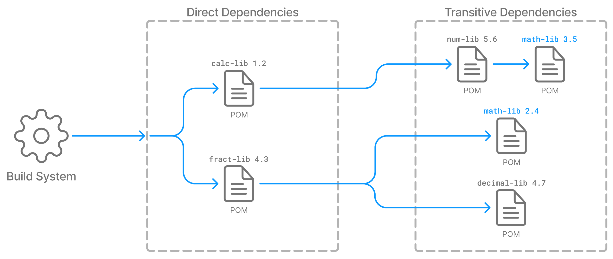

# Введение

С увеличением размера проекта растёт объём рутинных задач: компиляция исходников, управление зависимостями, запуск тестов, сборка артефактов, публикация и множество вспомогательных операций. Выполнять их вручную неудобно, трудозатратно и подвержено ошибкам.

Системы сборки решают эту проблему: они автоматизируют повторяемые шаги, делают процесс сборки предсказуемым и единообразным, обеспечивают воспроизводимость результата и удобство командной разработки.

В этой лекции мы разберём Gradle — современную, гибкую и высокопроизводительную систему сборки. Рассмотрим её основные концепции, структуру проекта, ключевые сущности, работу задач, управление зависимостями и поддержку многомодульных конфигураций.

# 1. Зачем нужна система сборки

Современная система сборки решает четыре ключевые задачи.

---

## 1.1. Автоматизация компиляции большого количества исходников

Даже в проектах среднего размера могут быть сотни и тысячи файлов, взаимосвязанных через сложную структуру пакетов и модулей. Система сборки:

- определяет, **какие файлы требуют перекомпиляции**, а какие уже актуальны;
- соблюдает корректный порядок компиляции с учётом зависимостей;
- обеспечивает стабильный, воспроизводимый процесс.

Компиляция вручную в таких условиях может замедляться, становиться трудоёмкой и подверженной ошибкам.

---

## 1.2. Подключение сторонних библиотек

Современные проекты широко используют внешние JAR‑библиотеки: JUnit, Jackson, Spring, JDBC‑драйверы и многие другие.

Система сборки:

- позволяет подключать зависимости декларативно;
- автоматически **скачивает** их из удалённых репозиториев;
- управляет **транзитивными зависимостями**;
- разрешает конфликты версий.

Без системы сборки это требовало бы ручного скачивания JAR‑файлов, их версиирования и контроля совместимости.

---

## 1.3. Инкрементальная сборка и кеши

Полная сборка с нуля может быть **дорогой с точки зрения ресурсов серверов CI/CD, локальной машины разработчика, времени**: компиляция большого количества файлов, обработка ресурсов, тестирование, генерация артефактов.

Чтобы ускорить процесс, системы сборки используют:

- **инкрементальную компиляцию** — пересобирают только изменённые части проекта;
- **кеширование результатов задач сборки** — повторяющиеся операции пропускаются, если результат уже известен;
- **кеширование зависимостей** — библиотеки скачиваются один раз.

Это значительно снижает нагрузку на машину **и ускоряет саму сборку**, что критически важно при частых итерациях разработки.

---

## 1.4. Единая точка запуска тестов, упаковки и публикации

Система сборки обеспечивает стандартизированный процесс:

- компиляции;
- запуска юнит‑ и интеграционных тестов;
- сборки JAR/WAR/ZIP артефактов;
- публикации результата в локальные или удалённые репозитории;
- подготовки проекта к размещению в продакшене.

Под "запуском CI/CD шагов" подразумевается, что система сборки предоставляет **единый интерфейс команд**, которые легко встраиваются в пайплайны GitLab CI, GitHub Actions, Jenkins и других инструментов. Например: `./gradlew test`, `./gradlew build`, `./gradlew publish`.

Система сборки становится основой автоматизации: любой этап сборочного процесса может быть вызван одинаково как на локальной машине, так и в CI.

---

<details>
<summary><strong>📘 Вопросы для самопроверки</strong></summary>

1. Чем полезна инкрементальная сборка и какие преимущества даёт кеширование задач?
2. Какую роль играет система сборки в автоматизации CI/CD процессов?

</details>

# 2. Краткий обзор решений

## 2.1. Ant: императивный XML

Ant использует императивный стиль конфигурации: разработчик вручную описывает **последовательность действий**, которые должны быть выполнены. Такой подход требует много шаблонного кода и плохо масштабируется.

### Пример конфигурации:
```xml
<project>
    <target name="clean">
        <delete dir="classes" />
    </target>
    <target name="compile" depends="clean">
        <mkdir dir="classes" />
        <javac srcdir="src" destdir="classes" />
    </target>
    <target name="jar" depends="compile">
        <mkdir dir="jar" />
        <jar destfile="jar/HelloWorld.jar" basedir="classes">
            <manifest>
                <attribute name="Main-Class" value="antExample.HelloWorld" />
            </manifest>
        </jar>
    </target>
    <target name="run" depends="jar">
        <java jar="jar/HelloWorld.jar" fork="true" />
    </target>
</project>
```

**Плюсы:** полный контроль над процессом.  
**Минусы:** высокий уровень шаблонного кода, отсутствие системы зависимостей, плохо подходит для крупных проектов.

---

## 2.2. Maven: декларативный XML и фиксированный lifecycle

Maven ввёл декларативный подход: разработчик описывает **что нужно собрать**, а не пошаговый процесс. Сборка выполняется в рамках фиксированного жизненного цикла (compile → test → package → install → deploy), что делает поведение проекта предсказуемым.

### Пример конфигурации:
```xml
<project xmlns="http://maven.apache.org/POM/4.0.0"
         xmlns:xsi="http://www.w3.org/2001/XMLSchema-instance"
         xsi:schemaLocation="http://maven.apache.org/POM/4.0.0
         http://maven.apache.org/xsd/maven-4.0.0.xsd">

    <modelVersion>4.0.0</modelVersion>
    <groupId>baeldung</groupId>
    <artifactId>mavenExample</artifactId>
    <version>0.0.1-SNAPSHOT</version>

    <dependencies>
        <dependency>
            <groupId>junit</groupId>
            <artifactId>junit</artifactId>
            <version>4.12</version>
            <scope>test</scope>
        </dependency>
    </dependencies>
</project>
```

**Плюсы:** стандартизированная структура проекта, встроенная система зависимостей, предсказуемый процесс сборки.  
**Минусы:** громоздкий XML, жёсткий фиксированный lifecycle, ограниченные возможности кастомизации без сложных плагинов.

---

## 2.3. Gradle: гибкость и высокая скорость

Gradle объединяет декларативный подход Maven и удобство программируемых конфигураций. Вместо жёсткого XML используется **Groovy или Kotlin как конфигурационный язык**, что делает настройки проекта выразительными и расширяемыми.

Gradle значительно ускоряет сборку за счёт инкрементальности и кэширования, как мы упоминали ранее. Стоит добавить, что Maven тоже умееет кешировать, но Gradle превосходит его в этом аспекте.

### Пример конфигурации:
```groovy
apply plugins { java }

repositories {
    mavenCentral()
}

jar {
    baseName = 'gradleExample'
    version  = '0.0.1-SNAPSHOT'
}

dependencies {
    testImplementation 'junit:junit:4.12'
}
```

**Плюсы:** высокая скорость сборки, гибкость, выразительные конфигурации, простота расширения.  
**Минусы:** более высокий порог входа по сравнению с Maven.

---

<details>
<summary><strong>📘 Вопросы для самопроверки</strong></summary>

1. Чем отличается императивный подход Ant от декларативного подхода Maven?
2. Как вы думаете, почему использование Groovy/Kotlin как конфигурационного языка делает Gradle более гибким?
3. За счёт каких механизмов Gradle достигает высокой скорости сборки?

</details>

# 3. Структура Gradle-проекта

Структура Gradle-проекта состоит из нескольких ключевых файлов и директорий, каждый из которых отвечает за отдельный аспект сборки. Понимание этой структуры — основа работы с Gradle, поскольку именно здесь задаются плагины, зависимости, настройки модулей и конфигурации сборочного процесса.

---

## 3.1. Общая структура проекта

Ниже приведена структура Gradle-проекта в классическом виде:

```
├── .gradle
│   └── ...
├── build
│   └── ...
├── build.gradle
├── settings.gradle
└── src
    └── ...
```

Эта структура формируется Gradle автоматически и отражает базовую организацию любого Java-проекта на Gradle.

---

## 3.2. settings.gradle — имя проекта и модули

`settings.gradle` определяет:
- имя корневого проекта;
- список модулей (в многомодульной конфигурации).

Пример:
```groovy
rootProject.name = 'gradleExample'
include 'module1'
```

Этот файл обрабатывается первым — он определяет состав сборки.

---

## 3.3. build.gradle — плагины, зависимости и задачи

`build.gradle` — основной файл конфигурации. В нём описываются:
- плагины;
- зависимости проекта;
- репозитории;
- кастомные задачи (tasks);
- настройки тестов и сборки.

### Пример (Groovy):
```groovy
plugins {
    id 'java'
}

group = 'org.example'
version = '1.0'

repositories {
    mavenCentral()
}

dependencies {
    testImplementation platform('org.junit:junit-bom:5.9.1')
    testImplementation 'org.junit.jupiter:junit-jupiter'
}

test {
    useJUnitPlatform()
}
```

### Пример (Kotlin):
```kotlin
plugins {
    id("java")
}

group = "org.example"
version = "1.0"

repositories {
    mavenCentral()
}

dependencies {
    testImplementation(platform("org.junit:junit-bom:5.9.1"))
    testImplementation("org.junit.jupiter:junit-jupiter")
}

tasks.test {
    useJUnitPlatform()
}
```

Использование Kotlin обеспечивает строгую типизацию и расширенное автодополнение.

---

## 3.4. Директория .gradle

`.gradle/` — внутренняя служебная директория Gradle. В ней хранятся:
- кеши сборки (checksums, execution history, file hashes)
- данные о предыдущих запусках
- вспомогательные метаданные.

Эти данные позволяют Gradle выполнять инкрементальную сборку и ускорять повторные операции.

---

## 3.5. Директория build

`build/` — выходная директория, содержащая артефакты сборки:
- скомпилированные классы
- JAR-файлы (`build/libs`)
- сгенерированные источники
- временные данные задач.

Эта директория не коммитится в git и пересоздаётся при сборке.

---

## 3.6. Каталог src

Стандартная структура Java-проекта:

```
src/
  main/
    java/        — исходники приложения
    resources/   — ресурсы
  test/
    java/        — тесты
    resources/   — ресурсы для тестов
```

Пример:
```
src
 ├── main
 │   ├── java
 │   │   └── org/example/Main.java
 │   └── resources
 └── test
     ├── java
     └── resources
```

Эта структура соответствует общепринятому стандарту JVM-проектов.

---

<details>
<summary><strong>📘 Вопросы для самопроверки</strong></summary>

1. За что отвечает файл `settings.gradle`?
2. Какие типы настроек обычно размещаются в `build.gradle`?
3. Зачем Gradle хранит данные в директории `.gradle/`?
4. Какие артефакты помещаются в директорию `build/`?

</details>

# 4. Gradle Wrapper

Gradle Wrapper (часто просто *wrapper*) — это механизм, который позволяет запускать Gradle-проекты **без предварительной установки Gradle** на машине разработчика или CI-сервера. Вместо этого в репозитории хранится минимальный набор файлов, отвечающих за загрузку и запуск нужной версии Gradle.

Wrapper решает две основные задачи:
- **фиксирует версию Gradle** для проекта;
- **обеспечивает воспроизводимую сборку** на разных машинах и в разных окружениях.

---

## 4.1. Структура файлов Gradle Wrapper

При инициализации wrapper’а в проект добавляются несколько файлов и директорий:

```text
├── gradle
│   └── wrapper
│       ├── gradle-wrapper.jar
│       └── gradle-wrapper.properties
├── gradlew
└── gradlew.bat
```

Кратко по каждому элементу:

- `gradlew` — скрипт для Unix-подобных систем (Linux, macOS);
- `gradlew.bat` — скрипт для Windows;
- `gradle/wrapper/gradle-wrapper.jar` — небольшой bootstrap-JAR, который занимается загрузкой Gradle;
- `gradle/wrapper/gradle-wrapper.properties` — конфигурация wrapper’а (в том числе URL дистрибутива Gradle).

Разработчик или CI вызывают не `gradle`, а `./gradlew` (или `gradlew.bat`), а дальше скрипт сам позаботится о загрузке и запуске нужной версии Gradle.

---

## 4.2. gradle-wrapper.properties и фиксация версии Gradle

Файл `gradle-wrapper.properties` хранит настройки wrapper’а, в том числе ссылку на конкретную версию Gradle, которая должна быть использована в проекте:

```properties
distributionBase=GRADLE_USER_HOME
distributionPath=wrapper/dists
distributionUrl=https\://services.gradle.org/distributions/gradle-8.4-bin.zip
zipStoreBase=GRADLE_USER_HOME
zipStorePath=wrapper/dists
```

Ключевое поле здесь — `distributionUrl`:
- указывает, **какую версию Gradle** нужно скачать (в примере — `gradle-8.4-bin.zip`);
- задаёт тип дистрибутива (`bin` — только бинарники, без документации и исходников).

Первый запуск `./gradlew`:
- проверяет, скачан ли уже нужный дистрибутив;
- при необходимости загружает его и раскладывает в директорию `GRADLE_USER_HOME`;
- запускает сборку с этой версией Gradle.

Таким образом, вся команда всегда использует одну и ту же версию Gradle, независимо от локальных настроек.

---

## 4.3. Зачем нужен Gradle Wrapper на практике

Основные преимущества использования wrapper’а:

1. **Фиксация версии Gradle.**  
   Проект явно указывает, с какой версией Gradle он должен собираться. Это исключает ситуацию, когда один разработчик использует Gradle 7.x, другой — 8.x, а сборка ведёт себя по-разному.

2. **Отсутствие требования к глобальной установке Gradle.**  
   Для запуска достаточно JDK и скрипта `./gradlew`. Никакой предварительной установки `gradle` в системе не требуется.

3. **Удобство для CI/CD.**  
   В конфигурации CI можно просто запускать `./gradlew build`, не думая о версии Gradle или её установке. CI-сервер сам скачает нужную версию на первый запуск и переиспользует её дальше.

4. **Кроссплатформенность.**  
   В репозитории сразу есть и `gradlew` (Unix), и `gradlew.bat` (Windows), поэтому команда может работать на разных ОС без дополнительных настроек.

5. **Воспроизводимость сборок.**  
   Одинаковая версия Gradle + одинаковый конфиг проекта = предсказуемое поведение сборки на любой машине.

Wrapper фактически превращает Gradle в часть проекта: версия и способ запуска закреплены вместе с кодом в репозитории.

---

<details>
<summary><strong>📘 Вопросы для самопроверки</strong></summary>

1. Какие файлы добавляются в проект при использовании Gradle Wrapper и за что каждый из них отвечает?
2. Какую роль играет свойство `distributionUrl` в `gradle-wrapper.properties`?
3. Почему использование wrapper’а повышает воспроизводимость сборок в команде и на CI?
4. В чём практическое отличие запуска `gradle build` и `./gradlew build`?

</details>

# 5. Основные сущности Gradle

Gradle построен вокруг небольшой, но выразительной модели: **project**, **plugin**, **task**. Эти сущности формируют каркас, через который описывается и исполняется сборка. Понимание их ролей необходимо как для простых, так и для многомодульных проектов.

Также важным компонентом является *жизненный цикл сборки* (build lifecycle) — последовательность фаз, через которые Gradle проходит при запуске.

---

## 5.1. Project

**Project** — базовая единица Gradle-сборки. Каждый модуль Gradle-проекта представляет собой отдельный `Project`. Даже если модуль единственный, Gradle всё равно создаёт объект Project.

Проект содержит:
- плагины
- зависимости
- задачи (tasks)
- репозитории
- конфигурации
- настройки (group, version, Java toolchain и др.)
- пути к исходникам и ресурсам

Пример объявления настроек проекта:
```groovy
plugins {
    id 'java'
}

group = 'org.example'
version = '1.0'
```

В многомодульных проектах каждый модуль — отдельный Project, связанный с другими через зависимости.

---

## 5.2. Plugin

**Plugin** — расширение Gradle, подключающее в проект дополнительную функциональность: задачи, конфигурации, жизненный цикл.

Типичные плагины:
- `java` — компиляция, тесты, JAR
- `java-library` — разделение API/implementation
- `application` — запуск и упаковка приложений
- `maven-publish` — публикация артефактов

Пример:
```groovy
plugins {
    id 'java'
}
```

Плагин добавляет стандартные задачи (`compileJava`, `test`, `jar`, `build`) и конфигурации (`implementation`, `api`, `runtimeOnly`).

---

## 5.3. Task

**Task** — минимальная единица работы: компиляция, копирование файлов, упаковка JAR, запуск тестов.

Задачи могут:
- зависеть друг от друга (`dependsOn`)
- содержать действия (`doFirst`, `doLast`)
- выполняться вручную (`./gradlew build`)
- создаваться декларативно или программно

Пример задачи:
```groovy
tasks.register('hello') {
    doLast {
        println 'Hello world!'
    }
}
```

Пример задачи с зависимостью:
```groovy
tasks.register('intro') {
    dependsOn tasks.hello
    doLast {
        println "I'm Gradle"
    }
}
```

---

## 5.4. Build Lifecycle (init → configuration → execution)

Gradle выполняет сборку в три этапа. Это ключевая модель, объясняющая, почему задачи сначала объявляются, а затем выполняются.


> 🔗 [Источник: документация Gradle](https://docs.gradle.org/current/userguide/build_lifecycle.html)

### 1) Initialization (инициализация)
- считывается `settings.gradle`
- определяется состав проекта (модули)
- создаётся объект `Settings` и набор `Project`

### 2) Configuration (конфигурация)
- Gradle **читает** каждый `build.gradle`
- применяет плагины
- создаёт задачи и граф зависимостей

На этом этапе Gradle *не выполняет задачи* — только формирует модель сборки.

### 3) Execution (выполнение)
- определяется, какие задачи запрошены пользователем
- выполняются только нужные задачи и их зависимости
- учитываются кеши и инкрементальность

---

<details>
<summary><strong>📘 Вопросы для самопроверки</strong></summary>

1. Что такое `Project` и какие элементы он включает?
2. Какую роль выполняют плагины в Gradle?
3. Что такое `Task` и как создаётся новая задача?

</details>

# 6. Groovy DSL

Gradle по умолчанию использует **Groovy DSL** — конфигурационный код на языке Groovy. Это не просто декларативная разметка, а полноценный скриптовый язык с динамической типизацией, замыканиями и упрощённым синтаксисом. Однако в Gradle он используется в основном **декларативно**, для описания настроек и структуры сборки.

---

## 6.1. Динамическая типизация

Groovy позволяет переменным менять тип во время выполнения:

```groovy
def v = "Hello"  // строка
v = 123           // теперь Integer
```

> Такой стиль делает код плохо поддерживаемым. Несмотря на то, что Groovy допускает такое, лучше так не писать.

---

## 6.2. Необязательные скобки

Groovy позволяет опускать скобки при вызове методов:

```groovy
println "Hello world"
```

Эта особенность делает Gradle-скрипты визуально чище:

```groovy
repositories {
    mavenCentral()
}
```

---

## 6.3. Замыкания (closures)

Замыкания — основа DSL Gradle. Это блоки кода, которые можно передавать как аргументы методов:

```groovy
def closure = { param ->
    println "Hello ${param}"
}
closure("World")
```

---

## 6.4. Неявный параметр `it`

Если у замыкания один параметр, его можно не указывать:

```groovy
def closure = { println "Hello ${it}" }
closure("World")
```

---

## 6.5. Вложенные замыкания

Замыкания позволяют создавать вложенные структуры, что и формирует внешний вид Gradle-DSL:

```groovy
repositories {
    mavenCentral()
}

dependencies {
    implementation "org.example:lib:1.0"
}
```

Благодаря этому DSL выглядит декларативно, хотя фактически является исполняемым кодом.

---

<details>
<summary><strong>📘 Вопросы для самопроверки</strong></summary>

1. Чем полезна динамическая типизация Groovy для Gradle DSL? 
2. Что такое замыкание и как оно используется в Gradle?
3. Что делает параметр `it` и когда он используется?

</details>

# 7. Java-проект

Для Java-проектов Gradle предоставляет плагин `java`, который добавляет стандартные задачи, конфигурации и структуру каталогов, делая сборку предсказуемой и удобной. Он является основой для большинства JVM-проектов и для таких плагинов, как `java-library` и `application`.

---

## 7.1. Плагин `java`

Подключение плагина:
```groovy
plugins {
    id 'java'
}
```

Этот плагин автоматически добавляет задачи:
- `compileJava` — компиляция исходников
- `processResources` — обработка ресурсов
- `classes` — формирование директории с классами
- `compileTestJava` — компиляция тестов
- `test` — запуск тестов
- `jar` — упаковка JAR
- `javadoc` — генерация документации
- `build` — агрегирующая задача

---

## 7.2. Основные задачи Java-проекта

### `build` — полная сборка проекта
```
> Task :compileJava
> Task :processResources NO-SOURCE
> Task :classes
> Task :jar
> Task :assemble
> Task :compileTestJava NO-SOURCE
> Task :processTestResources NO-SOURCE
> Task :testClasses UP-TO-DATE
> Task :test NO-SOURCE
> Task :check UP-TO-DATE
> Task :build

BUILD SUCCESSFUL
```

### `test` — запуск всех тестов
Gradle автоматически находит и запускает тесты на основе подключённых тестовых фреймворков.

### `clean` — удаление артефактов сборки
```
> Task :clean
BUILD SUCCESSFUL
```
Удаляет директорию `build/`, обеспечивая «чистую» сборку при следующем запуске.

---

<details>
<summary><strong>📘 Вопросы для самопроверки</strong></summary>

1. Какие задачи добавляет плагин `java`?
2. В каких директориях Gradle по умолчанию ищет исходники и тесты?
3. Какие задачи объединяет `build`?
4. Для чего используется `clean`?
5. Почему стандартная структура каталогов важна для JVM-инструментов?

</details>

# 8. JAR и Manifest

JAR (Java ARchive) — это zip-архив со стандартизированной структурой, который содержит:
- скомпилированные `.class` файлы (из `src/main/java`),
- ресурсы (`src/main/resources`),
- каталог `META-INF`,
- файл манифеста `META-INF/MANIFEST.MF`.

Gradle позволяет удобно управлять сборкой JAR-файлов и добавлять в них метаданные, включая `Main-Class`, что делает JAR исполняемым.

---

## 8.1. Структура JAR-файла

Типичное содержимое JAR включает:
```
<class-файлы>
<ресурсы>
META-INF/
    MANIFEST.MF
```

Манифест представляет собой обычный текстовый файл вида:
```
Manifest-Version: 1.0
Created-By: 1.7.0_06 (Oracle Corporation)
```

---

## 8.2. Конфигурация задачи `jar`

Задача `jar` создаётся автоматически плагином `java` и может настраиваться через одноимённый блок.

Пример:
```groovy
jar {
    archiveBaseName.set("example")
    manifest {
        attributes(
            'Implementation-Title': 'My App'
        )
    }
}
```

Запуск:
```
$ ./gradlew jar
BUILD SUCCESSFUL
```

Результат:
```
build
 ├── libs
 │   └── example-1.0.jar
 └── tmp
     ├── compileJava
     │   └── previous-compilation-data.bin
     └── jar
         └── MANIFEST.MF
```

---

## 8.3. Добавление `Main-Class` в манифест

Чтобы JAR стал исполняемым, в манифест добавляют ключ `Main-Class`:

```groovy
jar {
    archiveBaseName.set("example")
    manifest {
        attributes(
            'Implementation-Title': 'My App',
            'Main-Class': 'org.example.Main'
        )
    }
}
```

Теперь JAR можно запускать напрямую:
```
$ java -jar example-1.0.jar
Executing Main.main
```

---

## 8.4. Плагин `application`

Плагин `application` автоматизирует настройку точки входа:

```groovy
plugins {
    id 'java'
    id 'application'
}

application {
    mainClass = 'org.example.Main'
}
```

После этого:
- Gradle сам добавит `Main-Class` в манифест,
- можно использовать `./gradlew run`.

---

<details>
<summary><strong>📘 Вопросы для самопроверки</strong></summary>

1. Какие элементы обязательно входят в JAR-файл?
2. Что содержит файл `MANIFEST.MF` и зачем он нужен?
3. Чем удобен плагин `application` при работе с точкой входа?

</details>

# 9. Таски

В Gradle *таска* (task) — это минимальная единица работы: действие, которое Gradle может выполнить. Каждая задача выполняет конкретную операцию: компиляцию, копирование файлов, запуск тестов, сборку JAR или выполнение пользовательского кода. Таски могут иметь зависимости, дополнительные действия и участвуют в графе сборки.

---

## 9.1. Создание простых задач

Таски создают через `tasks.register(...)` — ленивое объявление, которое регистрирует задачу без немедленного создания объекта.

```groovy
tasks.register('hello') {
    doLast {
        println 'Hello world!'
    }
}
```

Вызов:
```
$ gradle -q hello
Hello world!
```

`doLast` добавляет действие, выполняемое в конце задачи.

---

## 9.2. dependsOn — зависимость между задачами

Если одна задача должна выполниться перед другой, используют `dependsOn`.

```groovy
tasks.register('hello') {
    doLast {
        println 'Hello world!'
    }
}

tasks.register('intro') {
    dependsOn tasks.hello
    doLast {
        println "I'm Gradle"
    }
}
```

Запуск:
```
$ gradle -q intro
Hello world!
I'm Gradle
```

Gradle гарантирует выполнение зависимостей *до* запуска основной задачи.

---

## 9.3. finalizedBy — завершающая задача

`finalizedBy` задаёт задачу, которая выполнится **после** завершения другой — в любом случае: успешно или с ошибкой.

```groovy
def hello = tasks.register('hello') {
    doLast {
        println 'hello!'
    }
}

def cleanup = tasks.register('cleanup') {
    doLast {
        println 'cleaning...'
    }
}

hello.configure { finalizedBy cleanup }
```

Запуск:
```
$ gradle -q hello
hello!
cleaning...
```

Это используется для финализации: очистки временных файлов, освобождения ресурсов и служебных действий.

---

<details>
<summary><strong>📘 Вопросы для самопроверки</strong></summary>

1. Что такое task в Gradle и какую роль он играет?
2. Что делает `dependsOn` и зачем он нужен?
3. Чем `finalizedBy` отличается от `dependsOn`?
4. В каких ситуациях полезно использовать завершающие задачи?

</details>

# 10. Зависимости

Gradle использует гибкую систему управления зависимостями. Каждая зависимость подключается в блоке `dependencies { ... }` и относится к определённой конфигурации (configuration), которая определяет, **на каком этапе сборки она будет использоваться** — при компиляции, тестировании, только в рантайме и т. д.

Ниже приведём примеры того, как могут быть описаны зависимости:

```groovy
dependencies {
    implementation 'org.codehaus.groovy:groovy:3.0.5'
    implementation project(':utils')
    compileOnly 'org.projectlombok:lombok:1.18.20'
    runtimeOnly 'mysql:mysql-connector-java:8.0.23'
    api 'com.google.guava:guava:32.1.1-jre'
    testImplementation platform('org.junit:junit-bom:5.9.1')
    testImplementation 'org.junit.jupiter:junit-jupiter'
}
```

---

## 10.1. Основные конфигурации зависимостей

---

### 10.1.1. implementation

Используется **чаще всего**. Зависимость необходима для компиляции и выполнения *текущего* модуля.

- включается в `compileClasspath`;
- включается в `runtimeClasspath`;
- **не экспортируется** в другие модули.

Пример:
```groovy
implementation 'org.codehaus.groovy:groovy:3.0.5'
```

---

### 10.1.2. compileOnly

Зависимость нужна **только на этапе компиляции**, но не должна присутствовать в рантайме.

Пример:
```groovy
compileOnly 'org.projectlombok:lombok:1.18.20'
```

Типичный случай — Lombok: аннотации нужны компилятору, но в рантайме библиотека не используется.

---

### 10.1.3. runtimeOnly

Используется **только при выполнении**, но не участвует в компиляции.

Пример:
```groovy
runtimeOnly 'mysql:mysql-connector-java:8.0.23'
```

Подходит для:
- JDBC-драйверов,
- логгеров,
- библиотек, не участвующих в API.

---

### 10.1.4. api

Используется в многомодульных проектах (при подключённом плагине `java-library`). Зависимость становится частью **публичного API** модуля.

- экспортируется наружу,
- добавляется в `compileClasspath` других модулей.

Пример:
```groovy
api 'com.google.guava:guava:32.1.1-jre'
```

Использовать только тогда, когда типы зависимости действительно «протекают» в API вашего модуля.

---

### 10.1.5. testImplementation

Зависимости, которые нужны только для тестирования:

```groovy
testImplementation platform('org.junit:junit-bom:5.9.1')
testImplementation 'org.junit.jupiter:junit-jupiter'
```

Тесты собираются и запускаются в отдельном classpath.

---

## 10.2. Транзитивные зависимости

Транзитивные зависимости — это библиотеки, которые подтягиваются автоматически, если выбранная вами зависимость требует их для своей работы.

Gradle автоматически выбирает версии транзитивных зависимостей, но при необходимости можно управлять этим процессом.



> 🔗 [Источник: документация Gradle](https://docs.gradle.org/current/userguide/dependency_constraints.html)

---

### 10.2.1. Констрейнты (constraints)

Позволяют задать **жёсткие версии транзитивных зависимостей**:

```groovy
dependencies {
    constraints {
        api 'commons-httpclient:commons-httpclient:3.1'
        api 'org.apache.commons:commons-lang3:3.8.1'
    }
}
```

Это гарантирует, что Gradle не выберет более старую или несовместимую версию.

---

### 10.2.2. ResolutionStrategy

Позволяет принудительно задать конкретную версию при конфликте зависимостей:

```groovy
configurations.configureEach {
    resolutionStrategy {
        force 'org.example:mylib:1.2.3'
    }
}
```

`force` переопределяет любые другие указанные версии.

---

<details>
<summary><strong>📘 Вопросы для самопроверки</strong></summary>

1. В чём разница между `implementation` и `api`?
2. Чем отличается `runtimeOnly` от `implementation`?
3. Что такое транзитивные зависимости и как Gradle работает с ними по умолчанию?
4. Зачем нужны *constraints* и *resolutionStrategy*?

</details>

# 11. Управление версиями

Управление версиями зависимостей — ключевая задача в любом проекте. Gradle предоставляет несколько механизмов, которые позволяют централизованно и предсказуемо контролировать версии библиотек:

- использование BOM (Bill of Materials),
- Version Catalogs (`libs.versions.toml`),
- комбинация Catalog + BOM.

---

## 11.1. BOM (Bill of Materials)

BOM — это специальный артефакт, содержащий *согласованные версии* зависимостей. Он не содержит собственных классов, а лишь определяет версии, которые рекомендуется использовать в проекте.

### Пример BOM-файла (в формате Maven POM):
```xml
<project>
  <modelVersion>4.0.0</modelVersion>
  <groupId>com.example</groupId>
  <artifactId>my-bom</artifactId>
  <version>1.0.0</version>
  <packaging>pom</packaging>

  <dependencyManagement>
    <dependencies>
      <dependency>
        <groupId>com.example</groupId>
        <artifactId>my-library</artifactId>
        <version>1.0.0</version>
      </dependency>
    </dependencies>
  </dependencyManagement>
</project>
```

BOM позволяет:
- унифицировать версии зависимостей во всех модулях,
- избежать конфликтов несовместимых версий,
- отделить управление версиями от их подключения.

---

## 11.2. Использование BOM в Gradle

Gradle поддерживает BOM через механизм `platform(...)`.

```groovy
dependencies {
    testImplementation platform('org.junit:junit-bom:5.9.1')
    testImplementation 'org.junit.jupiter:junit-jupiter'
}
```

Здесь:
- BOM фиксирует версии всех модулей JUnit,
- модуль `junit-jupiter` подключается **без указания версии** — она берётся из BOM.

---

## 11.3. Version Catalogs (`libs.versions.toml`)

Version Catalogs — современный механизм Gradle для централизованного управления версиями и зависимостями.

Каталог обычно находится по пути:
```
gradle/libs.versions.toml
```

### Пример структуры файла:
```toml
[versions]
groovy = "3.0.5"
checkstyle = "8.37"

[libraries]
groovy-core = { module = "org.codehaus.groovy:groovy", version.ref = "groovy" }
groovy-json = { module = "org.codehaus.groovy:groovy-json", version.ref = "groovy" }
groovy-nio  = { module = "org.codehaus.groovy:groovy-nio",  version.ref = "groovy" }

[bundles]
groovy = ["groovy-core", "groovy-json", "groovy-nio"]

[plugins]
versions = { id = "com.github.ben-manes.versions", version = "0.45.0" }
```

### Использование в `build.gradle`:
```groovy
dependencies {
    implementation libs.bundles.groovy
}
```

Преимущества Version Catalogs:
- единый источник правды для всех версий,
- улучшенное автодополнение в IDE,
- удобная группировка зависимостей через bundles,
- возможность управлять версиями плагинов.

---

## 11.4. Использование Catalog + BOM вместе

Version Catalog может ссылаться на BOM. Это мощный и гибкий способ сочетать оба механизма.

### В `libs.versions.toml`:
```toml
[libraries]
spring-bom = { group = "org.springframework.boot", name = "spring-boot-dependencies", version = "3.2.0" }
spring-web = { module = "org.springframework.boot:spring-boot-starter-web" }
```

### В `build.gradle`:
```groovy
dependencies {
    implementation platform(libs.spring.bom)
    implementation libs.spring.web
}
```

Эта схема даёт:
- BOM → фиксированные и совместимые версии Spring,
- Version Catalog → структурированное подключение зависимостей.

Комбинация особенно эффективна в больших проектах.

---

<details>
<summary><strong>📘 Вопросы для самопроверки</strong></summary>

1. Что такое BOM и какую роль он выполняет?
2. Как подключить BOM в Gradle?
3. Для чего используется файл `libs.versions.toml`?
4. Почему совместное использование BOM и Version Catalog упрощает управление версиями?

</details>

# 12. Репозитории

Репозитории — это источники артефактов, откуда Gradle загружает зависимости. В них размещаются JAR-файлы библиотек, плагины, BOM-файлы и другие компоненты. Конфигурация репозиториев задаётся в блоке:

```groovy
repositories {
    ...
}
```

---

## 12.1. Зачем нужны репозитории

Репозитории обеспечивают:
- автоматическую загрузку зависимостей,
- работу с кешированными артефактами,
- доступ к внешним и локальным библиотекам,
- удобное и масштабируемое управление версиями.

Без них пришлось бы вручную скачивать JAR-файлы, хранить их в проекте и обновлять вручную — что неудобно и не подходит для реальной разработки.

---

## 12.2. Maven Central

Основной публичный репозиторий Java-экосистемы:

```groovy
repositories {
    mavenCentral()
}
```

Преимущества Maven Central:
- размещены практически все популярные библиотеки,
- стабильность и высокая доступность,
- проверка артефактов и обязательные метаданные.

---

## 12.3. Maven Local

Локальный репозиторий Maven, находящийся по пути:
```
~/.m2/repository
```

Подключение:
```groovy
repositories {
    mavenLocal()
}
```

Используется для:
- тестирования локально собранных артефактов,
- работы с зависимостями, не опубликованными в удалённые репозитории,
- разработки библиотек, над которыми работают параллельно.

---

## 12.4. Несколько репозиториев

Gradle ищет зависимости в указанном порядке — сверху вниз:

```groovy
repositories {
    mavenLocal()
    mavenCentral()
    maven { url 'https://repo.example.com/repo' }
}
```

Это позволяет комбинировать локальные, публичные и корпоративные хранилища.

---

<details>
<summary><strong>📘 Вопросы для самопроверки</strong></summary>

1. Зачем нужны репозитории в Gradle?
2. В чём разница между `mavenCentral()` и `mavenLocal()`?
3. Когда стоит использовать `mavenLocal()`?
4. Почему порядок объявления репозиториев имеет значение?

</details>

# 13. Мультимодульные проекты

Мультимодульный проект Gradle объединяет несколько логически связанных модулей под одной сборкой. Каждый модуль — самостоятельный `Project`, но управляется общими настройками верхнего уровня.

---

## 13.1. settings.gradle — объявление модулей

Все модули перечисляются в одном файле:

```groovy
rootProject.name = "multi-example"
include "moduleA", "moduleB"
```

Gradle создаёт отдельный `Project` для каждого `include`.

---

## 13.2. Общие плагины и версии в корневом проекте

Корневой `build.gradle` применяет общие настройки ко всем модулям:

```groovy
subprojects {
    apply plugin: "java"

    group = "org.example"
    version = "1.0"

    repositories {
        mavenCentral()
    }
}
```

Так уменьшается дублирование и сохраняется единый стиль сборки.

---

## 13.3. Зависимости между модулями

Один модуль может использовать другой:

```groovy
dependencies {
    implementation project(":moduleA")
}
```

Это позволяет переиспользовать код и строить архитектурные слои.

---
