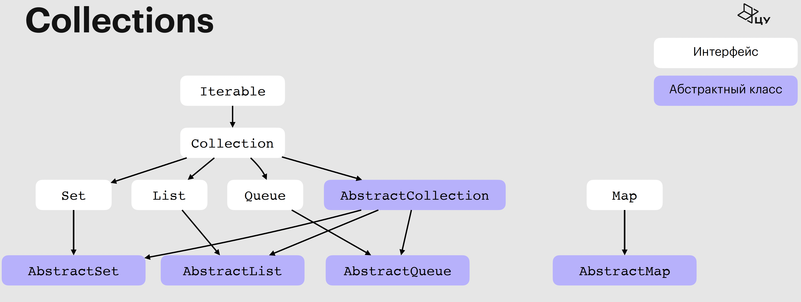
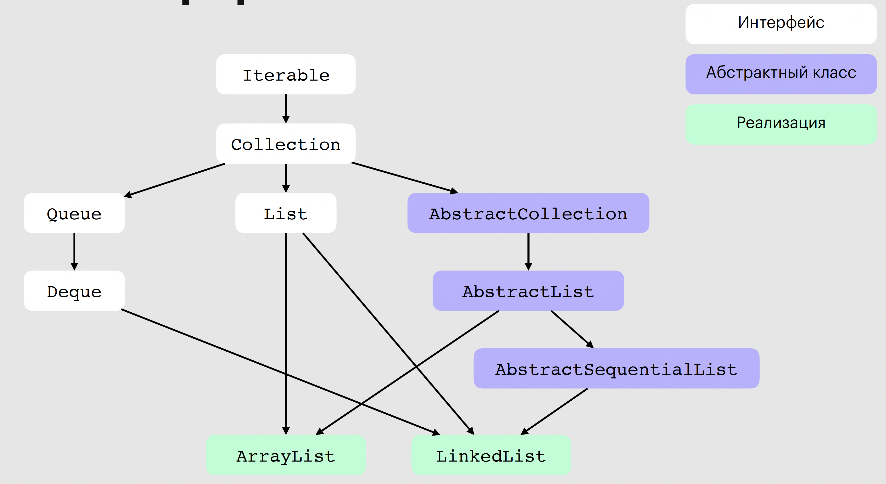
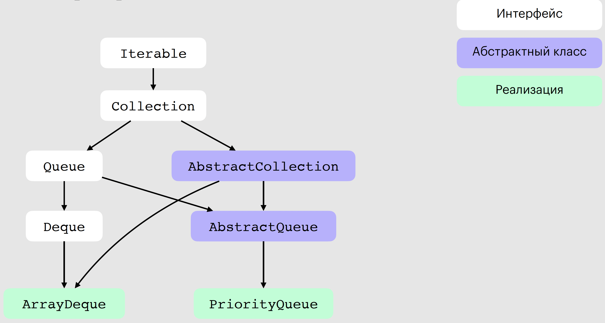
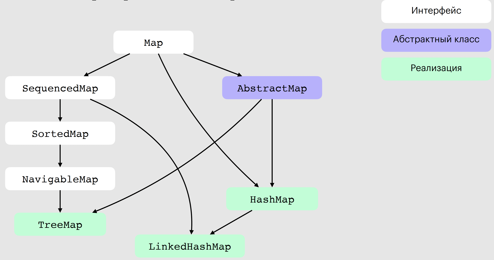
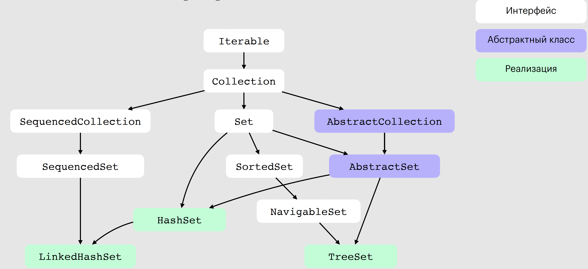

## Введение: Collections

В этой лекции переходим от **Generics** (type safety, PECS, erasure) и корректных контрактов `equals/hashCode` к **Java Collections Framework (JCF)** — стандартной, унифицированной экосистеме контейнеров для хранения и обработки данных в памяти приложения. В рамках курса мы будем разбирать иерархию `Iterable → Collection → {List, Set, Queue}` и отдельно стоящий `Map`, а также ключевые реализации и их поведение под нагрузкой.

**Связь с прошлыми лекциями.**  
— Типобезопасность и выразительность API мы обеспечиваем через **generics** (вы уже работали с wildcard’ами и bounded type parameters). Это напрямую влияет на сигнатуры методов коллекций и корректное использование `Iterator`.  
— Контракты **`equals`/`hashCode`** критичны для `HashMap`/`HashSet`: нарушение симметричности/согласованности ломает корректность хранения и поиска элементов. К этим контрактам мы вернёмся в соответствующем пункте лекции.  
— Обработка ошибок из прошлой лекции пригодится для понимания **fail-fast** поведения итераторов (`ConcurrentModificationException`) и корректного места обработки исключений.

**Цели раздела «Collections»:**
1) Понять архитектуру JCF и роль абстрактных классов (`AbstractCollection`, `AbstractList`, `AbstractSet`, `AbstractQueue`, `AbstractMap`).
2) Научиться выбирать реализацию под конкретный профиль операций: random access, вставки/удаления, поддержка порядка/сортировки, FIFO/LIFO/priority. (Будем опираться на материалы по `ArrayList`, `LinkedList`, `ArrayDeque`, `PriorityQueue`, `HashMap`/`LinkedHashMap`/`TreeMap`.)
3) Освоить безопасную итерацию и модификацию коллекций (итераторы, `modCount`, fail-fast), а также работу с **immutable** коллекциями (`List.of/Set.of/Map.of`).

---

## 1. Архитектура Java Collections Framework

**Иерархия интерфейсов.**  
Java Collections Framework строится вокруг иерархии `Iterable → Collection → {List, Set, Queue}` и отдельно стоящего `Map`, который не наследуется от интерфейсов Collection и Iterable.



**Базовый интерфейс `Collection`.**  
Интерфейс предоставляет методы определения размера, проверки пустоты/принадлежности, добавление/удаление и методы для преобразования коллекции в массив. Это фундамент для `List/Set/Queue`:
```java
public interface Collection<E> extends Iterable<E> {
    int size();

    boolean isEmpty();

    boolean contains(Object o);

    boolean containsAll(Collection<?> c);

    Object[] toArray();

    <T> T[] toArray(T[] a);

    boolean add(E e);

    boolean addAll(Collection<? extends E> c);

    boolean remove(Object o);

    boolean removeAll(Collection<?> c);

    boolean retainAll(Collection<?> c);

    void clear();
}
```
На практике в конкретных реализациях интерфейса `Collection` задана сложность операций и перечень допустимых/недоступных методов; “опциональные” методы могут быть не реализованы и бросать `UnsupportedOperationException`.

**Зачем `Map` вынесен отдельно.**  
`Map` — это ассоциативный массив пар «ключ → значение», он **не** подтип `Collection`, потому что у него другая модель элементов (пары `Map.Entry<K,V>`), другой набор операций (`get/put/remove`, `entrySet/keySet/values`) и иные инварианты (уникальность ключей).

**Абстрактные классы.**  
`AbstractCollection`, `AbstractList`, `AbstractSet`, `AbstractQueue`, `AbstractMap` — абстрактные классы для собственных коллекций. Они уже реализуют типовые методы и оставляют минимальный набор абстрактных операций для переопределения. Это сокращает объём кода и выравнивает поведение: стандартные проверки аргументов, предсказуемые (fail-fast) итераторы и `UnsupportedOperationException` для опциональных методов.
---

<details>
  <summary>📒 Вопросы для самопроверки</summary>
  <p>1) Почему <code>Map</code> не наследуется от <code>Collection</code> и как это отражается на наборе операций? Приведите пример с <code>entrySet/keySet/values</code>.</p>
  <p>2) Какие обязанности задаёт контракт <code>Collection</code>? Какие операции могут быть «опциональными» в конкретной реализации?</p>
  <p>3) Какую роль играют абстрактные классы и какие плюсы они дают при создании собственной коллекции?</p>
</details>

## 2. Семейство List: интерфейс и реализации



### Контракт `List`
`List` — упорядоченная последовательность с индексами, допускает дубликаты. Базовые операции: позиционный доступ, замена элемента, поиск индекса и представление диапазона через `subList`.
```java
public interface List<E> extends Collection<E> {
    E get(int index);
    E set(int index, E element);
    int indexOf(Object o);
    List<E> subList(int fromIndex, int toIndex);
}
```

### Иерархия и базовые абстракции
Для `List` предусмотрены абстрактные классы: `AbstractList` и `AbstractSequentialList` — они задают «каркас» реализации. В иерархии рядом — `ArrayList` и `LinkedList` как основные реализации.

### `ArrayList`: динамический массив

- **Хранение.**  
  Элементы лежат в массиве `Object[] elementData`. Массив elementData создается с запасом по размеру, чтобы при добавлении нового элемента не приходилось каждый раз выделять новую память и копировать все данные. Фактическое количество — в поле `int size`.
  `0 ≤ size ≤ elementData.length` (где `elementData.length` — текущая **capacity**).

- **Инициализация по умолчанию.**  
  Конструктор без `initialCapacity` не выделяет массив сразу (используется общий пустой массив).  
  При **первой вставке** создаётся массив на **10** элементов (дефолтная capacity). `DEFAULT_CAPACITY = 10`

- **Механизм роста.**  
  Когда `size == capacity`, вызывается `grow(minCapacity)`:
    - Новая ёмкость считается как ~**1.5×** от старой: `old + (old >> 1)`.
    - Затем берётся максимум из рассчитанного значения и `minCapacity`.
    - Данные переносятся `Arrays.copyOf(elementData, newCapacity)`.

- **Ограничение максимальной ёмкости (переполнение).**  
  При расчёте новой ёмкости `ArrayList` проверяет выход за пределы `int` и верхнюю границу размера массивов в JVM.
  Если требуемый размер превышает «максимальный размер массива» (~`Integer.MAX_VALUE - 8`), берётся верхняя планка:
  либо `MAX_ARRAY_SIZE` (`Integer.MAX_VALUE - 8`), либо — если `minCapacity` ещё больше — `Integer.MAX_VALUE`.
  Это предотвращает переполнение и сбои при `Arrays.copyOf(...)`.

- **Смещения при вставках/удалениях внутри списка.**
    - при вставке элемента(ов) в середину (`add(int, E)`/ `addAll(int, Collection<? extends E>`), например, по индексу `i`, элементы [i, size] сдвигаются вправо с помощью `System.arraycopy`
    - при удалении элемента из середины (`remove(int index)`), начиная с позиции `i`, элементы с индексов [i + 1, size] сдвигаются влево с помощью `System.arraycopy`, а последний слот массива обнуляется.

- **Дополнительно.**  
  Допускает `null` элементы. Не потокобезопасен; для многопоточности — внешняя синхронизация или альтернативы.

```java
private static final int DEFAULT_CAPACITY = 10;
Object[] elementData;
private int size;

private Object[] grow(int minCapacity);

// Конструкторы
public ArrayList() {}
public ArrayList(int initialCapacity) {}
public ArrayList(Collection<? extends E> c) {}
```

Демонстрация роста capacity:
```java
// Старт с пустого списка и последующие вставки
List<Integer> list = new ArrayList<>();
list.addAll(List.of(1));                  // size=1, capacity=10
list.addAll(List.of(2, 3, 4, 5, 6, 7, 8, 9, 10)); // size=10, capacity=10
list.addAll(List.of(11));                 // size=11, capacity=15
```

Сложности основных операций у `ArrayList`:
- `add(E)` — амортизированно O(1)
- `remove(Object)` — O(n)
- `get(int)/set(int, E)` — O(1)
- `indexOf(Object)` — O(n)

### `LinkedList`: ключевые особенности (детально)

- **Внутреннее устройство.**  
  Двусвязная структура: каждый узел хранит ссылку на предыдущий и следующий элементы, а список держит указатели на первый и последний узлы. Это даёт O(1) вставки/удаления на концах без сдвигов массива.
  ```java
  // Узел двусвязного списка
  private static class Node<E> {
      E item;
      Node<E> next;
      Node<E> prev;
      Node(Node<E> prev, E element, Node<E> next) {
          this.item = element;
          this.next = next;
          this.prev = prev;
      }
  }
  // Голова/хвост
  Node<E> first;
  Node<E> last;
  ```

- **Особенности операций с LinkedList.**  
  Нет мгновенного доступа по любому индексу: чтобы добраться до элемента с помощью метода `get(int)`, нужно пройти по ссылкам, сложность этой операции `O(n)`.
    - Вставки/удаления на концах: O(1) (`addFirst/addLast`, `removeFirst/removeLast`).
    - Позиционный доступ `get(int)/set(int, E)`: O(n).
    - Поиск/удаление по значению: O(n).

- **Итерация и локальные правки.**  
  Для последовательного обхода используйте `for-each` или `ListIterator`.  
  Локальные изменения вокруг текущей позиции итератора — **без доп. проходов**:
  ```java
  List<String> l = new LinkedList<>(List.of("A", "C"));
  ListIterator<String> it = l.listIterator();
  while (it.hasNext()) {
      String s = it.next();
      if ("A".equals(s)) {
          it.add("B"); // вставка между A и C в O(1) относительно позиции итератора
      }
  }
  // l: A, B, C
  ```
  Антипаттерн — индексная итерация `get(i)` в цикле: это может дать квадратичное время.

- **Память и locality.**  
  На элемент накладные расходы выше, чем у `ArrayList` (узел + две ссылки), отсутствует cache locality сплошного массива. Компенсируется **константным временем операций на концах** и удобством локальных изменений через итератор.

- **Дополнительно.**  
  Допускает `null` элементы. Не потокобезопасен; для многопоточности — внешняя синхронизация или альтернативы.

### Когда что выбирать
- Нужен быстрый random access и компактность в памяти → чаще `ArrayList`.
- Частые вставки/удаления на концах при редком позиционном доступе → `LinkedList`.

> 💡 Для большинства сценариев, где требуется двусторонний доступ к концам очереди (вставка/удаление с начала и конца), используйте ArrayDeque (который мы рассмотрим ниже), а не LinkedList. Он обеспечивает лучшую производительность, более эффективное использование памяти и лучшую кэш-локальность. LinkedList стоит предпочесть только если нужны частые модификации в середине списка через ListIterator или требуется явно двусвязная структура.

---

<details>
  <summary>📒 Вопросы для самопроверки</summary>
  <p>1) Чем отличаются <code>ArrayList</code> и <code>LinkedList</code> по внутреннему устройству и как это влияет на асимптотику операций? Назовите 3 операции и их сложности.</p>
  <p>2) Когда <code>LinkedList</code> — оправданный выбор, а когда он ухудшит производительность относительно <code>ArrayList</code>?</p>
  <p>3) Для чего в интерфейсе <code>List</code> методы <code>get/set/indexOf/subList</code>? Как их наличие отражает модель «список с индексами»?</p>
</details>

## 3. Queue/Deque/PriorityQueue



### Контракт `Queue`
`Queue<E>` задаёт пары методов с разной семантикой ошибок — «строгие» (бросают исключения) и «мягкие» (возвращают специальное значение при неуспехе):
- Добавление:
    - `add(e)` — бросает `IllegalStateException`, если элемент не может быть добавлен из-за ограничений длины очереди (capacity).
    - `offer(e)` возвращает true/false в случаях успешного и неуспешного добавления элемента.
- Удаление головы:
- `remove()` - удаляет и возвращает головной элемент. Если очередь пустая — бросает `NoSuchElementException`.
- `poll()` - возвращает `null`, если головной элемент не найден.
- Просмотр головы:
    - `element()` - возвращает головной элемент без удаления, если очередь пустая — бросает `NoSuchElementException`.
    - `peek()` - возвращает головной элемент, `null`, если элемент не найден.

> Используйте «строгие» методы, когда пустая очередь — нарушение ожидаемого поведения; «мягкие» — когда пустота допустима в нормальном режиме.

### Контракт `Deque`
`Deque<E>` расширяет `Queue` двусторонними операциями: работа **с обоими концами** очереди, работа со стеком. Для каждого действия есть пары методов начала/конца: `addFirst/offerFirst`, `addLast/offerLast`, `removeFirst/pollFirst`, `removeLast/pollLast`, а также стековые `push/pop`.

Мини‑пример: одна структура — два сценария (FIFO/LIFO)
```java
Deque<Integer> dq = new ArrayDeque<>();
// Очередь (FIFO):
dq.offer(1); 
dq.offer(2);
int first = dq.poll(); // 1

// Стек (LIFO):
dq.push(10); 
dq.push(20);
int top = dq.pop();         // 20
```

### Иерархия и реализации
В стандартной библиотеке ключевые реализации для этого семейства: `ArrayDeque` (двусторонняя очередь на массиве) и `PriorityQueue` (очередь на двоичной куче).

---

### `ArrayDeque`: Deque на массиве
- Элементы хранятся в массиве `Object[] elements`, индексы головы/хвоста — `head/tail`. Это **кольцевой буфер**: при добавлении/удалении индексы «вращаются» по модулю длины массива.
- Добавление/удаление на концах — амортизированно **O(1)**; при заполнении массив **расширяется** и элементы копируются в новый более крупный массив.
- Реализует `Deque`, поэтому одинаково удобна для **очереди (FIFO)** и **стека (LIFO)**, без накладных расходов для узлов (в отличие от связных структур).
- Не допускает null элементы, попытка добавить null приведёт к NPE.

Структурный набросок:
```java
// Примерная структура ArrayDeque
Object[] elements; // Элементы
int head;          // индекс первого элемента
int tail;          // индекс следующей позиции после последнего
private void grow(int needed); // При достижении capacity размера массив копируется в массив большего размера
```

Когда выбирать:
- Нужны **быстрые операции на концах** и низкие накладные расходы на каждый элемент.
- Универсальный контейнер: очередь/стек.
- Хорошая замена `LinkedList` для сценариев, когда нужна очередь/стек.

---

### `PriorityQueue`: Queue на двоичной куче
- Бинарная куча в массиве `Object[] queue`: у узла `i` дочерние элементы - `2*i+1` и `2*i+2`. Минимальный элемент — в корне (`queue[0]`).
- При вставке выполняется «просеивание вверх» (*sift‑up*), при извлечении минимума — «просеивание вниз» (*sift‑down*), инвариант кучи сохраняется.
-  порядок элементов определяется по их приоритету: сначала извлекаются элементы с наивысшим приоритетом. По умолчанию это естественный порядок сортировки (используется Comparable) для элементов с наименьшим значением, что по сути является минимальной кучей (min-heap). Для изменения порядка (например, для получения максимального элемента первым) необходимо указать пользовательский компаратор при создании очереди.
- Подходит, когда важен **порядок по приоритету**, а не по времени вставки: приоритизация задач, выбор k‑наименьших, планировщики.

---

### Практические акценты (когда что брать)
- **`ArrayDeque`**: максимально быстрая структура **FIFO/LIFO** в памяти, предсказуемые **O(1)** операции на концах, низкий overhead, удобна как универсальный буфер/очередь/стек.
- **`PriorityQueue`**: когда нужен **отбор/обработка по приоритету**. Чтение головы — быстро, вставка/извлечение — логарифмические, порядок задаётся компаратором/Comparable.

---

<details>
  <summary>📒 Вопросы для самопроверки</summary>
  <p>1) Чем отличаются пары методов в <code>Queue</code>: <code>add/remove/element</code> vs <code>offer/poll/peek</code>? В каких сценариях лучше использовать каждую пару?</p>
  <p>2) Покажите, как на одном <code>Deque</code> реализовать и очередь (FIFO), и стек (LIFO). Какие методы вы выберете и почему?</p>
  <p>3) Объясните идею «кольцевого буфера» в <code>ArrayDeque</code> и роль индексов <code>head/tail</code>. Почему операции на концах работают амортизированно за O(1)?</p>
  <p>4) Как <code>PriorityQueue</code> поддерживает инвариант приоритета на массиве? Где задаётся порядок (через <code>Comparable</code> или <code>Comparator</code>) и как это влияет на поведение?</p>
</details>


## 4. Map: интерфейс, реализации и внутреннее устройство



### 🧩 Интерфейс `Map<K, V>`

Интерфейс `Map` представляет ассоциативный контейнер: отображение ключей на значения. Ключи должны быть уникальны, значения могут дублироваться. В Java Map не является подтипом Collection.

### Основные методы `Map` (таблица)

| Метод | Назначение | Пояснение |
|-------|------------|-----------|
| `V put(K key, V value)` | Добавляет (или заменяет) пару ключ-значение | Возвращает предыдущее значение или `null` |
| `V get(Object key)` | Возвращает значение по ключу | Возвращает `null`, если ключ не найден |
| `V remove(Object key)` | Удаляет ключ и его значение | Возвращает значение, связанное с ключом |
| `boolean containsKey(Object key)` | Проверка существования ключа | Работает быстрее, чем `containsValue` |
| `boolean containsValue(Object value)` | Проверка наличия значения | Линейный проход по всем значениям |
| `int size()` / `boolean isEmpty()` | Размер / пустота карты | |
| `void clear()` | Удаляет все элементы | |
| `void putAll(Map<? extends K, ? extends V> m)` | Массовая вставка | Копирует все пары из другой Map |
| `Set<K> keySet()` | Множество всех ключей | Уникальные ключи, без значений |
| `Collection<V> values()` | Коллекция всех значений | Значения могут повторяться |
| `Set<Map.Entry<K, V>> entrySet()` | Все пары ключ-значение | Можно использовать в for-each |
| `V getOrDefault(Object key, V defaultValue)` | Возвращает значение или дефолт | Полезно для "lenient" логики |
| `V putIfAbsent(K key, V value)` | Вставка, если ключа ещё нет | |
| `boolean replace(K key, V oldValue, V newValue)` | Обновляет значение по ключу, если текущее равно `oldValue` | |
| `V replace(K key, V value)` | Простой `put`, только если ключ уже существует | |

> 💡 Важно! `get(key)` может вернуть `null` как из‑за отсутствия ключа, так и из‑за хранимого `null` значения. Для различения используйте `containsKey(key)`.

---

### 🧠 Как работает `HashMap`

#### Назначение хеш-функции

Хеш-функция применяется к ключу, чтобы получить **целочисленное значение — хеш-код**, по которому выбирается индекс бакета. Цель — **обеспечить равномерное распределение** ключей по массиву бакетов, чтобы минимизировать коллизии и сохранить быструю вставку/доступ **O(1)** в среднем.

```java
static final int hash(Object key) {
   int h;
   return (key == null) ? 0 : (h = key.hashCode()) ^ (h >>> 16);
}
```

- Используется `XOR` с битовым сдвигом, чтобы «перемешать» старшие и младшие биты `hashCode()`.
- Это улучшает распределение хешей по бакетам, особенно если `hashCode()` плохо реализован.

---

#### Что такое бакет

**Бакет** — это элемент массива внутри `HashMap`, который содержит либо:
- `null` (если пуст),
- цепочку `Node<K,V>` (связный список),
- либо красно-чёрное дерево `TreeNode<K,V>`, если цепочка слишком длинная.

```java
Node<K,V>[] table;
```

Индекс бакета вычисляется как:

```java
int index = (n - 1) & hash(key);
```

- `n` — длина массива `table`, всегда степень двойки.
- Маска `n-1` даёт равномерное распределение без `%` — быстрее и эффективнее.

---

#### Коллизии и цепочки

Если два разных ключа дают одинаковый индекс, возникает **коллизия**. Они решаются цепочками:

```java
static class Node<K,V> {
   final int hash;
   final K key;
   V value;
   Node<K,V> next;
}
```

При добавлении нового элемента:
- вычисляется индекс,
- происходит проход по цепочке с `equals()`,
- если ключ уже есть — обновляется значение,
- иначе — добавляется новый `Node`.

---

#### Динамическое расширение (`resize`) и `loadFactor`

- `loadFactor` (обычно 0.75) определяет, **насколько** можно заполнить карту.
- Как только `size >= capacity * loadFactor`, `HashMap` **расширяется**:
    - размер массива удваивается,
    - элементы **ре-хешируются**: вычисляется новый индекс, и распределяются по новой таблице.

```java
threshold = capacity * loadFactor;
```

---

#### Перевод цепочки в дерево (`treeify`)

Если количество элементов в одном бакете превышает `TREEIFY_THRESHOLD` (8):

- цепочка превращается в сбалансированное **красно-чёрное дерево**
- позволяет избежать деградации к `O(n)` при доступе

> 💡 Стоит упомянуть UNTREEIFY_THRESHOLD (= 6): при уменьшении плотности после операций дерево может быть обратно развёрнуто в список.

```java
static final class TreeNode<K,V> extends LinkedHashMap.Entry<K,V> {
   TreeNode<K,V> parent, left, right;
   boolean red;
}
```

> ⚠️ Если общее количество бакетов < `MIN_TREEIFY_CAPACITY` (64), вместо деревизации произойдёт `resize` — сначала увеличиваем количество бакетов.

---

#### Разрешение конфликтов порядка: `tieBreakOrder`

Если два объекта не сравнимы (`!Comparable`), но попадают в одно дерево — используется `tieBreakOrder`:

```java
static int tieBreakOrder(Object a, Object b) {
   int d = a.getClass().getName().compareTo(b.getClass().getName());
   return (d != 0) ? d :
       (System.identityHashCode(a) <= System.identityHashCode(b) ? -1 : 1);
}
```

---

### 🧭 `SortedMap` и `NavigableMap`

#### `SortedMap<K, V>`

Map с **отсортированными ключами**:
- либо по естественному порядку (`Comparable`)
- либо через переданный `Comparator`

Методы:

```java
SortedMap<K,V> subMap(K fromKey, K toKey);
SortedMap<K,V> headMap(K toKey);
SortedMap<K,V> tailMap(K fromKey);
K firstKey(); // минимальный ключ
K lastKey();  // максимальный ключ
```

Пример:

```java
SortedMap<Integer, String> grades = new TreeMap<>();
grades.put(1, "F");
grades.put(5, "A");
grades.headMap(3);  // всё до 3
```

---

#### `NavigableMap<K, V>`

Расширяет `SortedMap` — добавляет доступ к **ближайшим ключам**:

```java
K lowerKey(K key);     // ключ < key
K floorKey(K key);     // ≤ key
K ceilingKey(K key);   // ≥ key
K higherKey(K key);    // > key

Map.Entry<K, V> lowerEntry(K key);
Map.Entry<K, V> floorEntry(K key);
// ...
```

Пример:

```java
NavigableMap<Integer, String> scores = new TreeMap<>();
scores.put(100, "A");
scores.put(90, "B");
scores.put(80, "C");

scores.floorKey(85);  // 80
scores.ceilingKey(85); // 90
```

---

### 🔗 LinkedHashMap

Расширяет `HashMap` с сохранением порядка элементов.

```java
static class Entry<K,V> extends HashMap.Node<K,V> {
   Entry<K,V> before, after;
}
```

- **accessOrder = false** — порядок вставки (insertion-order)
- **accessOrder = true** — порядок доступа (access-order), используется в LRU-кэшах

---

### 🌲 TreeMap

- Использует **красно-чёрное дерево**
- Все операции: вставка, поиск, удаление — **O(log n)**
- Не допускает `null` в качестве ключей, значения `null` допускаются.
- Поддерживает как **естественный порядок (`Comparable`)**, так и **внешний компаратор (`Comparator`)**

Примеры:

```java
TreeMap<Grade, Integer> map = new TreeMap<>(); // natural order (implements Comparable)

TreeMap<Grade, Integer> map = new TreeMap<>(
   Comparator.comparing(Grade::getScore)
); // custom order
```

---

### 📦 Вспомогательные интерфейсы

#### `Map.Entry<K, V>`

```java
interface Entry<K, V> {
   K getKey();
   V getValue();
   V setValue(V value);
}
```

Позволяет итерировать по парам `ключ–значение`:

```java
for (Map.Entry<Integer, String> entry : map.entrySet()) {
   System.out.println(entry.getKey() + ": " + entry.getValue());
}
```

### 📦 Реализации Map: сравнение

| Реализация       | Устройство                     | Особенности                                |
|------------------|--------------------------------|---------------------------------------------|
| `HashMap`        | Массив бакетов, цепочки/деревья | Быстрая вставка/доступ, нет порядка         |
| `LinkedHashMap`  | `HashMap` + двусвязный список  | Порядок вставки / доступа (`accessOrder`)   |
| `TreeMap`        | Красно-чёрное дерево           | Ключи в порядке; нет `null` в ключах        |

---

<details>
  <summary>📒 Вопросы для самопроверки</summary>
  <p>1) Зачем нужна хеш-функция и что она делает в <code>HashMap</code>?</p>
  <p>2) Что такое бакет и как определить, куда попадёт элемент?</p>
  <p>3) Как работает <code>resize</code> в <code>HashMap</code>?</p>
  <p>4) В каких случаях бакет превращается в дерево?</p>
  <p>5) Чем <code>SortedMap</code> отличается от <code>NavigableMap</code>?</p>
  <p>6) Что делает <code>tieBreakOrder</code> и зачем он нужен?</p>
</details>

## 5. Семейство Set: HashSet, LinkedHashSet, TreeSet



`Set` в Java — это интерфейс, представляющий коллекцию уникальных элементов, которая не содержит дубликатов.

### Контракт и свойства `Set`
- **Уникальность.** В множестве нет дубликатов: принадлежность определяется через `equals` (для hash‑структур дополнительно требуется согласованность с `hashCode`).
- **Идемпотентность добавления.** `add(e)` вернёт `false`, если элемент уже есть; `contains/remove` опираются на тот же критерий равенства.
- **Контракты `equals`/`hashCode` для множеств.** Два `Set` равны, если содержат одинаковые элементы (порядок не важен). `hashCode` множества равен сумме `hashCode` его элементов.
- **Порядок обхода.** Интерфейс `Set` сам по себе порядок не гарантирует; он определяется реализацией: у `HashSet` — произвольный, у `LinkedHashSet` — порядок вставки, у `TreeSet` — сортированный порядок.
- **`null`.** По спецификации допустим, но поведение зависит от реализации: `HashSet/LinkedHashSet` позволяют один `null`, `TreeSet` — ограничивает добавление при естественном порядке при компараторе без явной поддержки `null`.
- **Fail‑fast итераторы.** Структурные изменения коллекции вне итератора приводят к `ConcurrentModificationException`.
- **Мутируемость (изменяемость) элементов.** Нельзя менять поля, влияющие на `equals/hashCode`, пока элемент находится в множестве — это нарушит инварианты поиска/удаления.
- **Опциональные операции.** Не все реализации поддерживают мутацию: неизменяемые фабрики (`Set.of(...)`) бросают `UnsupportedOperationException` на изменяющих методах.

---

### `HashSet`: множество поверх `HashMap`
- Реализован через внутренний `HashMap<E,Object>`, где добавление элемента `add(e)` — это под капотом операция `map.put(e, PRESENT)`, где элемент e кладётся во внутренний HashMap как ключ, а значением служит одна и та же «заглушка» PRESENT.
- Если `put(e)` вернул `null` → ключа ещё не было → элемент действительно добавлен (add вернёт true);
- Если вернул не `null` → ключ уже существовал → это дубликат (`add(e)` вернёт `false`).
-
```java
// Внутренняя схема
private static final Object PRESENT = new Object();
private HashMap<E, Object> map;

public boolean add(E e) {
    return map.put(e, PRESENT) == null;
}
```

- **Порядок обхода** не гарантируется и может меняться при структурных изменениях, размерах таблицы, версиях JDK и т. п. Полагаться на него нельзя. Нужен детерминированный порядок — берите `LinkedHashSet` (порядок вставки).
- Требования к `equals/hashCode`. Корректность полностью опирается на контракт: равные объекты обязаны иметь одинаковый hashCode. `equals` — рефлексивен, симметричен, транзитивен и согласован. Менять поля, влияющие на сравнение/хэширование, пока элемент находится в множестве, нельзя — поиск/удаление станут непредсказуемыми.
- `null`. Допускается ровно один `null`-элемент; `add/contains/remove(null)` работают корректно. Нужен порядок и поддержка `null` — используйте `LinkedHashSet`. Для сортировки с `null` — только через TreeSet с компаратором, который явно обрабатывает `null`.

### `LinkedHashSet`: детерминированный порядок обхода

- Основан на `LinkedHashMap`: каждый элемент хранится как ключ, а все записи связаны в двусвязный список. Благодаря этому итерация всегда идёт в порядке вставки (insertion-order).
- Порядок обхода стабилен и не меняется после расширений/rehash. Но если элемент удалить и вставить снова — он окажется в конце.
- `null`. Разрешён ровно один null-элемент; его положение также фиксируется по моменту вставки.
- Операции. Ожидаемо `O(1)` для `add/contains/remove`, как у `HashSet`, но с небольшой константой сверху из-за поддержки связного списка.
- **Fail-fast**. Итераторы fail-fast: структурные изменения коллекции вне итератора приводят к `ConcurrentModificationException`.
- Удобен для логирования/экспорта/кешей, где нужен стабильный и предсказуемый порядок обхода.
-
```java
Set<Integer> order = new LinkedHashSet<>();
order.add(3); 
order.add(1); 
order.add(2);

Iterator<Integer> it = order.iterator();
while (it.hasNext()) {
    System.out.println(it.next()); // Итерирование: 3, 1, 2
}
```

### `TreeSet`: отсортированное множество (RB‑tree)
- **Идея.** Построен на `TreeMap` (красно‑чёрное дерево). Элементы хранятся **в отсортированном порядке**. операции вставки/поиска/удаления — `O(log n)`.
- **Порядок.** Задаётся естественным порядком (`Comparable`) или внешним `Comparator` в конструкторе.
- **`null`.** TreeSet не допускает null элементы. Допускаются только значения, сравнимые между собой и согласованные с порядком компаратора. И хотя технически возможно использовать компаратор, который обрабатывает null, но это нетипично и может приводить к NPE.
-  Подходит, когда критичны сортировка, диапазоны, поиск ближайших элементов.

```java
private static final Object PRESENT = new Object();

private NavigableMap<E, Object> m;

public boolean add(E e) {
    return m.put(e, PRESENT) == null;
}
```

---

<details>
  <summary>📒 Вопросы для самопроверки</summary>
  <p>1) Почему <code>HashSet</code> реализуется через <code>HashMap</code>? Как по результату <code>map.put</code> понять, был ли элемент новым?</p>
  <p>2) Чем поведение итератора <code>LinkedHashSet</code> отличается от <code>HashSet</code>? Для каких задач нужен порядок вставки?</p>
  <p>3) Почему <code>TreeSet</code> не допускает <code>null</code>? Как задать порядок элементов и чем отличаются <code>Comparable</code> и <code>Comparator</code>?</p>
  <p>4) Приведите кейсы выбора: <code>HashSet</code> vs <code>LinkedHashSet</code> vs <code>TreeSet</code>. Чем вы руководствуетесь?</p>
</details>


## 6. Контракты `equals()` и `hashCode()` и их влияние на коллекции

---

### Зачем это вообще нужно?

Многие коллекции (`HashSet`, `HashMap`, `LinkedHashMap`) используют `equals()` и `hashCode()` для определения **уникальности объектов** и их **размещения во внутренних структурах** (например, бакетах `HashMap`).

Нарушение контракта этих методов приводит к:

- невозможности найти объект, который "точно там лежит"
- некорректному поведению `contains`, `remove`, `get`, `put`
- потере производительности (например, все объекты в одном бакете)

---

### 📐 Контракт `equals(Object o)`

```java
public class SomeObject {
    private final int id;
    private int count;
    
    public SomeObject(int id, int count) {
        this.id = id;
        this.count = count;
    }
    
    public int getId() {
        return id;
}

@Override
public boolean equals(Object o) {
    if (this == o) {
        return true;                     // сравнение по ссылке
    }
    if (!(o instanceof SomeObject)) {
        return false;   // проверка типа
    }
    SomeObject other = (SomeObject) o;
    
    return this.id == other.id && this.count == other.count;               // сравнение полей
}
```

Метод `equals()` **должен** быть:

| Свойство       | Требование                                       |
|----------------|--------------------------------------------------|
| **Рефлексивность** | `x.equals(x)` — должно возвращать `true`         |
| **Симметричность** | `x.equals(y)` ⇔ `y.equals(x)`                    |
| **Транзитивность** | `x.equals(y)` и `y.equals(z)` ⇒ `x.equals(z)`   |
| **Согласованность** | Повторные вызовы при неизменных данных — одинаковый результат |
| **Сравнение с null** | `x.equals(null)` — должно возвращать `false`     |

---

### 📌 Контракт `hashCode()`

```java
@Override
public int hashCode() {
    return Objects.hash(id);
}
```

> 💡 Ключи должны быть «эффективно неизменяемыми» по полям, влияющим на hashCode, на время нахождения в Map. Иначе поиск/удаление перестанут работать корректно

Метод `hashCode()` должен быть **согласован** с `equals()`:

```text
если x.equals(y) == true, то x.hashCode() == y.hashCode()
```

> 💡 Обратное **не обязательно**: два объекта могут иметь одинаковый `hashCode`, но быть `!equals`.

Также:

- `hashCode()` должен **всегда возвращать одно и то же значение** при повторных вызовах, если состояние объекта не изменилось.
- Равномерное распределение `hashCode` важно для производительности `HashMap`.

---

> ❗ Важно: переопределил `equals()` — переопредели и `hashCode()`

---

### ✅ Пример корректной реализации

```java
public class Grade {
    private long studentId;
    private int score; // 0..100

    @Override
    public int hashCode() {
        int result = score;
        result = 31 * result + Long.hashCode(studentId);
        return result;
    }
}
```

вместо собственной реализации тела метода `hashCode()` можно использовать готовый метод `Objects.hash()`:

```java
@Override
public int hashCode() {
    return Objects.hash(score, studentId);
}
```

---

### 📐 Реализация `Objects.hash`

```java
public static int hash(Object... values) {
    return Arrays.hashCode(values);
}

public static int hashCode(Object[] a) {
    if (a == null) return 0;
    int result = 1;
    for (Object element : a)
        result = 31 * result + Objects.hashCode(element);
    return result;
}
```

---

### 💥 Что будет, если нарушить контракт equals/hashCode?

```java
public class Grade {
    private final long studentId;
    private final int score;

    @Override
    public boolean equals(Object o) {
        if (this == o) return true;
        if (!(o instanceof Grade)) return false;
        Grade other = (Grade) o;
        return studentId == other.studentId && score == other.score;
    }

    // ❌ Нарушаем контракт: hashCode зависит только от score
    @Override
    public int hashCode() {
        return Integer.hashCode(score); // игнорирует studentId
    }
}
```

```java
Set<Grade> set = new HashSet<>();
set.add(new Grade(1L, 90));

// Новый объект: тот же studentId, тот же score → equals() вернёт true
// hashCode зависит только от score — то есть хеши совпадают
set.contains(new Grade(1L, 90)); // ✅ true

// Теперь — создаём объект с другим studentId, но тем же score
// hashCode тот же → попадёт в тот же бакет
// equals() вернёт false → не найден
set.contains(new Grade(2L, 90)); // ❌ false
```

> 💡 Причина: оба объекта попадают в один и тот же бакет, потому что `hashCode()` зависит только от score, но `equals()` различает `studentId`, и поэтому `contains()` не находит совпадение.

---

## Как контракт equals/hashCode влияет на коллекции:

### `List#hashCode()`

```java
int hashCode = 1;
for (E e : list)
    hashCode = 31 * hashCode + (e == null ? 0 : e.hashCode());
```

🔸 Порядок элементов имеет значение!  
🔸 Два `List` равны (`equals`), если содержат **одинаковые элементы в одинаковом порядке**.

---

### `Set#hashCode()`

```java
// hash = сумма хешей всех элементов
public int hashCode() {
    int h = 0;
    Iterator<E> i = iterator();
    while (i.hasNext()) {
        E obj = i.next();
        if (obj != null)
            h += obj.hashCode();
    }
    return h;
}
```

🔸 Порядок элементов **неважен**  
🔸 Главное — состав множества

---

<details>
  <summary>📒 Вопросы для самопроверки</summary>
  <p>1) Что означает «согласованность equals и hashCode»? Приведите пример нарушения.</p>
  <p>2) Почему важно переопределить оба метода, а не только один?</p>
  <p>3) Чем отличается <code>hashCode</code> для <code>List</code> и <code>Set</code>?</p>
  <p>4) Какие свойства должен соблюдать <code>equals()</code>?</p>
  <p>5) Что произойдет, если <code>hashCode()</code> меняется после помещения объекта в <code>HashMap</code>?</p>
</details>

## 7. Неизменяемые коллекции в Java

### 📌 Что такое неизменяемые коллекции?

Это коллекции, **содержимое которых нельзя изменить**: нельзя добавить, удалить или заменить элемент. Попытка изменить такую коллекцию приведёт к `UnsupportedOperationException`.

---

### ✅ Как создать неизменяемую коллекцию

С JDK 9 появились удобные фабричные методы:

```java
List<String> list = List.of("a", "b", "c");
Set<Integer> set = Set.of(1, 2, 3);
Map<Integer, String> map = Map.of(
    1, "one",
    2, "two",
    3, "three"
);
```

- `Set.of(...)` не допускает дубликатов элементов — при повторной попытке добавить существующий элемент бросает `IllegalArgumentException`.
- `Map.of(...)` не допускает дубликатов ключей — при конфликте ключей будет выброшен `IllegalArgumentException`.
- `Map.of(k1, v1, ..., k10, v10)` ограничена 10 парами; для большего числа пар используйте `Map.ofEntries(...)`.
- Эти коллекции неизменяемы: неизменяемость не распространяется на изменяемые объекты внутри.
- Эти коллекции **не допускают `null`** как элемент или ключ

---

### 🔥 Что произойдёт при попытке модифицировать?

```java
List<Integer> list = List.of(1, 2, 3);
list.add(4); // ❌ UnsupportedOperationException

Set<Integer> set = Set.of(1, 2, 3);
set.add(4); // ❌ UnsupportedOperationException

Map<Integer, String> map = Map.of(
    1, "one", 2, "two"
);
map.put(3, "three"); // ❌ UnsupportedOperationException
```

---

### 🧱 Что происходит внутри?

```java
static <E> List<E> of() {
   return (List<E>) ImmutableCollections.EMPTY_LIST;
}

static <E> Set<E> of() {
   return (Set<E>) ImmutableCollections.EMPTY_SET;
}

static <K, V> Map<K, V> of(K k1, V v1) {
   return new ImmutableCollections.Map1<>(k1, v1);
}
```

> 💡 JDK использует внутренние оптимизированные классы `ImmutableCollections` — у каждой конкретной реализации (`Map1`, `MapN`) жестко зафиксированное поведение.

---

### 🧰 Где это полезно?

- Константные справочники, enum-конфигурации
- **Defensive copies** — защита от изменений извне:

```java
class Config {
    private final List<String> tags;

    public Config(List<String> tags) {
        this.tags = List.copyOf(tags); // защитная копия
    }

    public List<String> getTags() {
        return tags;
    }
}
```

- Безопасный возврат коллекций: вызывающий не сможет их изменить
- Функциональные и реактивные подходы (immutability по умолчанию)

---

### 🧱 Как существующую коллекцию сделать неизменяемой`:

```java
List<String> mutable = new ArrayList<>(List.of("a", "b"));
List<String> readonly = Collections.unmodifiableList(mutable);
```

- `readonly` нельзя модифицировать напрямую
- **но `mutable` всё ещё можно менять**, и это отразится в `readonly`.
- "Под капотом" такие неизменяемые коллекции хранят ссылку на оригинальную коллекцию, переопределенные операции доступа делегируют вызов оригинальной коллекции, а операции модификации кидают исключение.

```java
mutable.set(0, "x"); // ✅ допустимо
System.out.println(readonly.get(0)); // x — изменилось, хотя readonly
```

💡 Фабрики `List.of(...)` создают по-настоящему неизменяемые коллекции — без обёртки вокруг изменяемого списка.

---

<details>
  <summary>📒 Вопросы для самопроверки</summary>
  <p>1) В чём разница между <code>List.of(...)</code> и <code>Collections.unmodifiableList(...)</code>?</p>
  <p>2) Почему нельзя положить <code>null</code> в <code>Set.of(...)</code>?</p>
  <p>3) Что произойдёт при попытке <code>map.put(...)</code> в <code>Map.of(...)</code>?</p>
  <p>4) Когда стоит возвращать <code>List.copyOf(...)</code> вместо оригинальной коллекции?</p>
</details>

## 8. Итерация и fail-fast поведение коллекций

---

### 📌 Интерфейс `Iterable<T>`

```java
public interface Iterable<T> {
    Iterator<T> iterator();
}
```

Если класс реализует `Iterable`, его можно использовать в `for-each`:

```java
for (String s : someIterable) {
    System.out.println(s);
}
```

---

### 🔄 Интерфейс `Iterator<T>`

```java
public interface Iterator<E> {
    boolean hasNext();
    E next();
    void remove(); // удаляет элемент, возвращённый последним next()
    void forEachRemaining(Consumer<? super E> action);
}
```

Итератор позволяет обойти элементы **без знания внутренней структуры** коллекции.

---

### 📥 Пример использования

```java
void printItems(Iterable<?> items) {
    Iterator<?> iterator = items.iterator();
    while (iterator.hasNext()) {
        Object item = iterator.next();
        System.out.println("item = " + item);
    }
}
```

или через синтаксический сахар:

```java
for (Object item : items) {
    System.out.println("item = " + item);
}
```

---

### ❌ Неправильный способ удаления при обходе

```java
static void removeEven(List<Integer> numbers) {
    for (var number : numbers) {
        if (number % 2 == 0) {
            numbers.remove(number); // ❌ ConcurrentModificationException
        }
    }
}
```

Почему падает? Потому что **модификация коллекции без использования `Iterator`** нарушает внутренние ожидания итератора — это и есть **fail-fast поведение**.

---

### 🚨 Fail-fast: `ConcurrentModificationException`

```java
List<Integer> list = new ArrayList<>(List.of(1, 2, 3, 4));
for (Integer x : list) {
    if (x % 2 == 0) list.remove(x);
}
```

> ❌ В примере выше получим ConcurrentModificationException при попытке получить следующий элемент

---

### 🧠 Как работает fail-fast?

Пример из `AbstractList`:

```java
protected transient int modCount = 0;

private class Itr implements Iterator<E> {
    int expectedModCount = modCount;

    public E next() {
        checkForComodification();
        ...
    }

    final void checkForComodification() {
        if (modCount != expectedModCount)
            throw new ConcurrentModificationException();
    }
}
```

- `modCount` увеличивается при любой структурной модификации (`add`, `remove`, `clear`)
- `Iterator` фиксирует `modCount` при создании в `expectedModCount`
- Если значения не совпадают — выбрасывается исключение

---

### ✅ Как правильно удалять элементы при итерации

```java
Iterator<Integer> it = numbers.iterator();
while (it.hasNext()) {
    if (it.next() % 2 == 0) {
        it.remove(); // ✅ корректно
    }
}
```
---

<details>
  <summary>📒 Вопросы для самопроверки</summary>
  <p>1) Зачем нужен интерфейс <code>Iterable</code> и какой метод он определяет?</p>
  <p>2) Чем <code>Iterator.remove()</code> отличается от <code>Collection.remove()</code>?</p>
  <p>3) Почему возникает <code>ConcurrentModificationException</code>?</p>
  <p>4) Как работает механизм fail-fast внутри <code>AbstractList</code>?</p>
  <p>5) Почему нельзя модифицировать коллекцию в <code>for-each</code>?</p>
  <p>6) Можно ли избежать <code>ConcurrentModificationException</code>, если использовать <code>iterator().remove()</code>?</p>
</details>


