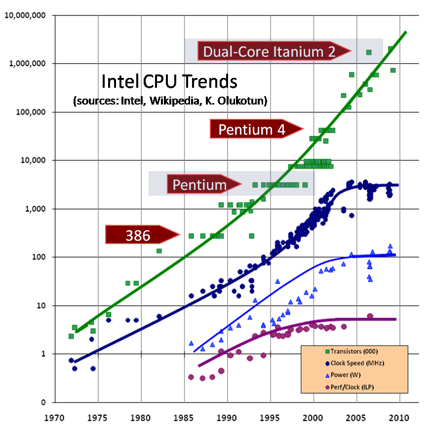

# Потоки и процессы

## Как процессоры становятся быстрее

В 1965 году Гордон Мур, сооснователь Intel, опубликовал наблюдение:
количество транзисторов на кристалле интегральной схемы удваивается
примерно каждые два года, при этом стоимость производства остаётся
прежней. Это наблюдение превратилось в самосбывающееся пророчество: индустрия ставила
планы производства так, чтобы соответствовать этому темпу. Уменьшение размеров транзисторов
и увеличение их количества само по себе некоторое время увеличивало скорость программ.


## The Free Lunch Is Over

К началу 2000-х индустрия столкнулась с физическим барьером: yменьшение транзисторов повышает их плотность,
но одновременно увеличивает плотность тепловыделения. Мощность процессора растёт
пропорционально квадрату напряжения и линейно частоте:

```
P ∝ C · V² · f
```

Одновременно возникла вторая проблема - скорость CPU росла быстрее скорости RAM,
и процессор всё больше времени проводил в ожидании данных, а не в вычислениях.



## Concurrency is the next major revolution in how we write software
```
Starting today, the performance lunch isn’t free any more. 
Sure, there will continue to be generally applicable performance gains that everyone can pick up, 
thanks mainly to cache size improvements. 
But if you want your application to benefit from the continued exponential throughput advances in 
new processors, it will need to be a well-written concurrent (usually multithreaded) application. 
And that’s easier said than done, because not all problems are inherently parallelizable and 
because concurrent programming is hard.
```
Проблему физического барьера увеличения производительности решили архитектурно, 
перейдя от вертикального масштабирования к горизонтальному: вместо ускорения одного вычислительного ядра,
процессоры предлагают несколько вычислительных юнитов. Такой подход полностью меняет способ написания программ,
вводя новую плоскость в вычисления - concurrency, способы взаимодействия и синхронизации таких распределенных вычислений.

## Закон Амдала
Не все вычисления можно производить распределенно, рано или поздно осмысленная программа должна
аккумулировать результаты своей работы, интуитивно должно быть понятно, что это ограничивает ускорение
через горизонтальную масштабируемость. Закон Амдала как раз об этом:

```
        1
S(n) = ─────────────
       (1 - p) + p/n
```

- **S(n)** — итоговое ускорение программы при использовании n ядер
- **p** — доля программы, которую можно выполнить параллельно (0 ≤ p ≤ 1)
- **(1 − p)** — доля, которая обязана выполняться последовательно
- **n** — количество ядер (потоков)

При n → ∞ ускорение стремится к теоретическому максимуму:

```
             1
S_max = ─────────
         (1 - p)
```

Это жёсткий потолок, который нельзя пробить добавлением ядер.
Например, если 20% программы строго последовательны (p = 0.8), максимальное
ускорение не превысит **5×** — независимо от того, сколько ядер в распоряжении.

| p (параллельная часть) | Максимальное ускорение |
|------------------------|------------------------|
| 50%                    | 2×                     |
| 75%                    | 4×                     |
| 90%                    | 10×                    |
| 95%                    | 20×                    |
| 99%                    | 100×                   |

Практический вывод: узким местом параллельной программы почти всегда
оказывается последовательная часть — сериализующие блокировки, сбор
результатов, I/O. Именно поэтому грамотная работа с синхронизацией
важнее, чем просто «добавить больше потоков».

## Процессы и потоки

В ранних операционных системах единственной единицей
выполнения был **процесс** — полностью изолированный контейнер с
собственным адресным пространством, файловыми дескрипторами и
состоянием CPU. Параллелизм достигался только через `fork()`: ядро
копировало весь процесс целиком. Такой сильно изолированный способ распределения вычислений
заставляет использовать относительно медленные механизмы взаимодействия (IPC): pipes, signals, shmem, sockets.
Для упрощения взаимодействия между такими единицами выполнения появились
**потоки** (threads) — единицы выполнения, разделяющие адресное
пространство родительского процесса.

### task_struct: один дескриптор для всех

В ядре Linux нет двух разных структур для процессов и потоков.
И процесс, и поток описываются одной структурой — `task_struct`
(определена в `include/linux/sched.h`). Ядро называет оба варианта
одним словом: **task**.

Ключевые поля `task_struct`:

```c
struct task_struct {
    pid_t             pid;       /* уникальный ID этого task              */
    pid_t             tgid;      /* thread group ID — общий для потоков   */

    struct mm_struct  *mm;       /* адресное пространство (Virtual Memory)*/

    struct files_struct *files;  /* таблица открытых файловых дескрипторов*/
    struct fs_struct    *fs;     /* корень и рабочая директория           */
    struct signal_struct *signal;/* обработчики сигналов                  */

    /* регистры CPU, стек — сохраняются при переключении контекста */
    struct thread_struct thread;
    /* ... */
};
```

Разница между процессом и потоком определяется тем, **разделяют ли
task одни и те же указатели**:

| Поле          | Процесс (`fork`)         | Поток (`clone` / `pthread_create`) |
|---------------|--------------------------|------------------------------------|
| `mm`          | своя копия (COW)         | **общий** с родителем              |
| `files`       | своя копия               | **общий**                          |
| `signal`      | своя копия               | **общий**                          |
| `pid`         | новый уникальный         | новый уникальный                   |
| `tgid`        | равен `pid`              | равен `pid` родителя               |

Системный вызов `clone(2)` — основа обоих. `fork()` — это `clone` без
флагов совместного использования. `pthread_create` внутри вызывает
`clone(CLONE_VM | CLONE_FILES | CLONE_SIGHAND | ...)`, передавая флаги
«разделять всё».

Именно поэтому `getpid()` внутри потока возвращает PID процесса
(т.е. `tgid`), а `gettid()` — уникальный ID самого потока (`pid` в
терминах ядра).

**Создание и стоимость переключения**

`fork()` копирует адресное пространство (Copy-on-Write, но всё равно
нужно скопировать таблицы страниц). Переключение между процессами
требует смены `mm` — это сброс TLB (буфера трансляции адресов),
дорогостоящая операция. Создание потока в разы дешевле: `mm` общий,
TLB не сбрасывается.

**Изоляция vs. разделение памяти**

Процессы изолированы: ошибка в одном (segfault, некорректный указатель)
не затрагивает другие. Потоки разделяют кучу и глобальные переменные —
любой поток может испортить память другого, это накладывает больше ограничений на то, как можно писать программы.
