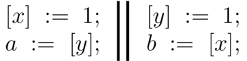
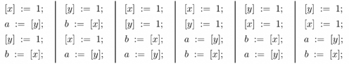
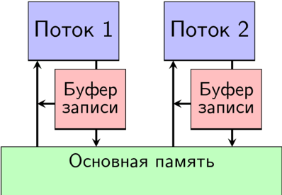

# Устройство памяти
## TSO
Ещё в 1979 году Лесли Лампорт в статье «How to make a multiprocessor computer that correctly executes multiprocess programs» ввёл,
как следует из названия, идеализированную семантику многопоточности — то, как мы думаем об исполнении программы.
Это модель *sequentially consistent* (SC): любой результат исполнения многопоточной программы может быть
получен как последовательное исполнение некоторого чередования инструкций потоков этой программы.

Посмотрим, любая ли программа может действовать в рамках этой модели? Рассмотрим следующую программу:

В этой программе два потока, в каждом из которых первая инструкция — инструкция записи в
разделяемую локацию (x или y), а вторая — инструкция чтения из другой разделяемой локации.
Для этой программы существует шесть чередований инструкций потоков:

В этом и последующих примерах мы предполагаем, что разделяемые локации инициализированы
значением 0. Тогда, согласно модели SC, у этой программы есть только три возможных
результата исполнения: [a=1, b=0], [a=0, b=1] и [a=1, b=1]. Однако если написать такую программу,
например, на C++, то можно увидеть результат [a=0, b=0]. Такой результат может появиться по двум
причинам: компиляторные и процессорные оптимизации. Однако если отключить компиляторные оптимизации
(например, с помощью `volatile`), то всё равно можно получить результат [a=0, b=0].

Для того чтобы понять, как подобный результат получается на процессоре, нужно обратиться к
модели памяти архитектуры, т.е. к её формальной семантике.
Модель памяти архитектуры x86 называется TSO (total store order).
TSO разрешает исполнения программ, выходящие за пределы модели SC; в частности, исполнение
программы SB, завершающееся результатом [a=0, b=0]. Такие исполнения называются слабыми,
как и допускающие их модели памяти.
Все основные процессорные архитектуры (x86, ARM, RISC-V, POWER, SPARC) обладают именно
слабыми моделями памяти.

Схематически TSO можно изобразить так:

В рамках этой модели потоки при выполнении инструкции записи не обновляют основную память
напрямую. Вместо этого они отправляют запрос в локальный буфер записи (store buffer),
из которого он через некоторое время попадает в основную память. При чтении поток сначала
проверяет свой буфер записи на наличие запросов к соответствующей локации и при их отсутствии
обращается к основной памяти.

## Memory barrier
Мы не хотим каждый раз думать о такого рода логических перестановках при написании программ — это
было бы слишком сложно, поэтому hardware-инженеры предоставляют способ сбрасывать буферы записи.
Таких барьеров три:

### MFENCE
**MFENCE** (memory fence) — полный барьер памяти. Он гарантирует, что все инструкции записи и
чтения, выданные до барьера, завершатся и станут видны остальным процессорам прежде, чем будет
выполнена любая инструкция после него. Фактически MFENCE сбрасывает store buffer текущего ядра в
основную память. Именно этот барьер нужен для предотвращения слабого исполнения программы,
рассмотренной выше.

### LFENCE
**LFENCE** (load fence) — барьер чтения. Он гарантирует, что все инструкции загрузки (load),
выданные до барьера, завершатся прежде, чем начнётся выполнение любой последующей инструкции.
На архитектуре x86/TSO LFENCE, как правило, избыточен для упорядочивания обычных читаемых
операций (reads already observe stores in program order).

### SFENCE
**SFENCE** (store fence) — барьер записи. Он гарантирует, что все инструкции записи (store),
выданные до барьера, станут глобально видимы прежде, чем любая инструкция записи после него
попадёт в основную память.
